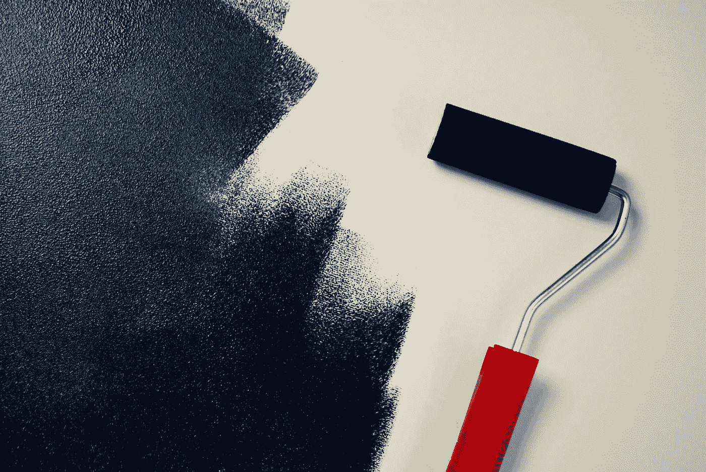
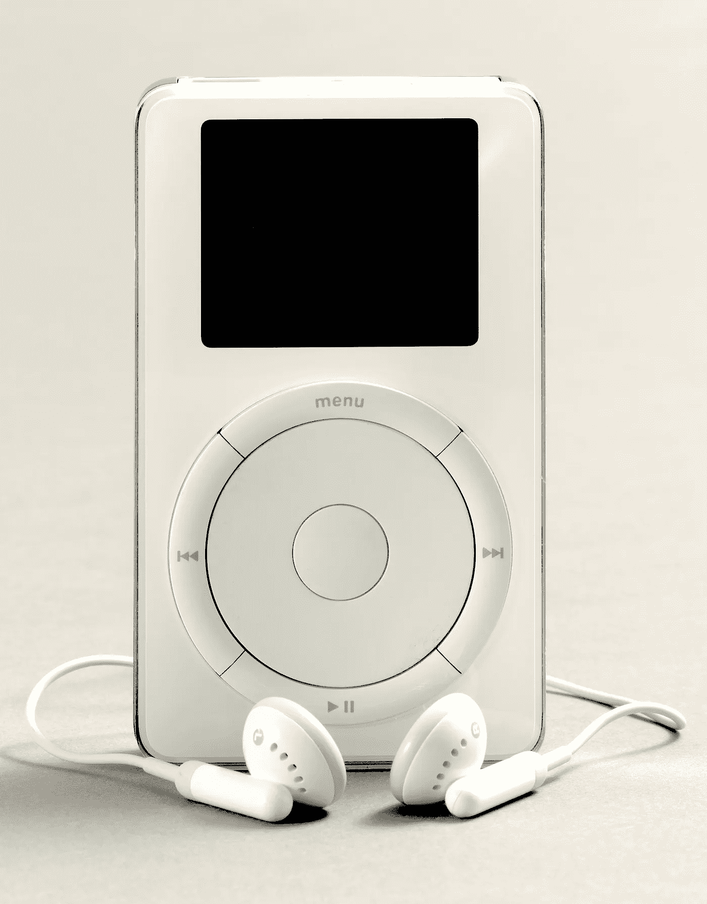
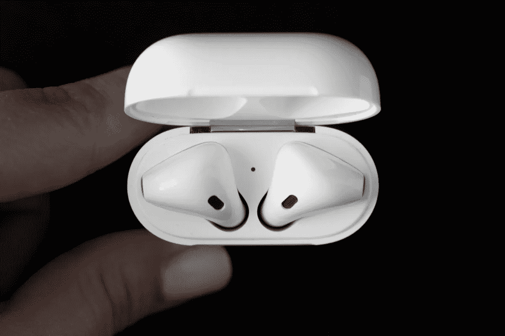
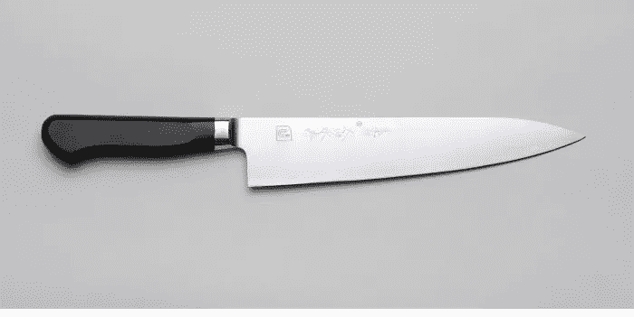
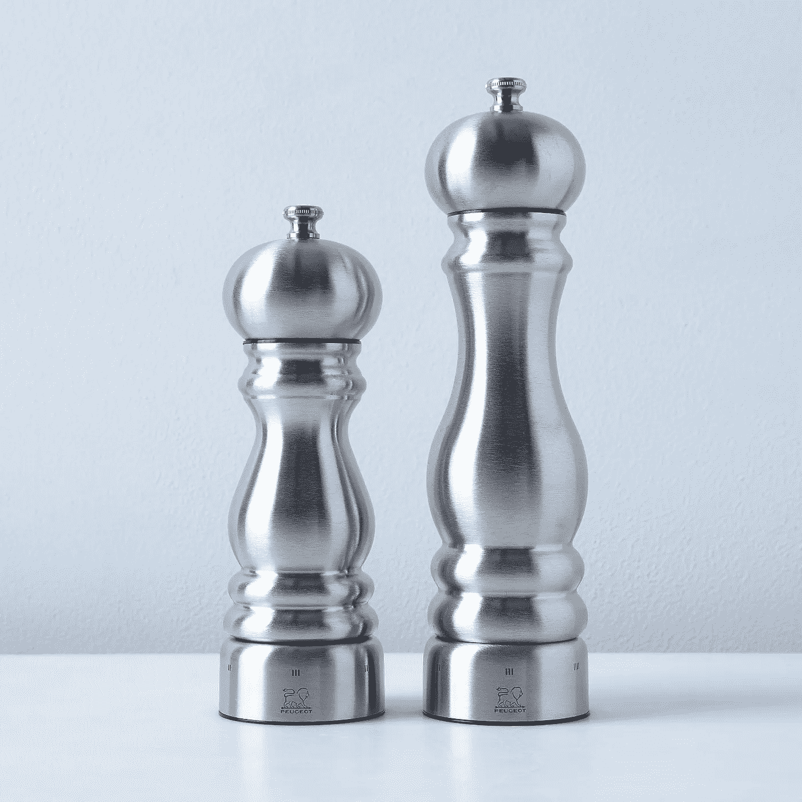

# 好产品的 10 条戒律

> 原文：<https://medium.com/swlh/the-10-commandments-of-good-products-d1d0a97b30ee>

## 什么定义价值？

我们生活在一个物质太多的世界里。作为一个设计产品的人，我一直在经历一场关于我们作为一种职业所创造的东西的生存危机——无论是数字的还是工业的。这东西真的对人有帮助吗？我们正在解决一个可行的问题吗？这种产品或服务真的能让世界变得更好吗？

不管后果如何，可以肯定地说，人类将继续创新。我们有责任去寻找、探索并最终改进我们日常使用的东西。不仅在资源充足的情况下迭代改进是不可避免的，而且发明，一个全新产品的诞生，随时随地都在发生。

本文探讨了 ***为什么*** 我们买 ***我们买什么*** ，以及一个产品如何“传播”以达到盈利。为什么有些产品看起来很快就达到了临界质量，而另一些却从未获得牵引力？这些产品是怎么发明的，是谁发明的？这些是每个创造者应该问的问题，因为了解产品的历史和它们为什么工作就是了解如何为未来而建造。理解发明背后的*为什么*会帮助你创造超越时间的有利可图的产品。这个列表是好产品的 10 条戒律。

# **1 它让一项不理想的任务变得更容易**

发明有价值的产品或服务的最简单、最明显的方法就是让人们不喜欢做的事情变得更容易、更快、更有效率，或者根本不存在。我们在键盘上打字，用机关枪向人们射击，搅拌食物，开车去上班，因为以前的选择并不容易。

这种外在的、实用的创新方法对于任何想要发明或改进产品或服务的人来说都是一个很好的起点。通过观察行为或系统并发现问题，你可以利用技术和设计使其更好和/或更直观。思考完成一项特定任务的步骤，以及如何消除其中一些步骤以最大限度地提高效率。亚马逊、优步和网飞——所有这些公司都省去了中间商，带来了更轻松的用户体验和更高的利润率。

声音信息(图形)设计也是这种效用诉求的一个例子。如果一本书或网页设计合理(声音排版、尺寸、引导、空白等)，它将更容易阅读和理解，因此它的功能价值增加了。如果你(一个企业家或创造者)在试图弄清楚要建立什么，或者想知道为什么你可能没有得到牵引力，看看其他的成功，发现他们的优势，发现他们的缺陷。这就是为什么产品审计是设计过程中如此有益的一部分。当你开始问*为什么*时，你开始从不同的角度看待你的产品或业务。这种观点的转变对企业家来说是至关重要的，这也是为什么在产品生命周期中循环顾问是一个好主意。有时候第一眼是一个人能得到的最纯粹的视角。

# 2 它具有集中价值

伟大的产品不会试图做所有的事情。他们是最小的，他们通常做*很少*的事情，*做得很好*。我记得在原生应用繁荣之初(直到今天)，许多初创公司都想开发“生活方式”应用，无所不能。我最近和一个客户合作了一个项目，在这个项目中，我不得不引导他们避免犯这个关键的、经常犯的错误。你的产品不可能集房地产引擎、商业发现工具和社交引擎于一身。人们不会使用它。为什么？原因有很多，但最大的一个原因是你不可能把每件事都做对。人们不会去寻找菜单最大、最多样化的餐馆。他们用谷歌搜索“X 市最好的披萨”。

此外，用户甚至在购买之前就必须了解产品的价值和功能。他们需要知道它能做什么，以及它将如何改善他们在特定领域的生活。在体验价值之前，他们必须想象价值。甚至谷歌在尝试社交化时也犯了这个错误。真的有人用 Google Plus 吗？不。谷歌巩固了自己作为发现和探索工具的地位，而不是社交工具。还要记住，为了渗透到不同的“类别”产品中，必须从其他平台迁移足够多的用户，以达到关键的大规模采用。这极具挑战性。

# 3 它持续

伟大的产品是经过精心设计的，能够持续相当长的时间。它们不需要为了继续成功而不断地重新设计。它们并没有真正过时。iPhone 就是一个很好的例子。虽然特色规格都有所增加，但手机的功能质量与最初的手机相比仍有所不同。我可以轻松地发短信、浏览图片、拍照、给朋友和同事打电话。就是这样。除了屏幕尺寸增加之外，尺寸和形状也相对没有变化。

Vespa 踏板车是伟大设计真正超越时间的另一个例子。 *Vespa* 几十年来相对没有变化。直到今天，它的简单和风格仍然使它成为一件令人向往的物品。其他经受住时间考验的产品包括:标准厨师刀，BIC 打火机，电脑鼠标，和游戏机控制器。所有这些产品都做得足够好，它们或多或少是一个成品。

伟大的产品也不会在有限的使用后土崩瓦解。尽管这是对信息技术工程的一个证明，但制造内置有计划淘汰的产品是不道德的。有计划的淘汰指的是一种策略，故意使一种产品有一个短的保质期，这样它在一段时间后就会变得不流行或不起作用。在 20 世纪 20 年代中期汽车市场达到饱和后，通用汽车首次开始实施这一战略。这个时候大家都已经买了车，销量在放缓。因此，为了刺激销售，通用汽车的负责人(小阿尔伯特·斯隆)建议他们每年进行设计变更，以说服车主他们需要升级。

有计划的淘汰存在至今。公司通常拥有他们将在两年后发布的产品的技术，但他们选择做出并营销增量变化，以便客户购买每个后续型号，增加这些公司的总利润。这合乎道德吗？绝对不行。伟大的产品应该持续相当长的时间——它们不应该保留技术，它们不应该被制造来破坏。伟大的产品应该以经久耐用为目标。

# 4 它具有美学吸引力

伟大的产品不仅*功能*好，它们*看起来*也不错。平衡和视觉和谐实际上有助于使产品更直观，因为每组功能在体验中有一个清晰的时间和空间。对于工业产品来说，这些是服务于特定任务的有限组件。例如，在一个标准的唱片/CD/音乐界面中，音量控件通常比其他控件大，因为这是一个更重要的特性。想想你在听播放列表的时候会调节多少次音量。太多了。因此，优秀的产品设计师知道如何将功能/特性分组，并根据位置、大小、颜色、质地来区分它们。

美学产品销售。当有人看到一辆车时，他们首先提到的是什么？他们谈论它看起来怎么样。人类也是如此。有大量研究表明，长相较好的人得到的批评性反馈较少，赚的钱更多，而且通常比长相不太好的人受到的待遇更好。好产品看起来不错。

# **五是直观**

好的产品简单易用。它们有一个层次基础，允许用户很容易地操作它的多个特性。好的产品使用白话和文化规范来传达功能。这使得它们在第一次被人使用时能够很好地工作。这一点尤其重要，因为*是我们在试用*时购买的。几乎每个产品现在都有免费试用期，甚至实体产品也允许你至少两周才能退回已经使用过的产品。

不熟悉的产品在开始时可能很难使用。想想学习一个新的复杂界面，视频编辑软件，甚至是一个视频游戏。可能需要一段时间才能“明白”。记住，一些产品——非常重要的高风险产品——一般人几乎从未使用过。以紧急列车出口为例。百分之九十九的人永远不会使用其中的一种——但当一个人使用时——它可能会影响其他数百人的生活。直观的设计可能是生与死的区别。

# 六是高效

好的产品总是遵循**高价值:资源**比率。不仅是材料本身的使用，还有把这些材料放在一起的人。好的产品诞生于典型的小团队，如果不是一个人的话。它们很紧凑，不会在装饰上花费过多的时间和资源。装饰品应该永远留给艺术和工艺。

好的产品不会占用多余的空间。它们优雅地融入它们所属的空间，产品中的元素也是如此。它们可以很容易地打包和移动。好产品不尴尬。

当有多余的附加物时，你能辨别出一个坏的产品。重度风格化就是一个例子。好的产品使用最少的资源或刺激来达到预期的效果、价值或功能。接口也是如此。如果你看到一个界面有大量的线条、夸张的标题和大量的动画，这通常表明他们对核心概念缺乏信心。归根结底，在产品领域，概念才是王道。

# 七是内脏

好产品直击灵魂。当你拿着劳力士的重量，踩下法拉利的油门，或者用手工锻造的日本厨师刀切洋葱时，该产品在多种感官上发挥作用，增加了它的反馈和最终价值。好产品*手感*好，就像你第一次拿 iPod、电脑鼠标，甚至枪的时候。他们只是*适合*。

在心理学和设计中，他们有一个术语来描述这种适合——它被称为刺激-反应相容性。刺激-反应相容性是指一个人对世界的感知与所需反应的相容程度。例如，门把手提供*转动/旋转、*，而门把手提供*推/拉*。同样，人体工程学设计也可以被认为是“本能的”。

视频游戏和它们的控制器是本能的产物——它们的目标是在多种感官上打击人类——它们是触觉、视觉和听觉。去一家拥有完美照明、新鲜面包的香味和热气腾腾的厨房的大餐厅是一种发自内心的体验。数码产品也是本能。产品不仅需要视觉上的组织，听觉和触觉反馈对于最佳体验也同样重要。想象一下，如果一只老鼠没有“点击”的感觉，它会感觉多么糟糕。好的产品设计超越了眼睛。

# 8 它满足搜索系统

“寻求系统”是人类探索、尝试新事物、挑战自我和学习的内在动力。所有的社交媒体产品都满足搜索系统，互联网、电视、旅游和每一款视频游戏也是如此。人们只是为了玩而玩，有太多的产品和服务直接或间接地迎合这种强烈的情感需求。以魔方为例，它是有史以来世界上最畅销的产品(售出 350，000，000 多件)。

当美国著名科学家哈里·哈洛注意到他的恒河猴实验对象在他的实验结束后会继续玩机械拼图时，这种寻找系统首次被发现。这是一个巨大的发现，因为在此之前，主流科学认为人类只是被服务于生理目的的事物所驱动。例如，如果每次成功后都有外在的奖励(食物),一个人在完成一个游戏或拼图时会变得更好。哈洛的发现证明了在普遍行为的背后有一种更强大的动力，这种动力来自内心。哈洛称之为“内在”动机，即人们渴望自由，挑战，并最终在世界上表现出来。他们需要控制，他们想要探索。

产品可以兼具功利性和寻求性。例如，自行车可以让你更快地工作，但它也可以是用来探索周围世界的工具。厨师刀使准备食物变得更容易，但它也能让你表现你的技能和艺术天赋。Instagram 允许你表达自己，只是现在比以往任何时候都快。就连看似纯粹功利的产品仪表盘，也满足了寻求系统。人类喜欢分析、推断和做出判断，即使这些判断不会导致性能、输出或资源的增加。人们为了研究而研究——这与自我有关。即使没有自主感，人类也需要自主感。

# 9 它是用户的一种表达方式

人们买东西不一定是因为它让他们的生活变得更好。事实上，人们可以说更多的“东西”实际上会降低一个人的生活质量。人们购买的产品表达了他们的内在精神，他们经常这样做是为了向他人传达他们是谁。 **他们采购到的项目**。这就是为什么媒体和营销对我们的集体价值观有如此巨大的影响。人类很快就会将某个特定的事物与理想的状态或状况联系起来。

当你设计一个产品，并以一种迎合你所面对的用户的表达本质的方式来营销它时，它成功的机会比它缺乏一些超越产品或服务功能的内在价值要高得多。二十多岁重视创新和技术的开发者拥有一块 Apple watch，五十多岁重视金钱的银行家拥有一块劳力士。不管怎样，购买这些物品并不是为了它们的功能，而是为了让用户向他人展示他们是什么样的人。产品购买是一种表达，不一定是基于理性效用的行为。

还要注意的是，如果产品是主人赠送的或者部分是主人创造的，那么对产品的依恋会增加。在心理学中，有一种真实的现象叫做“宜家效应”，顾客会对自己组装的家具产生好感，即使他们可能做得不好。人们对他们的创作和产品产生了依恋，他们开始用来定义自己*。营销专家都知道这种现象，并通过“品牌”策略强化这种现象。他们知道人们购买是为了地位和价值，而这些可以通过信息传递、媒体曝光和文化规范来塑造。不管怎样，人类很快就会将产品与人、价值观和故事联系起来。伟大的产品背后总是有一个故事，不管公司是否选择写它们。*

# 10 它帮助人们

一把 AK-47 是好产品吗…？好的产品应该总是旨在帮助人们和他们生活的环境。创造像玩具、家具和严格意义上的短保质期的新奇物品——低效用但高吸引力的产品最终对使用它们的人没有好处。帮助人们活得更长、更健康、更有精神和社会联系的产品是好产品。噱头产品不是。

拥有一个价值绝对新颖的产品的问题是，这种创造最终是不必要的。儿童玩具就是一个最好的例子。我们(成年人)敬畏地看着他们的手艺，并认为孩子们也会对他们有同样的惊奇。你有没有注意到幼儿对这些玩具不感兴趣，尤其是当你鼓励孩子玩的时候？玩耍是内在的，想象力也是。你有没有注意到，鼓励孩子玩玩具会让他想去玩盒子？这些玩具不仅阻碍了儿童的创造性发展，还给我们赖以生存的世界增加了不必要的污染。

最好的产品是由用户创造的。你曾经雕刻过你自己的勺子，制作过你自己的珠宝，或者用你自己的陶器啜饮过茶吗？你有没有经历过挣扎的时候，你真的需要创新来生存，或者至少更好地生存*？*这一创新过程很可能会带来丰厚的回报。你更看重那个产品，是因为创造它的本能体验。有一次旅行。

考虑到这一点，我们生活在一个在很多方面都太简单的世界里。我们完全脱离了我们的食物、朋友、家人和大自然。天冷的时候我们不在湖里游泳，我们不建自己的避难所，我们也不自己做饭。我们不会用自己的刀子切面包，也不会用自己的画笔表达自己。这就是产品让我们失望的地方。通过分离提取、生产和行动，我们对生活的本质有了一种更为宠坏的感觉。

产品也扭曲了我们对周围世界价值的认识。我们希望钱有更多的东西和更多的地位。我们从字面上定义自己，通过我们随着时间的推移收集的东西。我们的房子、汽车和劳力士。我们呆在自己不满意的工作岗位上是为了赚更多的钱，得到更多的东西，目的是什么？

快讯:拥有更多的东西不会让你更受欢迎。不会让你和人更亲近，也不会让你更幸福。

···

# 我是杰夫·戴维森

*我是一名 UX/UI 顾问，帮助公司设计* ***有价值、有利可图的*** *产品。联系 jeffdavidsondesign@gmail.com 的项目查询…我是开放的:)*

[http://jeffdavidsondesign.com/](http://jeffdavidsondesign.com/)

## 这篇文章发表在《创业公司》杂志上，这是 Medium 最大的创业刊物，有 361，652 人关注。

## 订阅接收[我们的头条新闻](http://growthsupply.com/the-startup-newsletter/)。

