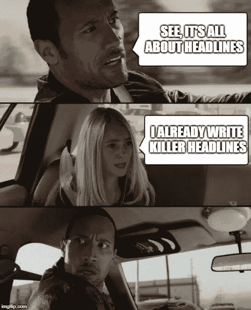

# 有史以来最有效的 10 个标题词

> 原文：<https://medium.com/swlh/the-10-most-effective-headline-words-of-all-time-c9f45bf2052d>

在我的上一篇文章中，我写了如何用完美的标题卖出更多并击败你的竞争对手。

如果你读到这里，你会知道**标题卖的是内容。**

所以我认为这是完美的跟进。

给你 10 个有史以来最有效的标题词，以及一些与之配套的例子。

# 秘密

**“秘密”**这个词立刻吸引了我们的好奇心，因为它暗示了我们正在错过的一些东西。

不知何故，我们错过了一个窍门。

这种**强大标题词**的一些例子:

*   让你的流量爆炸的 10 个秘密
*   在线杀死它的秘密
*   这个秘密帮助我减掉了 50 磅，而其他方法都不起作用

# 真实性

什么是**真相**？这是我们一直在寻找的东西。

事情的真相和“秘密”在感情上是一样的。我们对真实交易的好奇心和渴望。

这种**强大标题词**的一些实例:

*   你想知道名人减肥成功背后的真相吗？
*   理查德·布兰森成功背后的真相是什么

# 如何

如何…

大概是网络营销标题中使用最多的两个词。

这个词(嗯，技术上来说，单词)如此强大，是因为我们总是**想知道更多。我们喜欢简单的满足感，它让我们的生活变得更轻松，并帮助我们做事。**

这一**强大标题词**的一些实例:

*   **如何**带动更多流量
*   如何在网上获得更多的销售？
*   如何制作一只拥有激光束眼睛和弯刀爪子的自主机器人攻击犬？(好吧，也许不是那个)。

# 专家

专家是…

这已经成为一个相当熟悉的互联网内容的开端。有充分的理由。专家一小时的教学至少抵得上 10 小时的自学。

这种**强大标题词**的一些例子:

*   专家说这件事将永远改变你的生活
*   专家建议你不要做这一件事

# 销售

写一个“销售”标题，看着流量涌入。

人们喜爱**销售。我们喜欢感觉自己在讨价还价。**

这种**强大标题词**的一些例子:

*   本世纪最大的房产拍卖——不要错过
*   今年最大的比特币销售——谁买了它？

# 你是…

标题是一种有效的形式，因为它是开放式的，能让你思考。

这种**强大标题词**的一些实例:

*   你对这个网页设计失误感到内疚吗？
*   你是天生的企业家吗？
*   你错过了这场数字淘金热吗？

# 爱

你喜欢什么？

爱是一个强有力的词，这也是它成为头条新闻的原因。

这一**强有力的标题词**的一些实例:

*   如何找到你喜欢的行业
*   如何建立你热爱的生活
*   心理学家说，这是一种证明了的方法，可以找出你真正喜欢做什么

# 新的

谁不爱下一件大事？

这就是“新”这个词的由来。

这种**强大标题词**的一些例子:

*   新的研究表明，给猫剥皮的方法不止一种
*   新的研究表明，你不应该真的给猫剥皮
*   新的研究还表明，标题出售内容，人们浏览内容，所以可能甚至不会阅读这一点(但如果你这样做，它打破了你滚动搜索新信息的单调)。

# 打破

你有没有看到一个标题中有“打破”这个词，然后想——这听起来很无聊？

我不这么认为！这是爆炸性新闻！

突发新闻只意味着它是新的，超级新鲜的，刚刚出版，这个强大的标题词可以用在任何情况下。

这种**强大标题词**的一些例子:

*   打破——蔬菜对你有好处
*   打破——努力工作会有回报
*   打破——脸书也许并不那么私密

# 讨厌

这是情感光谱的另一端。一方面，我们爱是积极的，第二强烈的情绪是恨，这是一种消极的情绪。

任何能引起强烈情感反应的标题都是好的写作/新闻(在合理的范围内)。

这种**强大标题词**的一些例子:

*   为什么大多数人讨厌早上起床(有科学依据)
*   讨厌锻炼是件好事——原因如下
*   不要讨厌玩家，讨厌利率

我希望你觉得这篇文章很有用，它给了你一些标题创意，并且我编的一些标题让你的一天变得更加明亮。

## 你可能也喜欢这个:

## [如何通过成为一名出版作家来发展你的业务](/swlh/how-to-grow-your-business-by-becoming-a-published-author-8d8503c8ee4)

## 这个故事发表在 [The Startup](https://medium.com/swlh) 上，这是 Medium 最大的创业刊物，拥有 325，521+人关注。

## 在此订阅接收[我们的头条新闻](http://growthsupply.com/the-startup-newsletter/)。

