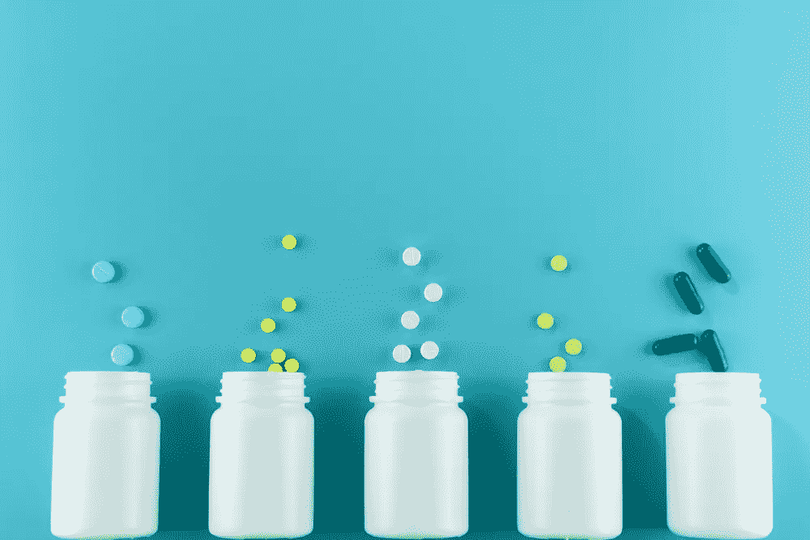
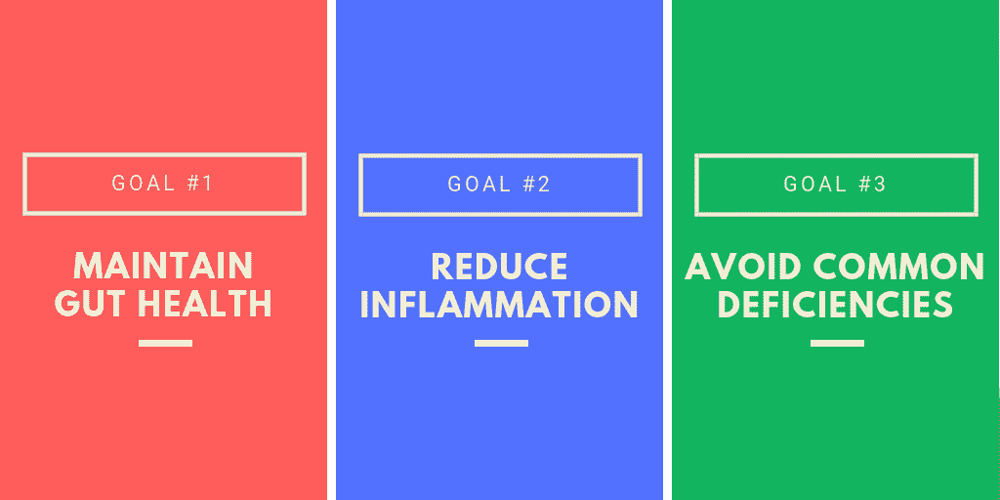
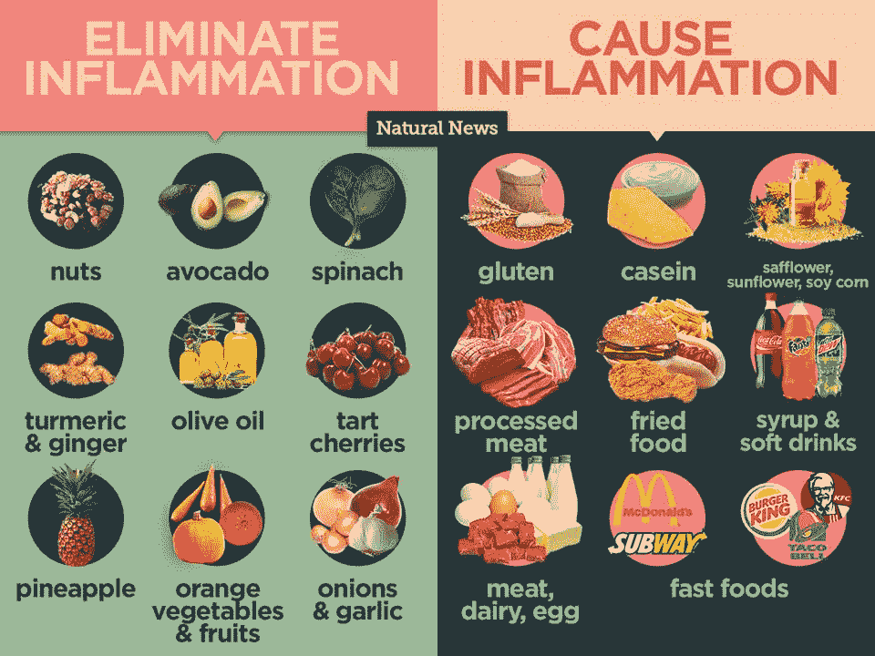
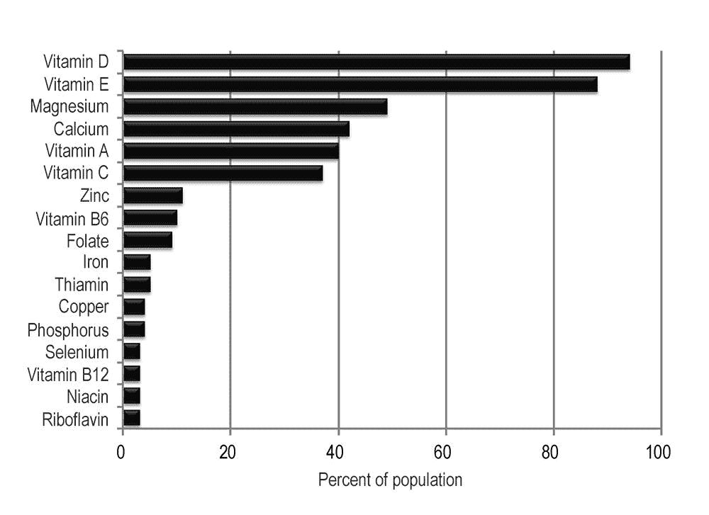
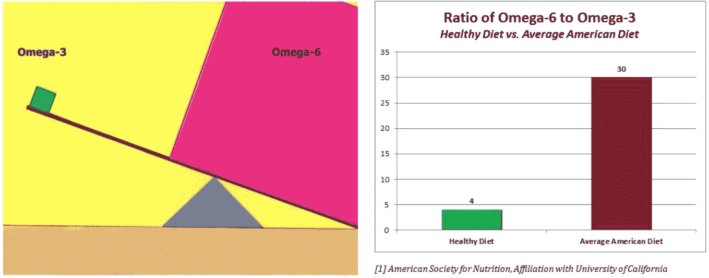

# 创业时保持健康的 12 种最佳补充

> 原文：<https://medium.com/swlh/the-12-best-supplements-to-keep-you-healthy-on-the-startup-grind-e610611d5247>

你可能已经知道了这一点，但是创办一家公司会付出代价。当你乘坐情绪过山车时，它会在精神上造成伤害。它还会对身体造成损害——低能量、高压力、胃灼热、体重波动，等等。很明显，深夜墨西哥卷饼需要结束了，但我也知道我需要一些额外的杠杆来帮助我的身体和健康回到正轨。

> **我发现，答案是用一种巧妙的补品养生法来补充我的饮食。**

最初，除了“感觉更好”之外，我没有任何具体的目标，但随着时间的推移，经过反复试验和大量阅读健康和营养方面的资料，我已经缩小了基本补充方案的范围，围绕三个主要目标:

# **目标 1:保持肠道健康**

你的微生物群对你身体的许多关键过程至关重要，从你的免疫系统到你的大脑和神经系统。肠道细菌还会向你的免疫系统发出信号，帮助对抗炎症。

## **肠道生态失调或失衡会导致很多问题，包括:**

*   情绪波动和焦虑:你的大部分血清素和多巴胺是在你的肠道中产生的，所以治疗肠道生态失调对心理健康至关重要。
*   对糖的渴望:有害细菌以糖为食，并分泌蛋白质，让你渴望更多的糖，形成一个危险的反馈回路。
*   体重增加:肠道微生物影响从摄入的营养物质中获取和储存能量/热量，肥胖的人与健康的人有不同的肠道微生物群。
*   炎症:研究表明，肠道微生物群也影响低度炎症和与之相关的疾病的发展，如二型糖尿病。
*   皮肤问题:肠道健康、食物不耐受和湿疹之间存在联系。
*   免疫力低下:肠道健康不佳会导致你的免疫系统过于活跃，更容易出现自身免疫并发症。

作为一个初创公司的创始人，上面的许多事情会让你失去兴趣，所以照顾好你的直觉很重要。

# **保持健康肠道需要避免什么**

普通的饮食充满了许多对你的肠道健康有害的成分。这些包括加工糖、酒精、麸质、大豆、鸡蛋和来自抗生素饲养的动物的乳制品。所有这些都会导致你肠道中有害细菌的生长和有益细菌的减少。

那么，你能做些什么来保持肠道健康呢？在你的饮食之外，有两类补充剂可以帮助肠道健康:益生元和益生菌。

# **肠道健康需要什么:益生元**

大多数益生元是一种纤维，它们喂养你肠道中的有益细菌。与益生菌不同，益生菌是与胃酸接触时可能被杀死的活细菌，益生元能够完整地通过你的消化道，并作为已经生活在那里的健康细菌的食物来源。

最近有很多关于益生元的研究，早期的发现很有希望。益生元似乎能积极影响新陈代谢，降低胆固醇，并对骨密度产生积极影响。

我尝试过一系列益生元食品和补充剂，下面是我推荐的几种:

*   **低聚半乳糖(GOS)** :这些是特殊连接的糖链，未经消化进入结肠，有助于促进有益菌的生长。就个人而言，我发现 GOS 产品比菊粉或低聚果糖产品引起的腹胀和胀气更少。我目前使用的是贾罗配方的[XOS 加 GOS 咀嚼片](https://thrivemarket.com/p/jarrow-formulas-prebiotics-xos-gos)。(在兴旺市场上，90 粒口香糖售价 10 美元)
*   **欧车前壳纤维**:与其他益生元纤维如菊苣根、菊粉或阿拉伯树胶纤维相比，我发现欧车前是我更好的选择。它是一种消化速度较慢的纤维，对我来说，比菊粉引起的腹胀和胀气更少；它也不会在混合液体时结块，如洋槐纤维。我每天服用 5-10 克，没有任何问题，并且使用安东尼的有机车前壳粉(亚马逊上 15 美元 1.5 磅)
*   **滑榆树皮**:除了含有高含量的可溶性和不溶性纤维外，滑榆树皮还是治疗胃酸倒流、胃灼热和 GERD 的常用草药。

# **肠道健康吃什么:益生菌**

益生菌是真正的活细菌，你服用它是为了让你的肠道充满更多的有益细菌。虽然还不清楚哪种菌株是最有效和有益的，但人们似乎一致认为更高多样性的菌株是有益的。

以下是我试图纳入健康肠道养生法的三种益生菌:

*   **乳酸杆菌**:一种生活在消化系统中的友好细菌，不会引起疾病。乳酸杆菌可以帮助我们更好地吸收营养，分解食物，并击退坏细菌和致病因子。我用的是 Culturelle 的 [10B CFU 消化健康配方(在](https://amzn.to/2zKWxP0) [Labdoor](https://labdoor.com/review/culturelle-digestive-health-probiotic) 上的评分是 98.1 分，80 粒胶囊在亚马逊上售价 33 美元)
*   双歧杆菌:一种常见于酸奶和奶酪等发酵食品中的有益细菌。虽然一些双歧杆菌经常与其他益生菌结合在一起，但我已经服用了一种专用的双歧杆菌复合剂，[10B CFU Probiota Bifido by Seeking Health](https://amzn.to/2QmSkX7)，因为我不吃任何乳制品，更缺乏这样的乳酸菌。(亚马逊上 60 粒胶囊售价 50 美元)
*   **布拉酵母菌**:一种热带酵母菌，首次从荔枝和山竹果实中分离出来，它似乎可以对抗细菌、寄生虫和真菌感染，并具有一系列益生菌益处。由于它被认为是一种更昂贵的益生菌，它通常不包括在许多配方中。对于我的布拉氏酵母菌剂量，我服用 [Florastor 的每日益生菌](https://amzn.to/2P5beS3)，每份含有 8.4B CFU。(在 lab door[上获得 92.9 分，在亚马逊上 100 粒胶囊售价 53 美元)](https://labdoor.com/review/florastor)

# **目标 2:减少炎症**

炎症会导致身体出现各种问题，包括初创公司创始人应该特别担心的事情，比如:

*   慢性疲劳
*   肌肉和关节疼痛
*   头痛
*   失眠
*   失忆等等

# **避免什么**

有很多常见的食物会增加你身体的炎症水平。其中包括高果糖玉米糖浆、油炸食品、酱油和人工甜味剂。这些尤其令享受糖果、寿司和无糖饮料的初创企业创始人担忧。

此外，对于许多人来说，就像 75%的乳糖酶活性降低的美国人一样，炎症的一大驱动力是乳制品和乳制品，如乳清蛋白。事实上，与乳糖不耐受相关的炎症是食用乳清蛋白最常见的副作用之一

# **消炎吃什么**

虽然饮食对对抗慢性炎症至关重要，但也有一系列对炎症和一般健康都很有效的补充剂。

以下是对我有效的方法:

*   **姜黄素(姜黄)**:一种经过充分研究的具有抗炎特性的草药补充剂。它的一个问题是它的口服生物利用度很低(你摄入的食物只有很低的百分比被吸收)，所以它和黑胡椒(胡椒碱)搭配很重要。我每天服用 2-4 克由自然营养提供的含生物丝氨酸的[姜黄姜黄素(亚马逊上 120 粒胶囊 20 美元)。](https://amzn.to/2P1majF)
*   **螺旋藻**:它含有一种叫做藻蓝胆素的活性成分，抑制 NADPH 氧化酶，赋予螺旋藻强大的抗氧化和抗炎作用。研究表明，螺旋藻的有效剂量为每天 1 至 8 克。我更喜欢以片剂形式服用，并使用[微成分螺旋藻片](https://amzn.to/2DYgqq7)。(亚马逊上 720 台平板电脑售价 21 美元)
*   **胶原蛋白肽(草饲，牛)**:虽然我不只是为了炎症才服用这种物质，但作为其益处之一，胶原蛋白具有抗炎特性。没有搅拌机很难混合，这就是为什么我采用肽的形式(而不是明胶或非水解胶原蛋白)。我见过的最划算的草饲胶原蛋白肽是自有品牌[Thrive Market Grass feed Collagen Peptides](https://thrivemarket.com/p/thrive-market-collagen-peptides)(20 盎司袋装 Thrive 售价 25 美元)。

# **目标 3:避免常见的营养缺乏**

根据美国农业部和膳食指南咨询委员会 2015 年的一份报告，大多数美国人摄入不足的几种关键营养素。其中包括维生素 D、维生素 E 和镁。

## **摄入量低于每日推荐剂量的人口百分比:**

镁和维生素 D 都被用于体内数百个过程，它们的缺乏会导致以下症状，这些症状可能会让许多初创公司的创始人感到担忧:

*   乏力
*   抑郁和焦虑
*   头发脱落

# **相对于欧米伽-6 平衡欧米伽-3**

现在，关于早期的炎症问题，还有另一种常见的缺乏，没有在上面的图表中体现出来，那就是美国人日常饮食中摄入的ω-6 和ω-3 的比例。推荐的比例是 4:1，然而，在美国人的平均饮食中，这个比例接近 30:1，这意味着ω-6 被过度消耗，而ω-3 被严重消耗不足。

平衡欧米伽 3 和欧米伽 6 的摄入很重要的原因是因为欧米伽 3 在很大程度上是抗炎的，而欧米伽 6 可能是炎症的原因。因此，摄入过多的 Omega 6 会增加我在上一节描述的一些炎症相关问题。

# **常见营养缺乏症吃什么**

综上所述，大多数初创公司创始人应该注意解决的三大营养缺乏症是:维生素 D、镁和 Omega 3。

至于产品，市场上有许多选择，但这里是我自己的首选:

*   **维生素 D3** :维生素 D 有两种形式，麦角钙化醇(维生素 D2)和胆钙化醇(维生素 D3)。在这两种形式中，D3 形式被认为在提高和维持体内维生素 D 浓度方面更有效 87%。我最喜欢的维生素 D 补充剂是经过 Labdoor 测试的由 Peak Performance 生产的[高级 D+K 配方，它也含有生物丝氨酸，有助于更好的吸收。(亚马逊上 60 粒胶囊售价 17 美元)](https://amzn.to/2OYoUy9)
*   **甘氨酸镁**:这是我喜欢的镁的形式，因为它被认为是最容易消化的，吸收量是碳酸镁的 2 倍以上，硫酸镁的 3 倍以上，&氧化镁的 8 倍以上。这种补充剂的高质量版本是低过敏性的纯胶囊甘氨酸镁(亚马逊上 180 粒胶囊售价 34 美元)
*   **Omega-3(浓缩鱼油)**:对于我的 Omega-3 补充剂，我更喜欢三倍浓度和肠溶的，这样我可以服用更少的药丸，也没有任何回味的风险。根据 Labdoor 的说法，我发现的最有价值的品牌是 [InnovixLabs 三重强度 Omega-3](https://amzn.to/2NVd6Ap) ，每粒胶囊含有 1073 毫克 Omega-3。(亚马逊上 200 粒胶囊售价 30 美元)

# 对我来说，除了增强健康，服用这些补充剂还有一个令人惊讶的高水平效果:它让我更普遍地意识到我摄入了什么。

你知道一句老话，你的身体是一座寺庙？嗯，那是真的，但是你的身体也有点像引擎。当你开始更有目的地投资于补充剂，以帮助它更平稳、更有效地运行，当你开始看到结果时，它会让你更加珍惜自我维护的重要性。

这是一种复合效应，服用补充剂会鼓励你改善饮食，这让你更有活力来跟上自我改善的养生法。

如果你有兴趣将补充剂用于任何其他目标，如提高能量、管理压力或提高免疫力，我很乐意听到你的评论，我会确保在未来的文章中涵盖这些内容。

## 这篇文章发表在 [The Startup](https://medium.com/swlh) 上，这是 Medium 最大的创业刊物，有+ 375，041 人关注。

## 订阅接收[我们的头条](http://growthsupply.com/the-startup-newsletter/)。

