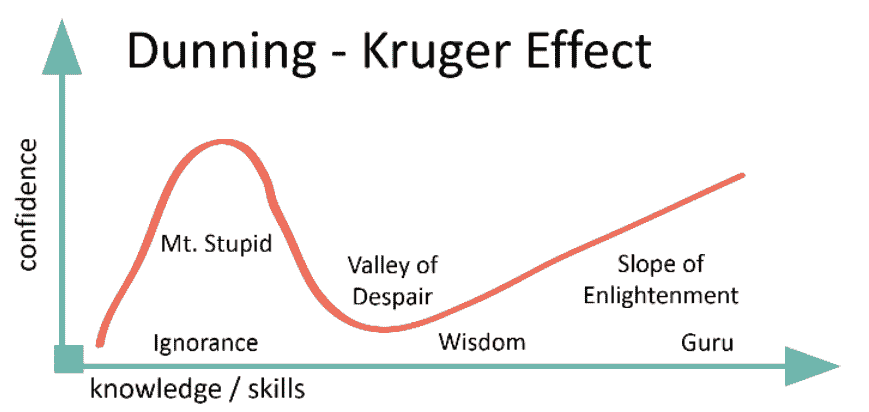
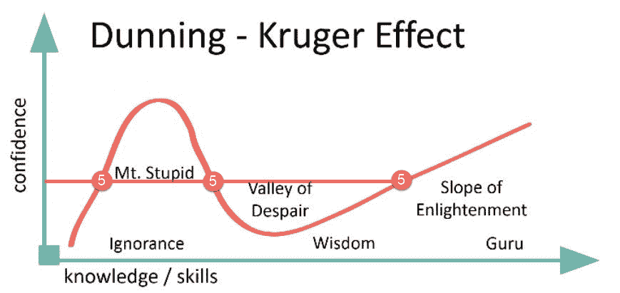
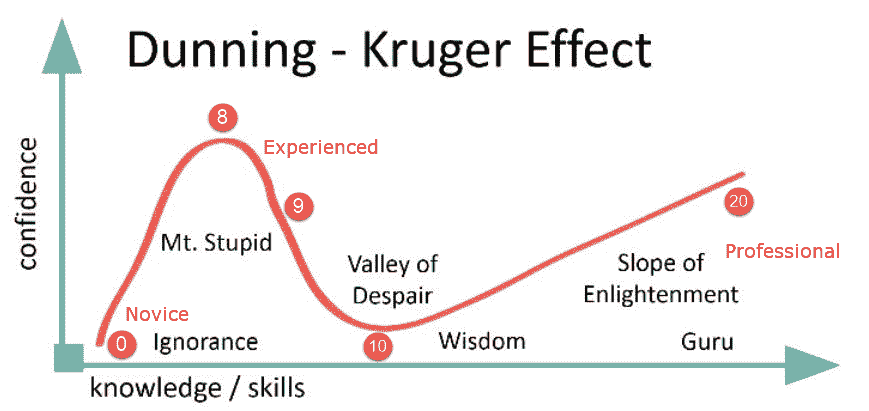
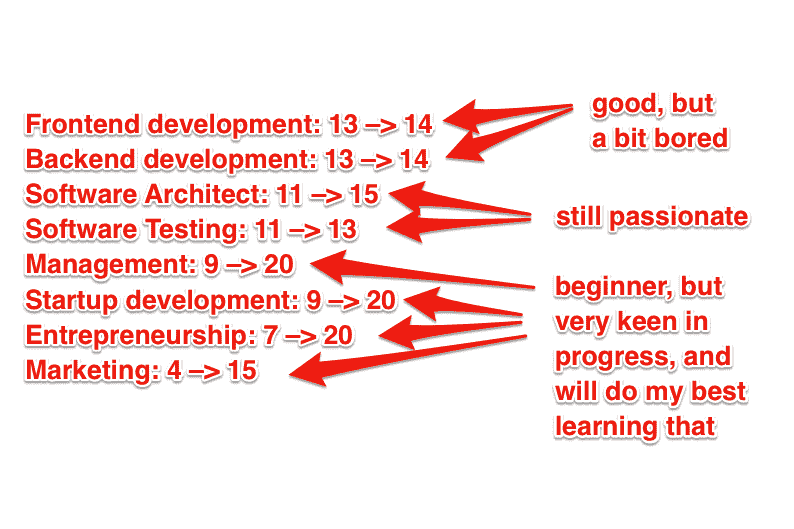

# 20/10 信心量表:建立伟大事业或梦之队的必备工具

> 原文：<https://medium.com/swlh/the-20-10-confidence-scale-the-necessary-thing-for-building-great-career-or-dream-team-ef6bf1825b43>

有些事情人们倾向于认为他们擅长。虽然有时这是真的，但最有趣的部分是关于我们对自己撒谎的事情。

**等等，等等，等等！谁在说谎，你刚才说我在说谎？**

是的，我知道它可能是什么样子:你偶然看到一个人的文章，文章开头的第一句话就是指控。对，就是这样，而且绝对有必要！只要和我多说几句，你就会明白为什么；)

这里有**两种情况**(只是路障的 2 面):

*   你开始学习一些东西，很快你会觉得自己比以前酷多了。而且，你比别人酷多了。是的，你得到了它——快速学习事物的超能力。耶！
*   你正在面试一个新人，申请你团队中的一个空缺职位。他听起来对自己的经验和技能非常自信，以至于你会立刻认为他是一名真正的专业人士。然后，你再深入一点，让他解决一个普通的任务，但他无法完成

我不确定……

好吧，事情是这样的——你可能认为自己是一个非常客观的人，但这也可能是一个陷阱。稍后，我会把你介绍给几个研究过我们的大脑和我们玩的很多游戏的人——我打赌你会感到惊讶(除非你已经听说过)。

所以，要么你能清楚地从上面看到自己处于其中一种情况，要么你强烈地认为这与你无关——我建议你熟悉一下我将要告诉你的事情。在这篇文章中，你会发现一些东西:

1.  为什么对自己的技能撒谎会影响你的职业生涯
2.  如何停止迷惑自己，最终得到“那个”工作(你不值得吗，嗯？)
3.  如何识别别人是否在对你说实话他们的技能(即使你认为你现在不需要它，但请相信我——这是一种真正的力量！)
4.  如何让自己和他人更清楚你想要实现的目标(你现在看不到其中的联系，对吧？稍等片刻，我会告诉你的)

**那么那 2 个聪明的呢？**

是啊！让我给你介绍一下**大卫·邓宁**和**贾斯汀·克鲁格** ( *如果你知道他们是谁，他们做了什么——你可以从下一节继续读——那里有很多有趣的东西！*)。这两个人把所有这些自我高估的东西放进一个漂亮的科学包装里，这就是现在所说的**邓宁-克鲁格效应**。再一次，让我们在现实世界中想象一下。

假设你正在面试一个全栈开发人员的职位。你让他从 0 到 10 评价自己的 Javascript 技能。他想出了数字“8”，但是当你让他解决一个简单的问题时，他却做不到。

好吧，好吧，数字“8”是你很少愿意接受的。为什么？因为那些知道这个话题的人可能会低估他们的技能，而那些很难达到 5 级的人可能会高估他们。

在上面的图片中，你可以看到邓宁-克鲁格“行动中”的形象。不严格地说，倾向于高估自己为专家的人缺乏全局(这本身伴随着能力)来看他们有多无能。

这种情况经常发生在已经获得基本理解的初学者身上。在 IT 领域，这一点似乎尤为重要——想想该领域有多少自学成才的人吧！

好吧，很好，但是我如何在实践中使用它呢？

这是我问自己的问题！是时候做一个小小的思维练习了:)

不，不要担心我们不会去解数学方程——相反，我们会摆弄一下邓宁-克鲁格效应的图表。再回到图表上来:也许，如果我们把一些点放进去，我们可以更好地理解它。让我们在“信心”轴上计算 10 个单位。现在，如果我们画一条穿过第五个的线呢？让我们看看！

**嗯，我现在该看什么？**

哈哈，是啊，我们都去过！可视化的唯一事实并不意味着你应该立即理解那里正在发生什么。别担心，我会向你解释我们在找什么。

让我带你回到我们通常评估彼此技能的方式。从 0 到 10，对吗？但是难道我们都没有经历过这种方法是多么有限吗？尽管你是个初学者，但当你觉得自己做得很好时，你的自我意识可能不允许你用低于 5 分的分数来评估你的技能。然而，如果你有一个更大的 20 分的范围，可能会有更多的可能性以更现实的方式评估自己。

**等等，这只是一个尺度的问题吗？**

这个问题问得好！当然不仅仅是规模的问题。我相信这更多的是关于给你自己的成长尺度加上临界点，并且能够合理化你给自己的分数。这就是为什么我们需要探索邓宁-克鲁格效应。

是的，一切都在一起了！现在，如果你在邓宁-克鲁格效应图上画出你的 20 点，你会发现它更有意义。此外，很明显为什么很难将整个自我评估归入通常的 10 分。

好吧，魔法！那是什么意思？具体来说，只要回忆一个你从职业或教育生活中了解的好的主题。这是什么，举个例子？而不是关注第 8 点和第 10 点。如果你从来没有对某件事情的复杂性感到痛苦(9-10 分)，并且你对此很有信心，那很可能你只是一个初学者(好吧，好吧，天才)，你应该使用数字 0-8。如果你知道曾经有一段时间你对某件事非常自信，但现在你一点也不自信了，那么你就在第 9-10 点，这是衡量你绝望程度的标准。别担心，很快就会好很多。如果你觉得自己很专业，但是缺乏知识，那就在你的直觉“满分 10 分”评估中加上 10 分，你会得到一个 10 到 20 分的数字，这将是你在这个尺度上真正的专业水平评估。轻松点。

因此，我建议在评估自己的技能或他人的技能时，使用 20/10 的方法。说清楚一点，我们假设你在应聘一个工作岗位，面试官在要求你对自己的技能进行评价。对于后者，你可以说这样的话:“信心指数 9 分，满分 10 分，满分 20 分”。还有，如果你说:“论 SDK(谢尔坚科-邓宁-克鲁格)的规模”，我也不会有什么反对的。解释一下邓宁-克鲁格效应——相信我，你会让人印象深刻！

**不，不仅仅是这样！**

我相信每个人都包含了他现在的 50%和他想成为的 50%，这意味着如果你能表明你的目标是什么，你就有更高的可能性得到公正的评价。让我们看看如何使用“20/10”来实现这一点。

如果你想表现出你是 Python 初学者，但想成为专业人士，可以标记为“3-> 15”。或者你可以用下面的方式表明你对提高自己在某个领域的技能不感兴趣:
“11->11”。例如，我是这样规划我的技能的:

*   前端开发:13 –> 14
*   后端开发:13–14 年
*   软件架构师:11–15 岁以上
*   软件测试:11–13
*   管理层:9 –> 20 岁
*   创业发展:9 –> 20
*   企业家精神:7 到 20 岁
*   营销:4–15 岁以上

**其他人呢？**

当然，我们谈论的主要是自我评价。让我们考虑一个场景，您想要雇用一名新的开发人员。所以在一次工作面试中，候选人说他在这个领域的技能是满分 10 分中的 5 分。以下是你可以找出真相的一些步骤:

1.  根据他多年的经验来核对他所说的话
2.  找出他曾经面对和解决过什么样的问题
3.  问他一些棘手的问题
4.  给他点东西解决

如果你依靠 20/10 的方法和邓宁-克鲁格效应，你会发现问恰当的问题更容易。还有，你可以把这种做法告诉候选人，让他对自己做出相应的评价。这将简化评估过程，并给你一个与潜在员工合作的基础。

关注你的职业生涯！祝你在 5 年内(或任何你觉得合适的时候)成功成为一名专业人士。当然，如果您有任何问题和/或建议，请不吝赐教。

## 这篇文章发表在[《创业](https://medium.com/swlh)》上，这是 Medium 最大的创业刊物，有+ 374，357 人关注。

## 订阅接收[我们的头条新闻](http://growthsupply.com/the-startup-newsletter/)。

