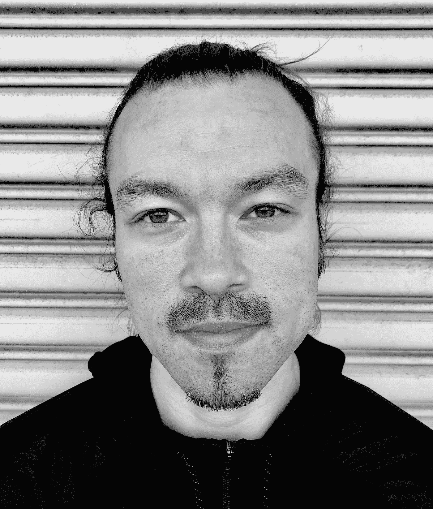
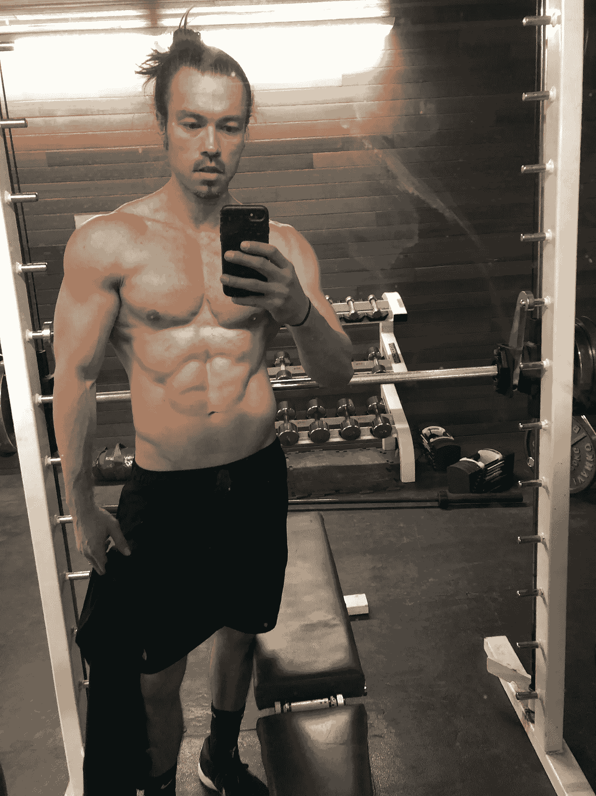

# 2018 年年终反思

> 原文：<https://medium.com/swlh/the-2018-year-end-reflection-21e66e578363>

## 一个小时的写作练习，帮助你欣赏你的胜利，找出你的弱点，并计划一个高影响力的 2019 年。

几年前，我开始了一项我认为会成为自己年度传统的活动。

这叫做 ***年终反思*** 。

在一年中的这个时候，我们倾向于关注来年的下一步。

虽然规划未来是一个很好的举措，但我们不能忘记反思过去的 12 个月，因为它向我们展示了什么是可行的，什么是不可行的，以及我们可以在哪里更好地利用我们的精力。

# 什么是年终反思？

花时间反思过去是一种被低估的行为。为什么？因为过去会留下线索。如果我们用这些见解来影响我们未来的决策，它们可以为我们节省大量的时间、精力和资源。

在体育运动中，这是成功的一个重要方面。教练组要求队员观看比赛录像，剖析哪些地方做得好，哪些地方做得不好。通过这样做，它揭示了优势和劣势。观看比赛录像的行为有助于球员(和教练组)从过去和未来的正确道路中学习。

在没有观看游戏影片或进行回顾的情况下，团队及其领导层只是在猜测未来的最佳战略和战术。

同样的概念也适用于我们的个人生活。动态是不同的，可能需要更多的纪律，因为你和我都是我们自己游戏中的教练和玩家。为了克服这个限制因素，明智的做法是尽可能简单地做这个练习。

为了做年终反思，问自己三个简单的问题:

1.2018 年有哪些顺利的事？(我的胜利是什么？我做对了什么？我应该继续做什么？)

2.2018 年有哪些不顺利的事？(我哪里做得不够？有哪些需要改进的地方？)

3.2019 年需要编辑什么？(我需要在哪里下车？我需要停止做什么？我的生活需要削减什么？)

下面我分享一下我的回答，以展示年终反思:

# 2018 年有哪些顺利的事？(我的胜利是什么？我做对了什么？我应该继续做什么？)

## A.媒体上的顶级作家

写作是我优先考虑的事情之一。虽然荣誉只是工作的副产品，并不是我写作的原因，但你的努力得到认可总是件好事。

[由于 Medium 是少数几个发表好内容的地方之一](https://el2.convertkit-mail2.com/c/preview/dpheh0hz/aHR0cHM6Ly9tZWRpdW0uY29tL0BpdHNicmlhbm1jZmFkZGVu)，我很自豪地说，我在这个平台上被选为以下领域的顶级作家:

*   心理健康
*   诗意
*   灵感
*   爱
*   生活课程

## B.价值驱动的 Instagram 帖子

2018 年，我做了这个决定，用我的 Instagram 账号作为教学的工具。

换句话说，我在自己的 [mcfaddenfitness IG 页面上创建和发布的大部分内容都是价值驱动的。](https://el2.convertkit-mail2.com/c/preview/e5uph7h9/aHR0cHM6Ly93d3cuaW5zdGFncmFtLmNvbS9tY2ZhZGRlbmZpdG5lc3Mv)

我想，既然 Instagram 的日访问量比我自己的网站多一些，我还不如在那里发布我所有最好的作品。

我真的很喜欢通过这个平台教学，因为它迫使我变得精确、实用和直接。

我每天都在发帖，所以如果你喜欢关于健身和健康的简短、简单和有用的建议，请在 Instagram 上关注我。

## C.我们与焦虑

[美国 vs 焦虑](https://usversusanxiety.com/)贴近我的心。这是一个基于故事的品牌，将不同背景、经历和环境的人们团结在一起。

从讲故事的角度来说，我认为这是我写过的最好(也是最短)的故事。

这三个词——我们与焦虑——讲述了许多人的感受。

它还邀请你加入一个由志同道合、季节相似的人组成的部落。也就是说，这个故事触动了我们内心深处的情感共鸣，这种情感共鸣与我们对归属感的需求息息相关。

这是我在今年最后一个季度开始的一个小小的个人项目。但是反响真的很好，和其他人的几次交谈让我相信这个项目还有发展的空间。

关于这个项目的更多细节和如何参与的信息，[点击这里](https://usversusanxiety.com/)。

2019 年，我将探索“我们与焦虑”将走向何方。

## D.日本+茁壮成长法

我在健身行业已经 10 多年了。在这段旅程中，我创建了一个“剧本”，指导整个人，而不仅仅是他们的组成部分。这叫做茁壮成长法。

我认为这是最有效的方法之一，有助于最佳表现、运动发展和整体健康。

这是我被邀请去日本的主要原因。

我的朋友约什·柴尔德里斯需要有人在健身房训练他的运动专项计划，提供符合运动营养原则的高营养膳食，让他对有针对性的恢复策略负责，并帮助他发展思维。

THRIVE 方法检查所有这些框。

下面是我在我的 [Instagram 账户](https://www.instagram.com/mcfaddenfitness/)上发布的茁壮成长方法

我来到日本有一个特殊的原因。
。在我逗留期间，我将和我的朋友约什·柴尔德里斯一起工作。在他为日本 B 联赛职业队 Neo Pheonix 效力期间，我将负责他的训练、营养、再生和心态发展。
。
我们将利用我称之为茁壮成长的方法。这是我在这个行业中 10 年来开发的一个“剧本”。茁壮成长法建立在四个支柱上
。
1。心态。你需要每天训练你的大脑。只需要 10 分钟。这一习惯有巨大的潜力。它有助于注意力、创造力、生产力、同情心和情感灵活性。至于身体成分，它有助于调节皮质醇水平，这一点很重要，不管你的具体目标是什么。关于运动表现，冥想也提高了我们不“过度认同”思想或情绪的能力。也就是说，我们更善于注意自己的想法/情绪，而不会被它们吞噬。
。
2。再生。我们在健身房进行的训练很大程度上依赖于我们从身心压力中恢复的程度。最终目标是移情。我们希望训练在球场上实现。因此，我们非常重视恢复营养、对比疗法和睡眠。但是如果你想看起来更好，表现更好，感觉更好，你需要优先考虑再生。
。
3。营养。不要把这个复杂化。你需要关注质量来获取微量营养素。你还需要关注数量，以达到你的宏量营养素。两者都很重要。(我将为他准备食物，以确保这一切发生)。
。
4。运动。我给他的训练计划是关于他的运动项目。也就是说，该计划是为了实现和提高运动潜力，使其转移到球场上。

** * *注:再次参与篮球运动让我真正看到了运动营养、循证运动训练、心态发展和恢复方面的机会。*

*前几天，当我思考篮球运动和茁壮成长方法时，我写下了一些短语*

*答:运动员负担不起随机锻炼*

*b .运动员无法承受随意的营养计划*

*c .运动员不能进行随机恢复套路*

如果你是一名教练、运动员、运动指导、技能教练(或参与任何级别的游戏)，并且你觉得 THRIVE 方法是你感兴趣的东西，那么让我们联系吧。给我发邮件，我会回复的，这样我们可以约个时间聊聊。

## E.在日本学到的生活经验

日本提供了一种与我和我的家人所习惯的截然不同的生活体验。

在我在这里的这段时间里，我学到了以下几点:

心智模型是我们思考现实世界中事物的方式。我们使用心智模型来联系我们自己的观点。有成千上万的心智模型，但是为了这篇文章，我想分享并强调其中的一个:强迫功能。
。
强迫职能被定义为任何迫使你采取行动并产生结果的任务、活动或事件。
。
自从来到日本，压力功能确实影响了我的观点、效率和热情。
。
1。视角。我们缩小了生活中的主要领域。我们在美国有一个更大的家，但现在我们住在一个两居室的公寓里。你猜怎么着？我们很好。事实上，在很多方面，我们拥有更少的空间更好。它迫使我们注意我们的消费。住在更小的地方意味着我们拥有更少的不必要的东西(衣服、垃圾抽屉、耐克等等)。
。
2。生产力。在来日本之前，我检查了自己的精力和注意力。换句话说，当我在这里的时候，我仔细观察了我每天将如何花费我的精力/注意力。我承诺做得更少，以便在我说“是”的领域做得更好。这种情况下的强迫函数是基于我在能量管理方面的研究。对于不同媒介的大多数人(运动员、企业家、艺术家等)，每天复杂工作的门槛大约是 4 小时。也就是说，明智的做法是找出如何利用你每天最好的时间来获得最好的回报。每天我都围绕着我需要完成的最艰巨的任务来计划我的 4 个小时。
。
3。激情。我在日本做一项特定的工作，这项工作也起强迫作用。在这项任务的众所周知的范围内，我的目标是增加价值和提高峰值性能。这种高度特定的环境证实了我的热情，并准确地反映了我的个人生活目标:帮助他人成为最具适应性和弹性的自我。
。最后一句话:当我们过得舒适时，考虑改变一下。当我们认为我们已经想通了，进入一个你没有所有答案的情况。当我们认为我们的方式是唯一的方式时，找一个地方从不同的角度看问题。

## F.每天锻炼一次(而且是我一生中最好的状态)

这是我个人的巨大胜利。多年来，我一直在努力不让健身房控制我的生活。换句话说，我通常有每天做 2 次，有时 3 次的冲动，认为越多越好。

越好越好。句号。

就我而言，在人生的这个季节保持最佳的身体和精神状态意味着每天在健身房集中锻炼 60-70 分钟，每周 4-5 次。

Me at almost 34 years old.

这就是我今天的样子(我不知道我有多重，也不知道我的体脂水平是多少)。但是，我在健身房里感觉像一头野兽，我喜欢我在镜子里看到的。所以，我很开心。

# 2.2018 年有哪些不顺利的事？(我哪里做得不够？有哪些需要改进的地方？)

2018 年，我没有很好地管理我的电子邮件列表(包括你)。对于这种管理上的缺失，我深表歉意。

我没有定期给你发邮件的部分原因是因为我想确保我的时事通讯有用。

因此，我停止了给你发邮件，因为我觉得我的方法不够严谨、直接和实用。

但我对 2019 年有个想法。一次，也许一个月两次，我在考虑给你发一个简讯，标题是， [***简单的建议，复杂的时代***](https://app.convertkit.com/landing_pages/299145?v=7) ***。***

复杂时期的简单建议是没有噱头，没有垃圾邮件——只是我分享我最好的东西。如果你想要诚实的策略，行之有效的战术和有用的故事来简化你的健身，提升你的注意力和健康水平，那么这封电子邮件简讯就适合你。

这份简讯的概念是简短、直接和有用。

我会把我所有的 Instagram 帖子整理成时事通讯，里面塞满了可行的建议和实用的策略，帮助你成为最具适应性和弹性的自己。

你怎么想呢?你会打开并阅读这样的时事通讯吗？

# 3.2019 年需要编辑什么？(我需要在哪里下车？我需要停止做什么？我的生活需要削减什么？)

2019 年我需要对大多数事情说“不”。

我已经围绕我生命中的一些重要项目创造了动力，现在是时候在这几件事情上进入“飞行模式”以加强它们中的每一件了。

本月，我重读了一本名为《Wabi-Sabi》的书，这本书面向艺术家、设计师、诗人、哲学家，书中有几个词是我在 2019 年创造的真正的北方:

*“削去精华，但不去诗意。保持东西干净无阻碍，但不要消毒。”*

# 2018 年最喜欢的事

**最喜欢的名言:**

“不要害怕没有尽头的工作。”-拉比·纳塔恩

**最喜欢的书:**

Hagakure:武士的秘密智慧

# 再见 2018。你好 2019。

感谢阅读。

如果你写下自己的年终反思，我很乐意阅读并分享基于我们各自反思的想法。给我发邮件到 brian@mcfaddenfitness.com。

你可以点击这里加入《复杂时代的简单建议》时事通讯。

*   布赖恩

## 这篇文章发表在 [The Startup](https://medium.com/swlh) 上，这是 Medium 最大的创业刊物，有+403，714 人关注。

## 订阅接收[我们的头条](http://growthsupply.com/the-startup-newsletter/)。

