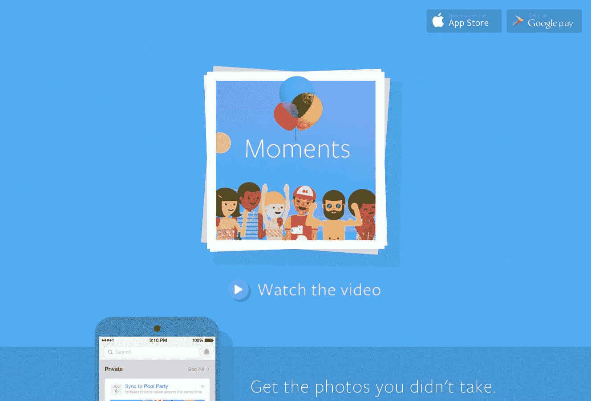
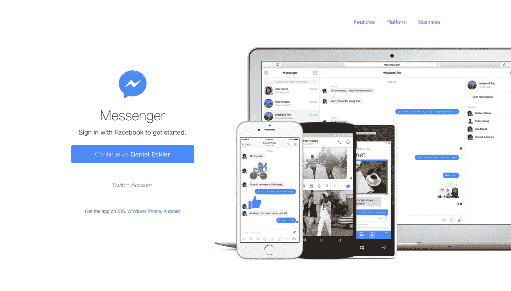
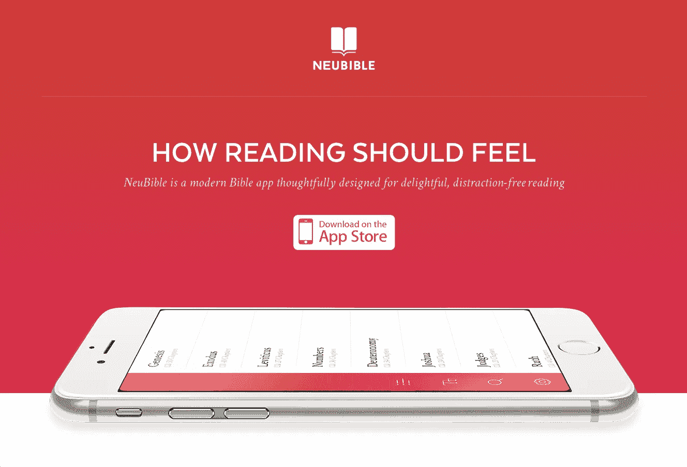

# 2015 年 21 个设计最佳的应用登陆页面

> 原文：<https://medium.com/swlh/the-21-best-designed-app-landing-pages-of-2015-bb8f365c19e6>

## 以及它们有效的 6 个原因

手机是这一代人的主要计算平台，但许多人仍然从传统网站上发现和下载应用程序。

自从 app store 推出以来，我们已经看到无数关于登陆页面灵感和优化的帖子，这些帖子通常吹捧显而易见的东西:展示一个好处；建立明确的行动号召；在文件夹上方放置一个下载按钮，等等。

2015 年，这些模式已经固化，并继续演变。请参见下面的年度最佳应用登陆页面。

> 额外奖励:参见 2015 年的 [21 款最佳设计应用。](/@danieleckler/the-21-best-designed-apps-of-2015-6e1bc2f459d3)

# 操作员

## (单个非滚动页面)

[Operator](https://operator.com/) 是 2015 年向非滚动登陆页面大转变的最好例子。

在保持视觉清晰度的同时，在一个页面上介绍一个应用程序，阐明它的价值，并提供下载是非常困难的。Operator 在这三个方面都做得非常出色，为页眉和页脚链接留出了空间。一个友好的表情符号甚至欢迎访客加入该应用的等候名单。

# Mylo

## (应用预览)

预览应用程序的功能是当今登录页面的一个重要功能，其中许多都集成了演示视频。 [Mylo](http://www.okmylo.com) 今年做得最好，实现了自动播放功能和旁白(默认为静音)，这清楚地说明了该应用的价值。

继轰动之后，Mylo 用时尚的全屏摄影向游客介绍了它的应用程序、品牌和价值观，突出了该公司简单生活的哲学。

*声明:我是 Mylo 的创始人。*

# 斯威夫特

## (现场应用程序演示)

[Swifty](http://swifty-app.com/) 今年将应用内演示提升到了一个新的高度，它提供了一个现场演示，鼓励用户在登录页面上测试应用。

如果你与演示互动，你会收到你的第一个一分钟课程，随后是今年出现的另一个趋势:用“获取应用程序”取代“在应用程序商店下载”，反映了应用程序商店最近在语言上的转变。

# 脸书时刻

## (视频)

解说视频在登陆页面上并不是什么新鲜事，但是 [Moments](http://momentsapp.com/) 视频的制作价值，以及它与浏览器的完全无缝集成，确实是如此。

播放器完全嵌入到浏览器中，视频的第一个屏幕与登录页面相匹配，这使得 Moments 网站可以从浏览器无缝过渡到视频。该视频清晰、生动、独特，解释了该应用的价值，但几乎没有展示它。

# 脸书信使

## (跨平台)

移动应用程序越来越不仅仅是移动应用程序:它们正在成为跨平台战略的一部分，该战略鼓励用户在任何具有可传输数据和一致体验的设备上进行连接。

除了展示它们在手机中的普遍性， [Messenger](https://www.messenger.com/) 还在背景中包含了该应用程序的笔记本电脑视图，这表明 Messenger 是一个跨平台的应用程序，可以在任何地方使用。添加一个集成，保留你的脸书登录，并以名字问候你，而不是要求你登录(上图没有)，你就有了一个消息应用程序，感觉它会跟随你到任何地方。

# 特里佩奥

## (富媒体)

凭借其引人注目的单页叙述和用户应用体验， [Trippeo](http://www.trippeo.com/) 成为 2015 年互动设计、富媒体集成和数字广告的最佳登陆页面。

该网站实现了流畅的动画流程，微妙(但有效)的视频使用，并通过一个简单的故事讲述了明确的价值主张。然而，像这样的网站是否会转变是值得怀疑的。无论哪种方式，浏览都是一种享受。

# 15 个更加鼓舞人心的登录页面

感谢您浏览之前的六个登录页面以及它们强调的 2015 年趋势。下面是 15 个更鼓舞人心的页面，别忘了查看 2015 年 [21 个最佳设计应用](/@danieleckler/the-21-best-designed-apps-of-2015-6e1bc2f459d3)和[在 Twitter 上关注我](https://twitter.com/mylo_daniel)。

如果我错过了什么，请在评论中告诉我，我会定期更新帖子或者在年底再写一篇。

> 如果你喜欢读这篇文章，请点击页脚的♥按钮，这样更多的人可以欣赏伟大的设计！

## 大家好，我是[丹尼尔](http://www.danieleckler.com)。我创办了一些公司，包括 Piccsy (acq。2014)和 EveryGuyed (acq。2011).我目前对新的职业和咨询机会持开放态度。通过[电子邮件](mailto:hi@danieleckler.com)联系。

## [孔](https://kong.wtf/)

## [潜望镜](https://www.periscope.tv/)

## [条纹](https://stripe.com/dashboard/iphone)

## [黑色](http://blackapp.photo/)

## 新圣经

## [过滤器](http://flyosity.com/filters)

## [ToDoist](https://todoist.com/iphone)

## [面孔](https://faces.fiverr.com/)

## [GameIt](http://gameit.us/)

## [卡塔尔](https://www.qapital.com/)

## [文档准备](http://www.docady.com/)

## [里松](http://rizonapp.co/)

## [Peeq](http://www.pq.am/)

## [城市步行街](http://urban-walks.com/)

## [QuizUp](https://www.quizup.com/en)

.

> 如果你喜欢读这篇文章，请点击页脚的♥按钮，这样更多的人可以欣赏伟大的设计！

嗨，我是丹尼尔。我创办了一些公司，包括 Piccsy (acq。2014)和 EveryGuyed (acq。2011).我目前对新的职业和咨询机会持开放态度。通过[电子邮件](mailto:hi@danieleckler.com)联系。

# 你可能也会喜欢:人性化设计

我写的一篇互动文章，探索了拟人化设计的过去、现在和未来。也可用作会议、活动等的演讲。

 [## 人性化设计

### 1950 年，美国心理学家哈里·哈洛进行了一项实验，将幼猴从它们的…

medium.com](/swlh/the-future-of-design-is-emotional-5789ccde17aa)