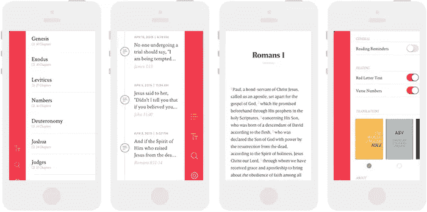

# 2015 年 21 款最佳设计应用

> 原文：<https://medium.com/swlh/the-21-best-designed-apps-of-2015-6e1bc2f459d3>

## 以及他们强调的必须知道的移动趋势

2015 年是正式的智能手表年，早期的估计表明，12 月将售出 3000 万块。当苹果透露其开发手表的计划时，铺天盖地的报道开始剖析利弊:我们需要智能手表吗？我们会吗？这对移动计算意味着什么？

> 在所有的炒作中，你可能已经忘记了智能手机的存在，尽管它们是市场上最重要的计算设备。

仅在 iOS 上就有 150 万个应用程序，而应用程序商店发现仍然不完善，因此跟上移动创新的步伐已成为一项挑战。也就是说，2015 年上半年是应用开发令人振奋的一年，尤其是在几个关键领域。在 2015 年过半之际，以下应用程序强调了移动领域最重要的趋势，并提醒我们应该花点时间从手表上抬起头来，将注意力重新集中到手机上。

> 额外奖励:参见 2015 年的 [21 个最佳登陆页面。](/@danieleckler/the-21-best-designed-app-landing-pages-of-2015-bb8f365c19e6)

# 贸易

在过去的几个月里，脸书、Twitter、Pinterest 和 Instagram 宣布整合购买按钮，社交网站终于试图在商业上获利。最近的这一尝试受到了亚洲主要通讯应用(最明显的是微信)的影响，这些应用使用户能够预约医疗预约、叫出租车或发送农历新年的数字现金红包。

> 社交网站最终试图在商业上获利

这些变化是否会产生影响(更不用说改变商业面貌了)还有待观察。手机现在在销量和流量上都超过了网络，但是只有少数手机第一的公司鼓励消费者在手机上购物。尽管这一领域的发展非常缓慢，但一些公司已经创造了真正有前途的移动商务体验…

## 操作员

你更愿意发短信:“为五个人预订@ Momofuku 7pm”还是加载你的 OpenTable 应用程序，滚动、点击并键入 5 分钟以获得相同的结果？

短信可以作为一个平台来运作的想法在今年获得了关注，让我们慢慢接近罗恩·卡普兰所说的“[对话式用户界面](http://www.wired.com/2013/03/conversational-user-interface/)这种转变是不可避免的，而短信作为探索的第一途径是完全有意义的。

运营商将自己定位为一个移动本地的短信专属网络，帮助你找到并购买任何你想要的东西。这听起来可能有点复杂，但仔细观察，它非常简单:写一个文本，得到你想要的。希望运营商将很快摆脱其私人测试状态，让每个人第一次体验购物的光明未来。

## Mylo

近年来，投资者已经注意到了时尚，但注意力主要集中在传统的电子商务机构，这些机构更喜欢实体扩张，而不是创新技术的发展:这就引出了一个问题，这些公司真正具有颠覆性的是什么？

进入 [Mylo](http://www.okmylo.com) :一个神奇的按钮，它会在瞬间提出着装建议之前分析你衣柜里的每一件衣服。更好的是，它可以探出头来查看天气，调查你的日常活动，以完善它的建议。

Mylo 汇集了来自全球各地商店的商品，将它们呈现在一个简单、有凝聚力的界面上，看起来和感觉上都像是一家商店。加上一个统一的收银台，我们就有了一个最新的例子，斯科特·贝尔斯基称之为一站式男装店中的“[界面层](/bridge-collection/the-interface-layer-when-design-commoditizes-tech-e7017872173a)”。

*声明:我是 Mylo 的创始人。*

*优秀奖*

*   [**Canopy**](https://canopy.co/app)**(2014 年末)**:为亚马逊策划的店铺。Canopy 为互联网上最大的产品目录带来了精品策展。
*   [**Spring**](https://www.shopspring.com/)**【2014 年末】** : Spring 在单个应用中拥有 700 多个品牌，让你可以关注品牌、浏览收藏夹、探索由行业影响者策划的系列。

# 生产力

如今，手机几乎在各个方面都优于传统计算平台。然而，2015 年是这种情况开始改变的一年，因为生产力应用程序和移动操作系统的增强功能将更多的时间从键盘和鼠标上移开。

> 除了工作场所，移动设备现在几乎在每个方面都优于传统计算平台。

苹果最近发布的多任务声明以及 Slack 的空前成功应该清楚地表明，目前台式机/笔记本电脑对生产力的束缚将很快被放松。这进一步证明了…

## 日出相遇

创业公司一直试图重新发明日历，就像他们试图重新发明电子邮件一样。 [Sunrise](https://sunrise.am/meet/) 对于谷歌日历来说，就像几年前邮箱对于 Gmail 一样，但有一点值得注意:它作为一个键盘嵌入到你的手机中，允许你在应用程序中设置活动，而无需实际打开它。

假设“[应用已死”](https://blog.intercom.io/the-end-of-apps-as-we-know-them/)，数字交互的未来是对话式的(见上文运营商)，那么这是移动的关键时刻。希望 Sunrise 将引发一场重大转变，即将应用[集成到操作系统层](/@mg/there-s-a-chat-for-that-apple-s-biggest-platform-opportunity-yet-19d5b1870857)和其他平台，如 Facebook Messenger 或 Mailbox。

## 多方面的

[**Niiice**](https://niice.co/)**:**Niiice 让你简化自己的创作过程。在网络上搜索灵感，并将其收集到智能 moodboards 中。

[**Hopper**](http://www.hopper.com/)**:**Hopper 提供有洞察力的、数据驱动的研究，帮助旅行者更好地决定去哪里、何时乘坐飞机和购买。

[**时间轴**](https://itunes.apple.com/us/app/timeline-news-in-context/id948867534?mt=8) **:** 联系上下文获取今天的新闻。时间轴可以让你滚动浏览一个故事的历史，这样你就可以了解新闻是如何到达那里的。

[**工作流**](https://workflow.is/)**(2014 年末):**工作流帮助你从 iOS 主屏幕在多个应用中执行多个操作，以非常巧妙的方式修复了一个关键的可用性问题。

# 这还不是全部

社交已经基本为移动所用，剩下的商业和生产力是主要的开发市场，但是还有什么其他有趣的移动应用被开发出来呢？

## 现场视频:潜望镜和猫鼬

[潜望镜](https://www.periscope.tv/)和[猫鼬](https://meerkatapp.co/)的出现是*2015 年的*移动故事，随着这两款应用争相成为直播视频的领导者，它将继续获得动力。

这两款产品的外观和手感都很流畅，引导用户相对轻松地体验全新的体验。不过，两者都有一些突出的设计挑战需要解决，随着它们的发展，新的解决方案很可能会出现

社交媒体目前似乎已经饱和，但有趣的新产品仍在不断涌现，视频可能会成为下一个十年的竞争者。在 2015 年剩下的时间里进行了一些更新和设计改进后，可以肯定的是，到今年年底，这两种应用程序将会有相当不同的体验。

## 互联网艺术:变形金刚

互联网艺术是一个未被重视、未被充分代表的领域，正在迅速走向成熟。如果你在好奇的思考:“什么是互联网艺术？”你并不孤单。很有可能，在某个时候，你已经随机点击并迅速忽略了像[无用网络](http://www.theuselessweb.com/)这样的网站上的流行作品，如[猫反弹](http://cat-bounce.com/)、[缓存莫奈](http://cachemonet.com/)或[惊人之美](http://www.staggeringbeauty.com/)。也许你遇到过[电动物品](https://www.electricobjects.com/)或者是[拉斐尔·罗森达尔](http://www.newrafael.com/websites)的 100 多件作品的主题(其中许多已经像“真正的”艺术品一样被出售)。

从技术上来说， [Metamorphabet](http://metamorphabet.com/) 是一款游戏，但在定义松散的互联网艺术类别中，它肯定没有什么不合适的地方。Fast Co 的约翰·布朗利说，“这有点像由制作黄色潜水艇的人制作的芝麻街片段。”每一个屏幕、交互和动画都设计得非常漂亮。

Metamorphabet 背后的公司 Vectorworks 多年来一直在创作网络和移动作品，但这是他们在长期中断后的第一次发布，希望它能引发一场类似于网络的移动艺术运动。

*优秀奖*

*   [**跑过 6**](https://itunes.apple.com/us/app/runnin-through-the-6/id935185650?mt=8) **:** 像德雷克一样跑过多伦多的街道。你每跑完 6 次就会多 100 次灾难。
*   [**GeekWatchApp**](https://itunes.apple.com/us/app/geek-watch-retro-calculator/id985804550?mt=8) :把你的高科技 Apple Watch 变成复古的、卡西欧风格的计算器。
*   [**我的偶像**](http://appmyidol.com/)**(2014 年末):**上传一张自拍，给你的头像造型，看着你的摇头头像表演你最喜欢的曲目。
*   [**Poo Time**](https://itunes.apple.com/us/app/pooptime/id492081982?mt=8)**(2014 年末):** Poo Time 是一个娱乐频道和便便追踪 app。再也不会无聊上厕所了！

## 印刷已死:新圣经

[NeuBible](http://www.neubible.co/) 回答问题:如果用 Medium 设计圣经会是什么样子？

不管你的宗教信仰如何，NeuBible 都是一个必看的网站，因为它干净的视觉设计，完美的突出功能，最值得一提的是它流畅、直观的交互。由于有一个非常规的侧边导航和六个从左到右排列的窗格，你可能会认为这是一个导航灾难。恰恰相反，它是完全无缝的。

然而，这里真正的故事，是对有史以来流传最广的书的当代重新诠释。随着本月早些时候苹果新闻在 WWDC 的发布，我想我们可以确认印刷终于死了。

## 离线->在线:灵魂循环

在 WWDC，苹果自豪地宣布 98%的财富 500 强公司现在都有应用程序。每一个大企业都知道向移动的过渡有多重要，但是这些仓促的、半生不熟的尝试往往会导致丑陋的、非功能性的产品，这些产品可能根本就不应该被开发出来。

线下将不得不转移到线上才能生存，尽管 Soulcycle 应用缺乏创新，但它是一个很好的例子，说明一家公司如何从线下转移到线上，而不重建他们的整个业务。

Soulcycle 肯定不是最大的线下公司(这可能是他们能够成功实现这一目标的原因)，但他们无疑为一个简单、漂亮、用户友好的应用程序设定了标准，该应用程序的性能完全符合客户的要求。从客户体验的角度来看，这项工作肯定会取得成功。

## 荣誉奖

*   [**Ello**](http://appstore.com/ello/ello)**:**Ello 是一个漂亮的无广告社交网络，感觉像是 Tumblr x 脸书的混合体，2015 年更新。
*   [**Highball 鸡尾酒**](https://itunes.apple.com/us/app/highball-share-collect-cocktail/id973319934?mt=8) : Highball 可以让你收集和分享鸡尾酒配方，界面时尚。
*   [**Bookmarq**](https://itunes.apple.com/us/app/bookmarq-book-suggestions/id980166926?mt=8) :干净利落的设计，Bookmarq 是和朋友一起阅读的最佳方式。
*   [**密度**](http://www.density.io/) :一个城市的心跳，密度衡量的是进出当地商户的人流量。
*   **2014 年末申请:** [中型](https://medium.com/m/app)，[储备](https://reserve.com/)，[便士](http://www.getpennies.com/)，[产品猎取](https://www.producthunt.com/apps/ios)，[脸书集团](http://www.facebookgroups.com/)。

# 展望未来

感谢你花时间查看 2015 年迄今为止最有趣的应用。2015 年上半年是充满希望的一年，为最后半年干杯。如果你认为我可能错过了一些你最喜欢的，不要犹豫让我知道，我很乐意谈论它。

别忘了查看 2015 年 [21 个最佳登陆页面](/@danieleckler/the-21-best-designed-app-landing-pages-of-2015-bb8f365c19e6)和[在 Twitter 上关注我](https://twitter.com/mylo_daniel)。

> 如果你喜欢读这篇文章，请点击页脚的♥按钮，这样更多的人可以欣赏伟大的设计！

大家好，我是[丹尼尔](http://www.danieleckler.com)。我创办了一些公司，包括 Piccsy (acq。2014)和 EveryGuyed (acq。2011).我目前对新的职业和咨询机会持开放态度。通过[电子邮件](mailto:hi@danieleckler.com)联系。

# 你可能也会喜欢:人性化设计

我写的一篇互动文章，探索了拟人化设计的过去、现在和未来。也可用作会议、活动等的演讲。

 [## 人性化设计

### 1950 年，美国心理学家哈里·哈洛进行了一项实验，将幼猴从它们的…

medium.com](/swlh/the-future-of-design-is-emotional-5789ccde17aa)