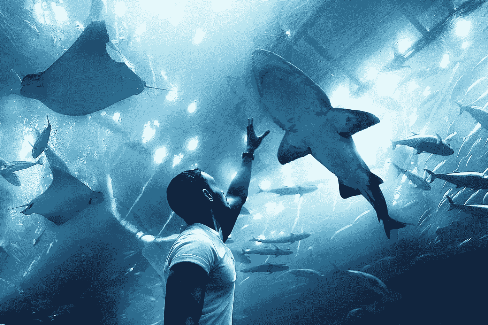
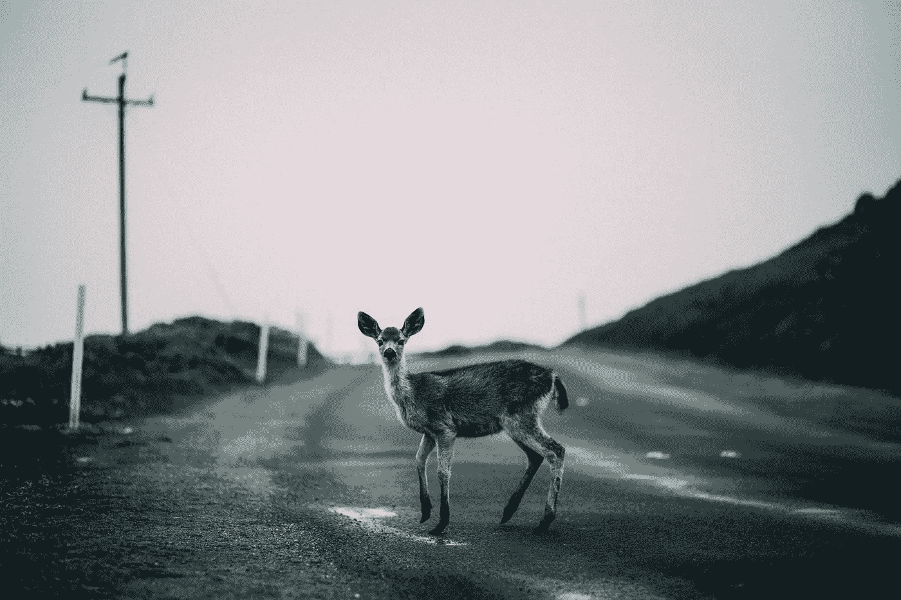
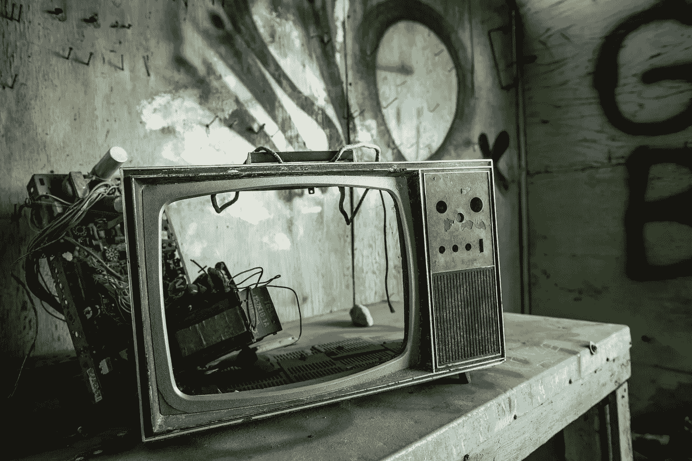

# 生活中最重要的 22 个警告

> 原文：<https://medium.com/swlh/the-22-most-important-warnings-in-life-ee8895ffb5ab>

Photo by [Moon](https://unsplash.com/photos/ku4RG5r43cQ?utm_source=unsplash&utm_medium=referral&utm_content=creditCopyText) on [Unsplash](https://unsplash.com/search/photos/woah?utm_source=unsplash&utm_medium=referral&utm_content=creditCopyText)

互联网上关于自我提升和 T2 自我成长的许多讨论都涉及到你应该做什么或者你应该在生活中采纳什么。

经常(至少我发现)我们会被一个专家告诉我们“跳”而另一个作家告诉我们“蹲”所淹没。

这些不同叙述的繁琐似乎只会导致我们中的许多人像“车灯前的鹿”一样完全静止不动。

Photo by [Steven Pahel](https://unsplash.com/photos/q5rP88HsYN0?utm_source=unsplash&utm_medium=referral&utm_content=creditCopyText) on [Unsplash](https://unsplash.com/search/photos/deer-in-the-headlights?utm_source=unsplash&utm_medium=referral&utm_content=creditCopyText)

在我短暂的成年生活中，我经历了许多起起落落，也许还有更多的跌宕起伏。

在花了一些时间思考这些经历后，我开始明白在生活中有一些*警告*是人们应该认识到的。

这些警告中的一些是物理性质的，而一些警告则局限在人类思维的范围内。

不管性质如何，识别你生活中的这一警告，然后采取必要的步骤来克服或摆脱这一因素，是建立自己并积极向前发展的关键。

# 你的便便从来都不是固体。

这可能很粗糙，但确实是真的。你的便便是什么样的？是固体吗？水多吗？它燃烧或伤害吗？你的排泄物是你内在健康的重要指标。

# 你用优步送麦当劳(或任何快餐/外卖)。

我的意思是来吧…

虽然习惯性地独自吃这种食物是不好的，但你甚至不能走出你的住所，为自己寻找食物。

再来一次…来吧。

# 你认为五分钱乐队是个好乐队。

不需要解释。

# 你花在酒吧的时间比花在咖啡馆/图书馆的时间还多。

虽然我完全赞成出去，在欢乐和欢呼中度过时光，但当酒吧成为每周——或者每天的例行公事时，是时候盘点一下你在哪里度过时光了。

# 晚上，没有电视机刺耳的静电噪音，你无法入睡。

Photo by [Tina Rataj-Berard](https://unsplash.com/photos/0Q33pyk-AXI?utm_source=unsplash&utm_medium=referral&utm_content=creditCopyText) on [Unsplash](https://unsplash.com/search/photos/blaring-tv?utm_source=unsplash&utm_medium=referral&utm_content=creditCopyText)

你在想什么让你保持沉默？

当“噪音”消失时，有些东西会回来困扰你。

看看是什么让你痛苦，而不是试图扼杀它。

# 你不记得你读过的最后一本书。

阅读。

无论是实体书，kindle，还是 audible…让你的大脑肌肉跳动起来。

# 你每年花在香烟上的钱超过 0.01 美元。

它会让你死得更快。

# 你甚至不能忍受你自己放屁的味道。

类似于第一点。

如果连你自己都受不了自己酿造的啤酒的味道，你体内的某些东西可能会碎裂。

# 你刚从干预中出来。

虽然这可能是改变你为人的时刻，但不要对此事掉以轻心。

该是你醒来的时候了。

# 你在杂货店的中间通道购买大部分食物，而不是沿着外面的边缘。

如果你的食物有自己的广告，你可能没有给你的身体补充它需要的营养。

所有好的动植物食品都可以在超市的边缘找到。

# 你拒绝去医生的办公室体检——因为你害怕结果。

有时候你需要听到坏消息来唤醒自己。

也许你正在通过良好的营养和锻炼来预防，也许这并不适用于你。

你知道你是否需要检查。

# 当智能手机的电池电量低时，你会感到焦虑。

Photo by [rawpixel](https://unsplash.com/photos/yqIY6phL3lk?utm_source=unsplash&utm_medium=referral&utm_content=creditCopyText) on [Unsplash](https://unsplash.com/search/photos/low-battery?utm_source=unsplash&utm_medium=referral&utm_content=creditCopyText)

你可能上瘾了。

见鬼，你的移动设备可以在大脑中释放多巴胺，就像可卡因可以提供同样的“快感”

放下手机，在现实世界里活一会儿。

# 你有更多食物的照片，而不是和朋友在一起的照片。

这是一种奇怪的文化现象，我至今无法理解。

# 狗永远不想和你有任何关系。

一只狗能如此好地辨别积极和消极的能量，这是很了不起的。

如果一只狗见到你没有欣喜若狂，那可能是有什么事。

# 你会在皮肤上看到彩色的痣。

这可能令人难以置信地担心。

如果这适用于你，请请去寻求专业意见。

# 你不知道除了“前 40 名”以外的任何音乐。″

也许我在这里让我自己的意见占了上风，但大多数，如果不是所有的音乐都是垃圾，几乎没有艺术完整性。

尝试不同的声音。寻找音乐的基础设施甚至不同于人类在过去 20 年中见过的任何东西。

# 比起你自己的家庭，你更关心卡戴珊家的问题。

还有人在乎吗？

# 你已经很久没有对任何人说“我爱你”了。

爱情征服一切。

# 很难走一英里。

Photo by [Jeremy Bishop](https://unsplash.com/photos/h9NU6laTNzM?utm_source=unsplash&utm_medium=referral&utm_content=creditCopyText) on [Unsplash](https://unsplash.com/search/photos/walking?utm_source=unsplash&utm_medium=referral&utm_content=creditCopyText)

人体是终极的两足机器。

如果你找不到走 1 英里的耐力，可能有严重的心血管问题需要解决。

# 你太了解人们在谈论商业广告时提到的话题了。

出去，关掉电视。

你正慢慢成为媒体和企业集团的绵羊。

你买了他们的垃圾，甚至可能没有注意到。

# 你需要 xanax，ambien，lunesta 等来入睡。

虽然我知道由于化学物质的不平衡，有些人确实需要这些药物，但我确实认为我们的文化正在大量滥用这些药物。

也许你需要克服一些焦虑和问题。

也许你需要和某人谈谈(治疗可能是一件伟大的事情)。

也许你需要在白天耗尽体力，进行锻炼。

# 你发现自己在说类似“你能相信他会这样对我吗？”“她怎么敢对*我*说那种话？”"难道他不知道我是谁*吗？"*

别再做该死的受害者了。

# 还有谁想自己当老板？

## 我提供给你一个经过测试和验证的 6 部分指南，它包含了强大的概念，可以帮助你识别、规划、成长和完成你的创造性追求。

# [> > >在这里获得免费指南< < <](https://mailchi.mp/4b982beed325/free-6-step-course)

## 学到了什么？按住👏说“谢谢！”并帮助他人找到这篇文章。

## 还评论！你喜欢什么？你讨厌什么？你在做什么？

## 这篇文章发表在《创业公司》杂志上，这是 Medium 最大的创业刊物，有 340，876 人关注。

## 订阅接收[我们的头条](http://growthsupply.com/the-startup-newsletter/)。

