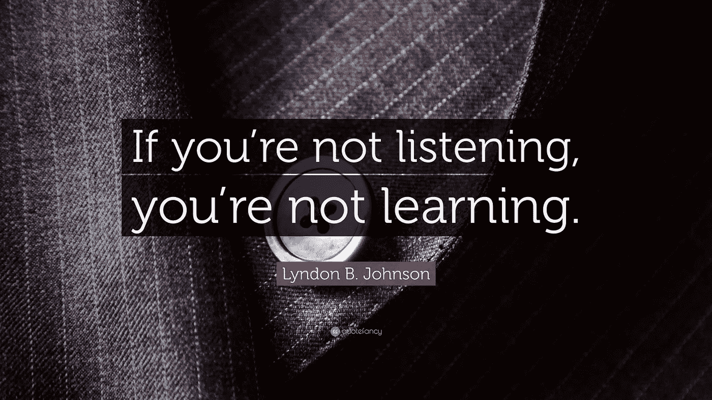

# 你应该听的 3 个最好的技术播客

> 原文：<https://medium.com/swlh/the-3-best-tech-podcasts-you-should-listen-to-5926df72b8ec>

上周，我分享了我最喜欢的 5 本关于创业和科技的书。另一个了解这个行业的好方法是通过播客。

每当我开车的时候，我都会打开播客。这是让这些原本毫无意义的时间变得有价值的好方法。播客也是我马拉松训练期间的忠实伙伴。

那里有大量非常好的内容。以下是我的三大选择。

[**《二十分钟 VC》**](http://www.thetwentyminutevc.com)**作者哈利·斯特宾斯**

我第一次真正接触风险投资和创业。我只是喜欢这种形式:20 分钟的节目，结尾著名的快速开火，以及令人印象深刻的产生优秀内容的风险投资家和创始人名单。

如果你对这个行业感兴趣，一定要听！

由于我的公司 [Hyperlane](https://hyperlane.co) 是一家 SaaS 公司，哈里的另一个节目 [SaaStr](https://www.saastr.com) 当然也是我的常客。

****尼克·莫兰著****

**更长的形式:完整的 Rachet 剧集可以持续一个小时，并对节目中的每个人进行更深入的挖掘。除了对风险投资的深刻见解，完整的 Rachet 还负责向我介绍了[等等，但为什么要这样做](https://waitbutwhy.com)(下周会有更多介绍)。**

**[**本周在创业公司**](http://thisweekinstartups.com) **由杰森·卡拉卡尼斯****

**我必须承认:我是杰森的超级粉丝。他严肃的风格和语调让我在很多场合笑了。这个播客的特色是对创始人的长时间采访，以及对科技行业最新发展的专家意见。**

**提示:不要快进这个节目的广告，因为它们通常很搞笑。**

**希望你会喜欢他们！**

****

## **这个故事发表在 [The Startup](https://medium.com/swlh) 上，这是 Medium 最大的企业家出版物，拥有 271，476+人。**

## **在这里订阅接收[我们的头条新闻](http://growthsupply.com/the-startup-newsletter/)。**

****