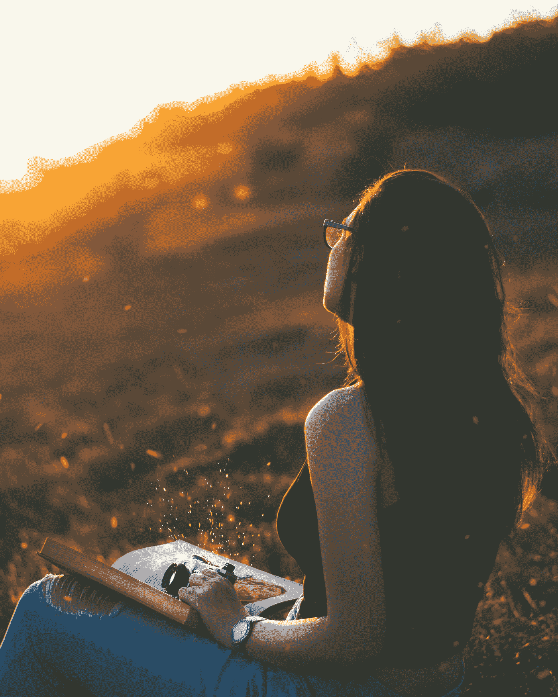

# 防弹生活视觉的三个基本层次

> 原文：<https://medium.com/swlh/the-3-elementary-layers-of-bulletproof-life-vision-cdf87a072e6e>

Photo by [Milos Tonchevski](https://unsplash.com/@tonchevsky?utm_source=medium&utm_medium=referral) on [Unsplash](https://unsplash.com?utm_source=medium&utm_medium=referral)

> 戏剧、战斗、恐怖、麻木和屈从——每天这些东西都在抹杀你的神圣原则，无论何时你的头脑不加批判地对待它们或者让它们溜走——马库斯·奥勒留

你只有一次生命。

如果你不保护它，你最终会憎恨你的生活，憎恨其他人的境遇。

大多数人都找借口逃避需要完成的工作。

他们不做工作，而是寻求戏剧。

你可以把你的注意力放在日常生活或者你的未来愿景上。

在保护你的视力之前，你必须定义它来设定一个方向。缺乏方向导致缺乏明确性，从而导致无所作为。

一旦你定义了你的愿景，你必须保护它，否则你的头脑会被不重要的东西占据。

> **头脑不断地寻找思想去思考，寻找挑战去面对，寻找问题去解决。如果你不设定一个意向，它会补上自己的挑战和问题。因此，你会自动运行，无用的想法占据你的头脑。**

# 第一层:环境

为了保护你的视力，你首先要优化你的成长环境。

消除让你沮丧的消极的人、事或干扰。有时候，说再见很难，但如果你想成长，你就必须放手。

当你从生活中清除杂物时，添加一些有助于你实现愿景的东西。找到以成长为导向的人，投资于你成功所需的教育或工具。

**你的头脑是宝贵的。你必须设置好你的环境，把高质量的想法带进你的头脑。**

只要你的头脑被无用的戏剧或其他人的议程占据，你就会不断地找到理由来逃避你的日常琐事。

把你的注意力当作一种宝贵的资源。不要浪费在不值得你关注的新闻、通知、人物或事件上。

通过[阅读书籍和文章](/swlh/how-i-read-self-improvement-articles-without-wasting-my-time-772aac8bf0a6)来洗脑。在执行日常任务时听有声读物和播客。

设定界限。养成习惯。执行早上和晚上的例行公事。无情地拒绝那些对你来说不重要或不令人兴奋的事情。

**不要每时每刻都有空。去山洞里做必须做的工作。没有人关心你的优先事项。**

> “让你周围的人反映出你想成为什么样的人，你想有什么样的感受。能量是会传染的。”—雷切尔·沃尔钦

# 第二层:幸福

当你的笔记本电脑或手机没电了，你会怎么做？你不能不充电就强迫它执行。

同样，你需要像对待婴儿一样对待你的幸福。

让我们面对现实吧。如果你感到痛苦或不适，你怎么可能超越目前生活中的戏剧？

我不是说在艰难时期你不应该关注你的健康。但是大多数人直到面临健康状况时才会照顾好自己。

所以不要等待疾病找上门来。如果你真的想改善你的视力，就要预防健康不佳。

你的精神和身体健康是相互关联的。

你的食物、睡眠和身体运动决定了你的大脑一整天的功能。

给自己喂食高营养的食物。获得 7-9 小时的优质睡眠。训练你的身体，或者至少在一天中运动，以优化自己在工作中的表现。

你的思想和身体是发挥你全部潜力的工具。

> "保持身体健康是一种责任，否则我们将无法保持头脑清醒。"—佛陀

# 第三层:哲学

你的现实是在你的头脑中创造的。

甚至在保护好自己的环境或者照顾好自己之后，你还会经常面对生活中的戏剧。

这就是第三层的用武之地——你的哲学。

你对压力有什么反应？在逆境中你会做什么？

如果你问大多数人，他们会恐慌或沮丧。

当事情没有按照我希望的方式发展时，我自己也会感到沮丧。我讨厌现在无用的戏剧遮蔽了我对未来的视野。

但是我不得不提醒自己——我能做些什么呢？如果答案是什么都没有，那就别担心了。如果答案是某事，尽一切努力解决这个问题。

> 生活是不公平的。但是生命也是一份礼物。学会换位思考是体会生活之美的关键。

在危机时刻，调整你的思维以冷静行动和清晰思考是一项需要时间培养的技能。

**当生活向你抛出戏剧时，接受它。然后，用一些工具来管理你的想法和感觉，比如冥想、正念、写日记、感恩和善良。**

> “你可以控制自己的思想，而不是外界事件。认识到这一点，你就会找到力量。”
> ――马可·奥勒留

设定你自己的优先事项，为你的愿景而努力，听起来可能很自私。但如果你想做更大的好事，你必须把自己放在第一位。

就像他们在飞机上说的，在帮助别人之前先戴上你自己的面具。

无私地自私，让世界变得更美好。

用你的环境、幸福和哲学来保护你的视力。

现在走吧。让它发生。

# 成功是日常行动的结果…

为**高绩效和成功**设计你的每日清单。[点击这里下载](http://bit.ly/daily-success-list)你的免费拷贝。

[Get Your FREE Cheatsheet](http://bit.ly/daily-success-list)

## 这篇文章发表在 [The Startup](https://medium.com/swlh) 上，这是 Medium 最大的创业刊物，有 323，238+人关注。

## 在此订阅接收[我们的头条新闻](http://growthsupply.com/the-startup-newsletter/)。

