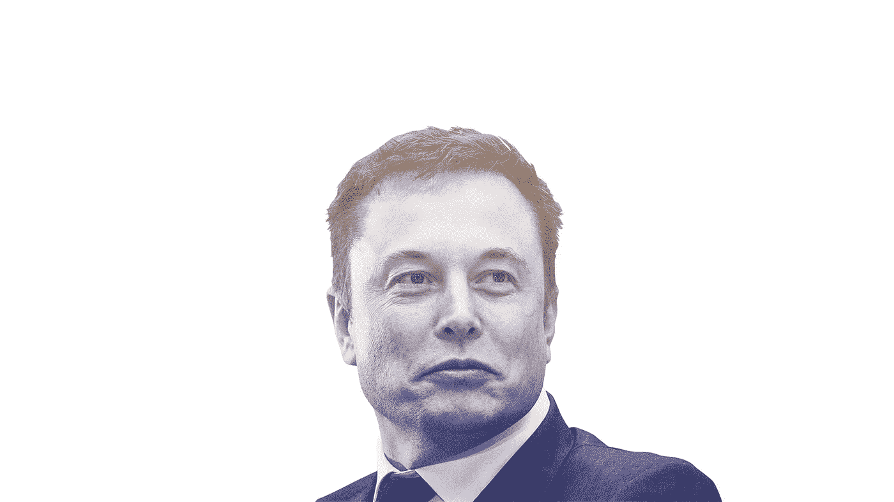

# 3:埃隆·马斯克

> 原文：<https://medium.com/swlh/the-3-elon-musk-261edd7daddf>

[CNN](https://www.cnn.com/2017/02/16/tech/my-hero-kristie-lu-stout-elon-musk/index.html)

这是一个系列的开始，将详细介绍著名企业家、发明家和改变世界的人使自己与众不同的三种方式，希望你能在自己的生活中受益于他们的技术。

> "当某件事足够重要时，即使机会对你不利，你也要去做。"——埃隆·马斯克

# 背景