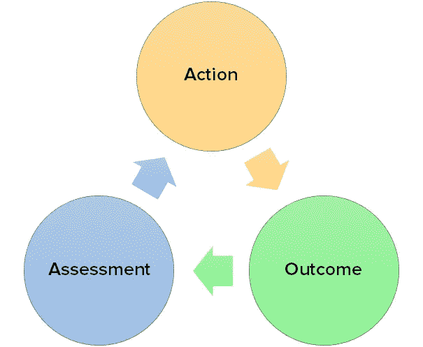

# 3 分钟反馈循环将您的决策效率提高 10 倍

> 原文：<https://medium.com/swlh/the-3-minute-feedback-loop-to-10x-your-decision-making-efficiency-f845aa0ffafd>

Photo by [Patrick Baum](https://unsplash.com/photos/I33riCqIWUA?utm_source=unsplash&utm_medium=referral&utm_content=creditCopyText) on [Unsplash](https://unsplash.com/search/photos/spiral?utm_source=unsplash&utm_medium=referral&utm_content=creditCopyText)

*愚弄我一次不要脸；愚弄我两次，我感到羞耻。有一半的时间，我们在愚弄自己，而且不是两次，而是几次；一遍又一遍。随着时间的推移，自我提升、职业发展、创造性的洞察力或学习通常都会变得更好，因为你从尝试和错误中获得的潜意识反馈会无缝地发生。然而，把这留给你的潜意识就像通过付出很少或不付出努力来等待生活变得更好，它可能会，但让我们坦率地说，如果我们不付出努力，它不会在合理的时间框架内或以我们希望的程度发生。*

除了经典的长篇大论的文章介绍，你还需要评估你在生活中各个方面的行为，以真正了解你是在进步还是停滞不前。有很多方法可以做到这一点，你可以自学，找一个导师，持续给予你的全部注意力。尽管如此，我发现如果你没有实施一个让你保持正轨的反馈循环，所有这些都将化为乌有。

## 行动>结果>评估

你对某事不满意，你想要改变，你想要改善你生活的某个方面，那么你会怎么做？你采取某种行动，如果你不这样做，那就是你做错了。无为滋生停滞。

采取行动后，你会达到某种结果。这种结果可能是立竿见影的，也可能还没有发生，或者两者兼而有之。不管怎样，你都在不断评估这个结果。你开始去健身房了？短期的结果是，你在努力把事情安排到你的时间表中，你感到疼痛，你可能会感到更有活力。

你的评估是，疼痛会消失，进展会很慢，你需要找到一种方法来重新组织你的时间。好了，你已经绕了一圈，所以你要采取另一个行动。

This is the feedback loop that runs my life

你的新行动是针对之前的评估。在开始一天的工作之前，你开始睡得更早，醒得更早，以适应你的锻炼。结果是你成功地将这项新活动融入了你的生活，疼痛消失了，但根据你的评估，你可能没有取得正确的进展。所以你采取另一个行动来解决你的评估。也许你改变了饮食。你明白了。

你可能会想，“嘿，我已经这样做了，夏洛克。”你可能会，你的大脑已经让你走了这么远，我相信它可以在飞行中做出决定。问题不在于你不去做，问题就像前面提到的，在于你没有 100%意识到它的发生。

如果你做出改变，有意识地把事情放入如上的反馈循环中，你会立刻看到不同。这可能是轶事，但我肯定不只是我——90%的时候，不知所措的感觉，你的想法被分散，绝望的感觉可以追溯到不知道该做什么。不知道该如何对待健身计划、职业决策、恋爱关系，我敢说是生活。

通过有一个框架来做这些决定，通过 ***有意识地*** 评估你所采取的行动的结果。通过有意识地把主动性和反应性结合起来做事情，你将成为一个决策高手。会一直是正确的决定吗？当然不会，但这总比用你的潜意识掷骰子要好。压力也小了，相信我说的…

如果你喜欢这篇文章或觉得它有用，我真的很欣赏这个可爱的数字拍手，它似乎是作者在这里的可卡因等价物。

这是另一篇我想你会喜欢的文章——这是[你可以在不到 3 分钟的时间里做的 8 件小事](/swlh/8-tiny-things-you-can-do-to-immediately-improve-your-life-in-less-than-3-minutes-81baa9f59276)

我也看过这份简讯，你可能会喜欢。我每隔几个周末就发一封小小的电子邮件(如果有的话),里面有一些我发现/制作的有用或很酷的东西。别担心，我和你一样讨厌垃圾邮件。随意订阅:)

出来吧。

## 这篇文章发表在 [The Startup](https://medium.com/swlh) 上，这是 Medium 最大的创业刊物，有 305，765+人关注。

## 在这里订阅接收[我们的头条新闻](http://growthsupply.com/the-startup-newsletter/)。

