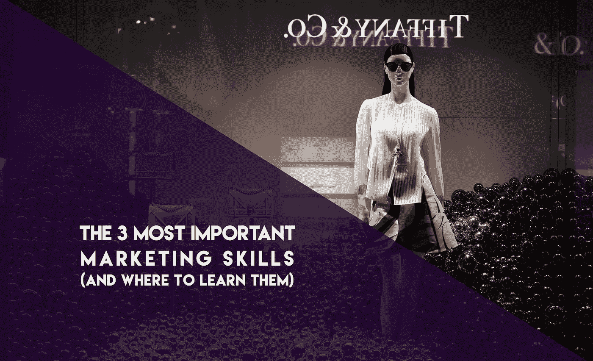

# 3 个最重要的营销技巧(以及在哪里学习)

> 原文：<https://medium.com/swlh/the-3-most-important-marketing-skills-and-where-to-learn-them-6f19714cda49>

如今，要想在营销方面出类拔萃，你需要掌握很多技能。不过，我可以把范围缩小到前三名。这是我作为营销总监的视角。十年来，我与许多全球和小型客户合作，教会了我很多东西。

最重要的营销技巧是:销售、讲故事和原生平台掌握。的…