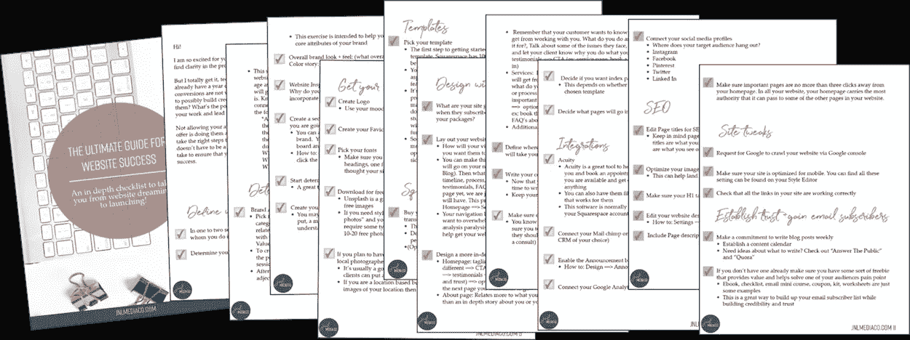

# 今天你需要遵循的 3 个事实

> 原文：<https://medium.com/swlh/the-3-truths-of-today-that-you-need-to-live-by-bf63a718da07>

Photo by [Willian Justen de Vasconcellos](https://unsplash.com/@willianjusten?utm_source=medium&utm_medium=referral) on [Unsplash](https://unsplash.com?utm_source=medium&utm_medium=referral)

你知道那种感觉吗，当一切都如你所愿，你情不自禁地微笑，知道你会好起来的？这可能是也可能不是一种普遍的感觉，但我相信你在某个时候会有这种感觉。

听起来有点奇怪，但不久前的一本书对我产生了这种影响。这本书是作者本人赠送给我的，所以你最好相信我看了我签名的那本书。

我甚至有一本[《富裕 20 点:放弃你的普通工作，开创一个史诗般的事业，过上你想要的生活》的唯一原因是](https://www.amazon.com/Rich20Something-Ditch-Average-Start-Business/dp/0143129384/ref=sr_1_1?ie=UTF8&qid=1525156855&sr=8-1&keywords=rich+20+something+daniel+dipiazza)[谁说要有大学学历才算“成功”？我的意思是，就在几年前，大部分情况下可能是这样的，但现在不是了(大部分情况下)。](https://medium.com/u/cec3d7acfd97#1)您不再需要缴纳会费</h1>

 这是第一扇门:主入口，99%的人在这里排队，希望能进去。第二道门:VIP 入口，亿万富翁和名人溜进去的地方。但是没人告诉你的是，总有，总有。。。第三扇门。这是一个入口，你必须跳出队伍，跑到巷子里，敲一百次门，砸开窗户，溜进厨房——总有办法的。亚历克斯·巴纳扬

我们不必再遵循旧的规则，而是走自己的路去创造(是的，创造！)我们非常清楚自己有潜力过的生活。

# #3)赚钱很容易(执行是另一回事)

很抱歉在这里听起来有点“呜呜呜”,但我开始明白所有的钱其实都是能量。金钱没有好坏之分……它只是中性的，但我们如何使用它才是决定它好坏的因素。

好了，这并不完全与规则 3 相关，但仍然是需要把握的重要一点。

不管是谁，执行是如此重要！我无法告诉你我花了多长时间只是制定战略和计划如何开展我的业务，而不是实际去做。

是的，互联网为我们创造了这么多“赚钱”的机会，但实际上采取行动和做这件事是完全不同的事情。

# 行动呼吁

*   你是企业家还是有抱负的企业家？那么我相信你知道拥有一个漂亮的网站和一个能吸引你理想客户的品牌的重要性。我整理了一份 12 页的清单，可以帮助你理解创建一个符合其目的的网站的过程。在这里下载它

The Ultimate Guide To Website Success Checklist

*   对于我所有的女性企业家或有抱负的企业家，我想邀请你们加入我刚刚创建的 FB 小组！如果创业、旅行、生活设计和心态听起来对你有吸引力，那就加入这里的 [**！**](https://www.facebook.com/groups/539477953139120/)

## 这篇文章发表在 [The Startup](https://medium.com/swlh) 上，这是 Medium 最大的创业刊物，有 356，974 人关注。

## 订阅接收[我们的头条新闻](http://growthsupply.com/the-startup-newsletter/)。

