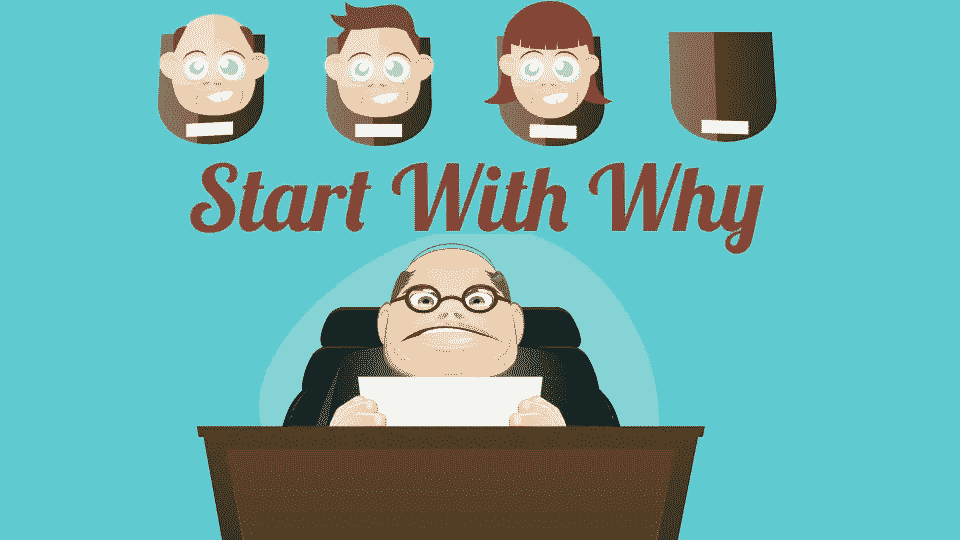

# 有史以来最好的 365 本商业书籍:从为什么开始

> 原文：<https://medium.com/swlh/the-365-best-business-books-of-all-time-start-with-why-73c2fe8fa4a3>

尽管我们可以通过多种方式相互交流，但实际上只有两种方式可以影响人类行为:你可以操纵它，也可以激励它。

正如西蒙·西内克在他的书《从为什么开始》中所描述的那样，从长远来看，用胡萝卜诱惑比使用大棒更有效。

特别是，他建议通过关注我们组织的原因，我们可以更好地动员人们采取行动。

# 我的关键要点/原则

人们买的不是你做的东西，而是你为什么做这件事。

1963 年夏天，25 万人出现在亚伯拉罕·林肯面前，聆听马丁·路德·金发表他的“我有一个梦想”的演讲。

但是有多少人支持金博士呢？很少。他们为自己而出现。他找出了一个别人认为是自己的原因。

为什么这包括与他们自己相匹配的愿景、价值观和信仰。无形资产的整合。人们追随他并不是因为他认为美国已经改变了。人们追随他是因为他们认为美国已经改变了。金博士为美国提供了一个前进的方向，而不是一个可以遵循的计划。

欧内斯特·沙克尔顿，一位著名的鼓舞人心的领导者，从未实现他的既定目标——到达南极——展示了同样的技能。当沙克尔顿呼吁船员加入他的命运攸关的探险时，他并没有定义一个合适的技能列表。他找到了自己的原因，并寻求追随者。广告写道:

“招聘从事危险旅行的人。微薄的工资，刺骨的寒冷，长达数月的完全黑暗，不断的危险，安全返回成疑。成功时的荣誉和认可。”沙克尔顿只雇佣那些相信他的人。他们的生存能力得到了保证。当员工有归属感时，他们会保证你的成功。

# 要问自己的问题

*   我们的组织为什么清楚地陈述了吗？
*   我们说的和做的每一件事都清楚地传达了吗？

# 这本书还包括什么？

在本书的其余部分，你将了解黄金圈，如果你想让你的信息与你的受众产生共鸣，就要遵循一个特定的顺序——无论是内部利益相关者还是潜在客户。

*今年(2018 年)，我正在阅读并总结有史以来排名前 365 位的商业书籍。点击这里**[*，你可以获得完整的书单，以及我对每本书的评论链接。*](/@stevecunningham/the-top-365-business-books-of-all-time-37025bd11eb6)*

**快乐学习！**

**

## *这篇文章发表在 [The Startup](https://medium.com/swlh) 上，这是 Medium 最大的创业刊物，拥有 285，454+人关注。*

## *在此订阅接收[我们的头条新闻](http://growthsupply.com/the-startup-newsletter/)。*

**