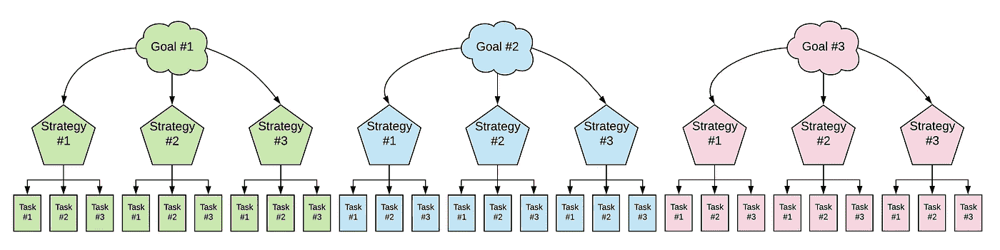

# 3x4 目标设定系统

> 原文：<https://medium.com/swlh/the-3x4-goal-setting-system-2e1f8f0d16a4>

## 利用三者的力量，更有效地完成更多工作。

6 个月前，我开始写下我真正的生活目标。我总是对自己想要实现的目标有一个模糊的想法，对实现目标需要做什么有一个粗略的想法，但是没有实际的可执行的计划。

我感到沮丧，因为我没有更接近上个月想要的东西，这让我更加泄气。这是吮吸的循环。

我决定分解所有我想要的东西，它看起来像这样。

I’m clearly not a graphic designer.

我为自己设定了 3 个目标。一般来说，一个和健康有关，另外两个和我的工作有关。

以下是我目前的目标:

1.  将在线展示增加 50%
2.  减掉 30 磅
3.  增加 MRR 10，000 美元

然后，每个目标都有 3 个支持策略来帮助我实现它。让我们以“增加 MRR 10，000 美元”为例。

但是，我怎么能创造 1 万美元的收入呢？以下是实现这一目标的策略。

1.  在 3 个会议上发言
2.  开展脸书竞选活动
3.  写 50 篇关于营销的中型文章

现在，我已经记下了这些策略(这些策略本身就很重要)，我将围绕这些策略来定义任务。

我们以“在三个会议上发言”为例。以下是我的任务。

1.  建立即将召开的会议列表
2.  申请 12 次(我申请的会议中，大约有一半我都会发言，但由于申请很容易，我宁可谨慎一点)
3.  创建幻灯片

然后，我填写剩下的部分，包括所有其他的目标、策略和任务。全部完成大约需要 2-3 个小时，但是它为你创建了一个路线图。

但是，等等！多出来的 3 是干什么的？

最后，在你开始新的、更大的目标之前，你有 3 个月的时间去做所有这些。

你可能不会马上实现每个目标。但是，如果你每三个月做一次，并努力完成任务，毫无疑问，你会比坐在那里走得更远。

## 这篇文章发表在[《创业](https://medium.com/swlh)》上，这是 Medium 最大的创业刊物，有 289，682+人关注。

## 订阅接收[我们的头条新闻](http://growthsupply.com/the-startup-newsletter/)。

