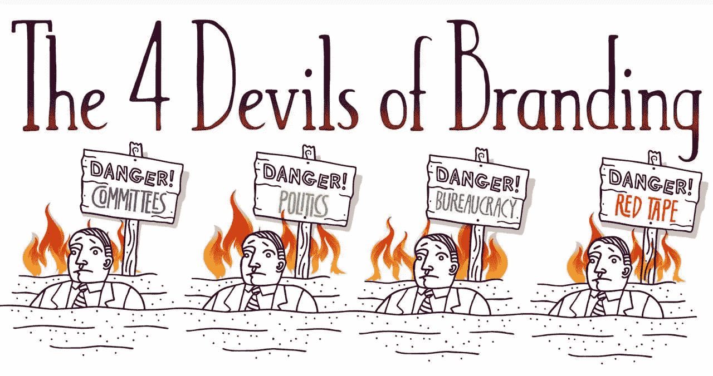

# 这 4 个狡猾的品牌魔鬼(如果被忽视，他们会对你的品牌造成什么影响)

> 原文：<https://medium.com/swlh/the-4-devils-of-branding-revealed-361c0f77bde>

## 这是一个关于我如何面对 4 个吸人性命的品牌魔鬼并活着谈论它的故事

我们称他们为“烙印恶魔”

他们出现了:

*   在水冷却器那里，
*   在会议上，
*   在头脑风暴会议上，
*   在有灵感的时候，
*   在致力于“打破习惯性平庸的枷锁”的会议上…

但是这些可预测的魔鬼只有四个(作为普通罪犯),并且是本周三特别一分钟的主题。

鉴于这个话题是关于*品牌的魔鬼*，它的数字，我将被迫加班在这特别的一分钟周三集。

这些魔鬼不仅适用于品牌本身，也适用于那些考虑[品牌重塑](https://www.risingabovethenoise.com/how-to-rebrand-19-questions-ask-before-you-start/)的人，因为在处理品牌重塑时，这些魔鬼会更加普遍。

# 品牌的魔鬼被揭露了

品牌的魔鬼？他们在这里:

1.  委员会(如何在四面墙内冲淡灵感)
2.  政治(如何成功操纵你实际上不喜欢的人)
3.  官僚主义(规则如何凌驾于主动性和思考能力之上)
4.  繁文缛节(如何不灵活和增加层次，只是因为我们认为缓慢移动比快速移动更聪明)

# 我们已经讨论了品牌的四大要素。有第五个魔鬼吗？

通过命名这些，我们可以隔离这些恶魔，从而将它们从有效且有利可图的品牌化过程中驱逐出去。

但是有一个狡猾的小恶魔仍然会出现:

另一个“魔鬼”是停下来的倾向。

对于那些对付这最后一个附加恶魔的人来说，**只有一个关键的治疗方法** : *这个新视频*将直接杀死那个恶魔的心脏:

# 终极保护

对付这些该死的品牌魔鬼最著名的武器就是《品牌干预》这本书。

*原载于***。**