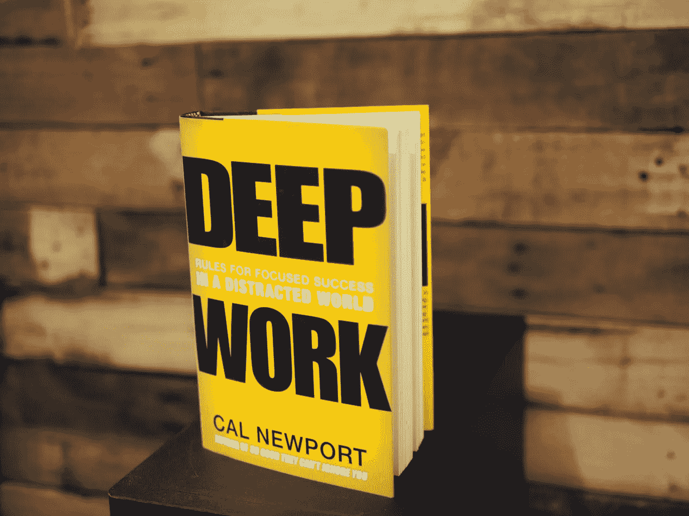
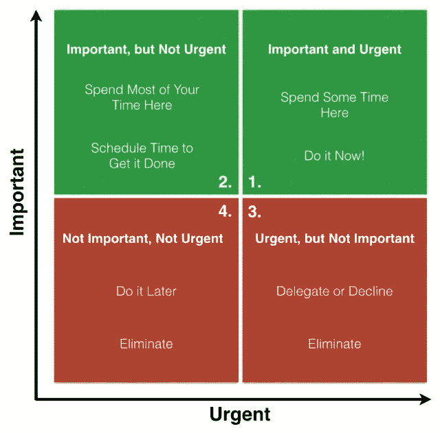

# 以少做多的 4 种简单方法

> 原文：<https://medium.com/swlh/the-4-easy-ways-of-getting-more-done-by-doing-less-27687dbc4c71>

Photo by [Marvin Meyer](https://unsplash.com/@marvelous?utm_source=medium&utm_medium=referral) on [Unsplash](https://unsplash.com?utm_source=medium&utm_medium=referral)

> “从做必要的事情开始；然后做可能的事；突然间，你在做不可能的事情。”
> 
> -弗朗西斯的阿西西

本周早些时候，我和一些非常聪明的人坐在一个大会议桌旁，许多重要的任务都在争夺他们的注意力，而(像我们所有人一样)时间太少，无法完成所有任务。

我被召集来参加这个会议，是为了训练这个高功能的团队完成一项不那么简单的任务:在更短的时间内完成更多的工作。

这是现代商业的金鹅。

> 我们如何从有限的时间和资源中挤出更多的生产力？

这是一个有趣的问题，有一些有趣的答案…

不幸的是，这是一个绝对错误的问题。

正如传奇哲学家——皇帝马库斯·奥勒留在两千年前如此恰当地指出的那样:

***“重要的是:做得更少，更好。”***

 [## 帮助你主宰生活的传奇语录

### 马库斯·奥勒留，所谓五贤帝中的最后一个，写了一系列日记条目(后来由…

medium.com](/the-mission/quotes-from-a-legend-to-help-you-dominate-life-35671ba2390b) 

这就是我们开始讨论的地方。不是用卑鄙的策略，生产力黑客，或花哨的应用程序。而是你千万不要把*忙碌*和*效率*混为一谈。

80/20 法则(也称为帕累托原则)是一个被广泛讨论的现象，但简单地说，它表明(在所有学科和生活领域中)只有大约 20%的输入负责大约 80%的输出。

> 换句话说，数量少得惊人的活动对绝大多数结果负责。

尽管我们很多人都意识到了这一点，但不幸的是，很大一部分人没有将它有效地运用到生活中。

相反，我们旋转我们的车轮去追求更多，更多，更多。试图解决一个不断扩大的待办事项清单，错误地希望这会有所帮助。

***剧透预警:不会。***

你所做的一切都是为了完成任务，如果你退后一步，如实回答，你会发现*实际上并没有帮助*。

所以，在大部分任务都不值得做的框架下，让我们来谈谈你能从你的待办事项清单中检查出更多事情的 4 种方法。

# **1)完工**

做那件事。

这是我们大多数人考虑从我们的待办事项列表中检查一个项目的传统方式。我们实际上是在做事情。

*完成*一项任务的问题在于，很少有任务真正值得*完成*。

当你创建每日、每周或每月的任务清单时，问问自己:

这是我特别适合完成的任务吗？

这类似于卡尔·纽波特在他恰如其分的书名《T2》《T3》《深度工作》《T4》《T5》中所说的**深度工作**。极具挑战性、增值的工作，只有*你*才能完成。

这些任务应该消耗你大部分的时间、精力和资源。

不幸的是，我们大多数人花在这类任务上的时间太少了。相反，我们沉迷于**肤浅的工作**，这些工作同时是卑微的、没有附加值的、完全可以外包的。

肤浅的工作应该通过以下三种方法中的一种从待办事项列表中删除。

# **2)删除**

*消除任务*。

这里的引导性问题应该是:*这真的有必要吗？*

如果答案是*否*，那么删除它。不问任何问题。

许多人错误地认为时间是他们最宝贵的资源。

这不是真的。

> 注意力是你最宝贵的资源。

不要把它浪费在没有意义的活动上，这些活动对你完成目标没有特别的帮助。

# 3)授权

把任务分配给别人。

好吧，也许这个任务实际上很重要，但是没有很好地利用你的时间和技能。你不能只是*删除*它，因为这是应该完成的事情，但你也不应该扮演神奇女侠，自己承担所有任务。

这是许多公司经理类型出错的地方。

他们担心授权会让他们显得懒惰或无能。

授权，如果做得恰当，两者都不是。这是接受这样一个事实，即人们有独特的技能，任何成功的团队都会利用个人的优势，避免他们的弱点。

汤姆·布拉迪是一名优秀的四分卫，但不是一名合格的司线员。

> 找出团队中每个人最适合打什么位置，然后让他们发挥自己的优势！

你怎么知道什么时候这个任务最适合你的助手呢？

一般来说，如果有人可以被训练成完成一项任务 80%的能力，那么就这么做。

# 4)延期

把任务推迟到以后。

在这里要小心行事，因为*延期*看起来很像拖延。

不是那样的。

它是对一项既不是关键的，也不是时间相关的任务的有意识别。当你发现这样一个任务时，考虑推迟它，或者，如果它真的不重要，删除它。

可视化任务的一个简便方法是通过所谓的**艾森豪威尔矩阵**。

# 艾森豪威尔矩阵

> 重要的事很少是紧急的，紧急的事也很少是重要的 —德怀特·戴维·艾森豪威尔

在艾森豪威尔矩阵中，根据重要性*和紧迫性*判断，任务可以细分为四个类别中的一个。**

**在象限 1 中，你有同时**重要**和**紧急**的任务。**

**不言而喻，这些任务总是应该首先完成。谢天谢地，由于它们的紧急性质，我们通常不需要被告知两次就能完成这些任务。**

**当我们到达象限 2 时，事情开始分崩离析。这些是**重要**但**不紧急**的任务。**

**这些任务几乎不可避免地会被拖延。这是导致灾难的原因。**

**象限 2 *中的任务必须*得到调度，否则它们总是会被推到一边，让位于更紧急的任务。**

**像象限 3 这样的任务。**

**这些活动都**紧急**，但**不重要**。我们经常错误地认为我们正在变得*有效*，而事实上我们只是在*忙碌*。**

**完成这些任务，但前提是你已经将大部分时间和精力投入到象限 1 和象限 2 的活动中。**

**象限 4 是为一种特殊类型的无意义工作保留的，这种工作既不重要也不紧急。**

**面对这种工作，人们必须问自己:为什么要自寻烦恼？**

***委派*、*推迟*或*删除*这些任务，不要浪费宝贵的一秒钟去为此难过。**

**你的第一反应可能是抗议你的*工作日中象限 4 活动的存在，但是一点批判性的分析将不可避免地证明相反的事实。***

> **在你的待办事项列表中，象限 4 的活动比你意识到的还要多。**

**找出它们，但最重要的是，发现你的象限 1 和象限 2 任务。**

**一旦你将**重要的**和**不重要的**任务分开，应用我们讨论过的完成任务的四种模式之一(*完成、删除、委派、延期)*来处理你的待办事项列表，你要知道，毫无疑问，你是*有效的*。**

**执行这个游戏计划，你很快就会成为做得更少、更好的大师。**

****感谢阅读！如果你喜欢这篇文章，帮我一个忙，拍一下**👏几十次。你的支持对我来说意味着一切！**

**[**点击此处参加免费的五个势力范围电子邮件课程！**](http://www.thehyperfocusedmind.com/)**

****

## **这篇文章发表在《T4》杂志《创业》(The Startup)上，这是 Medium 最大的创业刊物，拥有 319，283+读者。**

## **在这里订阅接收[我们的头条新闻](http://growthsupply.com/the-startup-newsletter/)。**

****