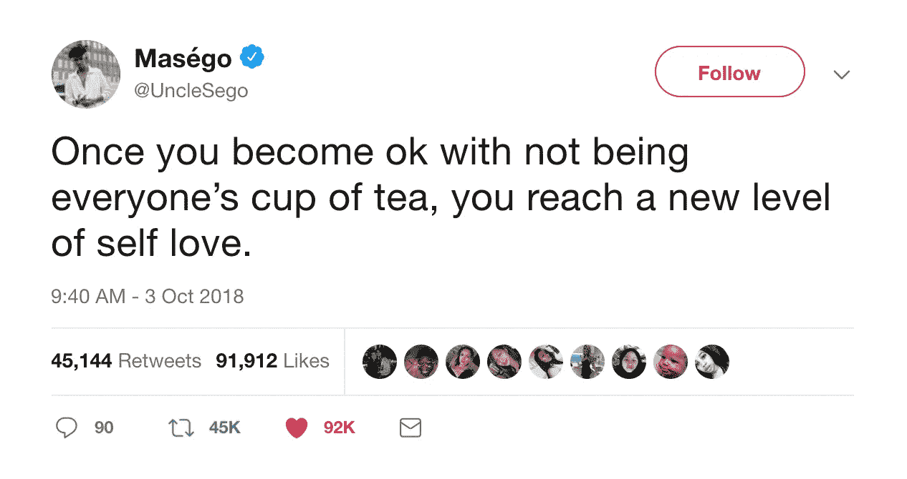

# 你仍然不爱自己的四个原因。

> 原文：<https://medium.com/swlh/the-4-reasons-you-still-dont-love-yourself-28057599440>

@unclesego Via Twitter

啊，自爱…大家最喜欢聊的话题。能够完全爱自己是一项非常困难的任务。很多时候，人们一生都没有为自己感到骄傲和快乐。不要走那条路。

> 你不能改变自己，所以要学会爱它。

首先，到底什么是自爱？
*为自己的幸福和快乐着想(字典定义)*

类似于自我意识的意思。前女友曾经问我，怎样才能更爱自己？我无法给出一个简单的答案，因为爱你自己要比这复杂得多。

我最后写了 300+字发给她。这是不久前的事了，现在我将根据我给她的答案写一篇文章。

我和自爱做着巨大的斗争。前一天，我觉得做自己非常幸运，第二天，我对这个世界感到愤怒，甚至希望我是另一个人。我会说我爱我自己的 20%,而其余的 80%我仍在努力。

*“伊恩，一个连自己都不完全爱自己的人，怎么能写出自爱的文章呢？”*

毫无头绪，但它就这么发生了。

## 1-你总是担心别人有你没有的东西

我想说，不断的比较是人们在自爱中挣扎的最大原因。如果你总是盯着别人拥有而你没有的东西，你永远不会完全自爱。

它可以是家庭、生活方式、关系、朋友、财产等等。

我是有罪的，我猜每个读到这篇文章的人也是。有时候很难不有点嫉妒。可爱的社交媒体源。唉，当然，阿什莉买了新的雪地靴，她的父母很富有

**社交媒体的问题在于，人们宁愿砍掉自己的胳膊，也不愿发布真正影响他们的事情。**
你多久看一次帖子；丢掉工作，找警察的麻烦，与抑郁症作斗争或者类似的事情？你很少这样做。我不知道你怎么想，但是关于真实事物的帖子总是更能吸引我。

我们总是知道你生活中发生了什么好事。我们不经常看到的是什么没有成功，以及你正在做什么来克服它。

大声抱怨。要么学会不看，不在乎，要么删除社交媒体。尽管如此，删除社交媒体并不能阻止你看到其他人在做什么。

## 2——你忘记了你拥有别人没有的东西

以防你可能忘了，你是 1/7，000，000，000+。别担心，我不会在下一段写“你很特别，你是独一无二的。”

你并不特别，但你身上有些东西是特别的。

上面说了，我本来是写给我那个问的姑娘自爱的。她有时缺乏安全感，总是担心我认为其他女孩很漂亮。

凯莉有着雕塑般的身材。不开玩笑，她有一个健康的身体，许多女性锻炼多年来实现。她很漂亮，毫无疑问，我为她神魂颠倒。

当她问及关于自爱的问题时，我肯定会谈到她令人难以置信的身材和长相。我告诉她；你拥有女神般的身材，我喜欢它的每一个方面。此外，你是超越惊人的，你不需要化妆。女人 ***梦想*** *看起来和你一样漂亮。我只是提醒她她甚至知道自己拥有的天赋。*

我可以讨厌我的瘦骨嶙峋的身体，并为此抱怨，或者我可以认为这是一种祝福。我只是不能增加体重，即使我能，我也不知道如何增加。也许我对自己的身材不是很满意，但是不用担心体重增加还是很甜蜜的。

你会有一些你不喜欢的特质。我不认为这个星球上有任何人喜欢他们的每一件事。学会和他们一起生活，专注于你所拥有的让你成为你自己的东西。

## 3-你的过去仍然困扰着你。

这是一个大的。需要的时候那个黑衣人记忆橡皮擦工具在哪里？

*你的过去相关与不相关。你的过去是你的过去，而不是你的未来。*

**感恩与选择。**

你必须感激发生在你身上的一切。如果你不是，你就不会自爱。原谅你自己的错误，并学会从你所面临的困难挑战中成长。

下定决心发展你全心全意代表的新道德和价值观。会说话的价值观；我不是不幸的，有麻烦的，可怜的，我只是在成长，调整和学习。你可以做的另一件事是，如果这种情况仍然让你痛苦，那就试着修复它。一个很好的例子就是需要对另一个人进行报复。不要去想你会做什么让那个人痛苦，而是感谢他们带给你的教训和挑战。这将让你对一些可能需要在头脑中有个结论的事情松一口气。

一旦你放下了过去的包袱，你会觉得一个重担从你身上卸了下来。我会第一个告诉你，改变对过去的看法可以彻底改变你的生活。说对已经发生的事情用不同的方式思考会有那么大的效果似乎很愚蠢。即便如此，我们仍在与它作斗争。

你仍然在意别人对你的看法。

## Retitle:你停下来是因为你太在乎别人的看法。

不要切换标签，在 facebook 上说“我根本不在乎别人对我的看法，从现在开始我要做我自己！”

在某种程度上，我们都很在乎别人对我们的看法。想要有一个吸引人的形象没有错。当你太在意时，问题就来了&觉得你需要以一种物质的或不真实的方式给人留下印象。

如果不受到批评、憎恨、评判等，你不可能做任何实质性的事情。说出一个在公众眼中没有几千个仇人的名人或成功人士。只有一个。

你不需要取悦每个人。做一些让你不舒服或者甚至有点尴尬的事情。正是这些事情让你的性格得以绽放。*lol，Ian“blossom”*
我知道我可能在其他三篇文章中引用过这句话，但这只是..

> 少在乎别人怎么看你，多在乎你怎么看自己。—伊恩·罗姆普雷

Kanye West 最近谈到了一个不存在关注者/喜欢者/评论的社交媒体平台。就我个人而言，我认为这将是非常整洁的。想象一下没有任何分析的 Instagram 或 Twitter。

## 简短结论:

这是一个过程。这也不是永远的事情，有些日子会是“那些”日子。

*   忘记其他人和他们的胜利、进步和生活。
*   记住你身上有太多别人没有的东西。
*   原谅自己的错误，让过去完全过去。
*   不管别人怎么想怎么说，做自己想做的事。

# 👏🏼如果你喜欢，请鼓掌，如果你将来想从我这里得到更多，请关注！*别忘了你最多可以鼓掌 50 次*👏🏼

## 这篇文章发表在 [The Startup](https://medium.com/swlh) 上，这是 Medium 最大的创业刊物，拥有+404，714 读者。

## 在此订阅接收[我们的头条新闻](http://growthsupply.com/the-startup-newsletter/)。

