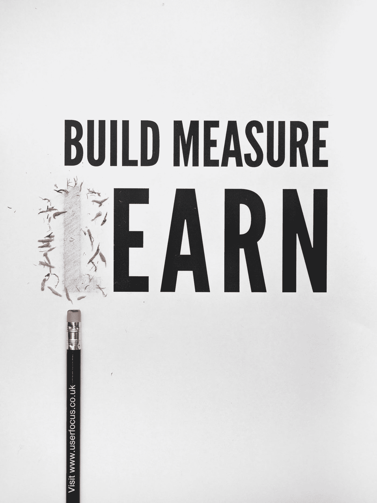

# 招聘时你应该考虑的 4 个特质…

> 原文：<https://medium.com/swlh/the-4-traits-you-should-look-at-when-your-hiring-8882d63584f8>

## 这些是如何成就或毁灭你的事业的！

Photo by [Clem Onojeghuo](https://unsplash.com/@clemono2?utm_source=medium&utm_medium=referral) on [Unsplash](https://unsplash.com?utm_source=medium&utm_medium=referral)

每次你雇佣新员工，你都在冒险。让一个陌生人加入你的公司是冒险的，给团队增加一个新成员会降低生产力和其他风险。这篇文章将帮助你降低这种风险，让你在招聘过程中取得成功。这将使你的生意更好，并增加你的利润，因为如果你建立了一个伟大的团队，你的客户会感觉到这一点，并从你这里购买一次又一次。

有很多关于这个主题的书，如果你读了所有的书，你会发现作者说你应该在招聘时看 50 多种特质。作为一个企业家，你没有时间去做这些，也没有钱像大公司那样雇佣一个代理机构来雇佣你。这就是为什么，在读了 10 多本关于这个主题的书，雇佣了 10 多个人之后，我总结出了这 4 个特点，它们很容易检查，并且真的能帮你找到好的人。

> 没有伟人的伟大愿景是无关紧要的。吉姆·科林斯

在我深入研究每个特质之前，我想问你一个问题:你为什么想雇佣一个新人？在你雇佣一个人之前，你应该清楚你的企业现在需要的技能是什么。当你有了这种技能，你需要问自己是否真的需要一个人，或者这个活动也可以由一台稍加编程的机器来完成…

> 例如:我合作过的许多小企业表示，他们没有时间关注社交媒体(Instagram、脸书等)，他们雇佣的大多数人都不注意拼写，或者他们没有照顾好客户。在一次谈话后，他们发现如何在周日的 1 个小时内使用工具和自动化来处理社交媒体，以便安排下周的所有事情，每天用智能手机拍摄 5-10 分钟的业务趣事。大多数平台现在都有能力或有不同的应用程序，允许你在有人联系你时发送快速消息回复。这将消除人为的拼写错误，并自动提供给客户。这是一个小企业主不需要雇人的例子。他们实际上喜欢创造市场竞争和与客户联系。

如果你认为这种技能不能由人工智能自动完成，你需要在雇人时寻找 4 个特征:

1.  爱
2.  信任
3.  速度
4.  改进

仅此而已。你现在可以去做一些采访了！开玩笑，让我们来看看每一个，让我来帮助你发现为什么这些特质真的很重要。其他的技能和能力可以在工作中发展，但是当你想在你的生意中找一个新人时，这四个是必须的。

# 1.爱

爱情很重要。如果你能找到一个像爱你的事业一样爱他的工作的人，你就中大奖了。对于这一点，你在介绍你的公司和你的愿景时也必须非常清楚。你要记住，人们只和人一起工作。这意味着作为你的员工，你必须在第一次面试时做好陈述。

Photo by [Mandy von Stahl](https://unsplash.com/@mvs_berlin?utm_source=medium&utm_medium=referral) on [Unsplash](https://unsplash.com?utm_source=medium&utm_medium=referral)

大多数人认为爱是一种感觉。我相信爱是一个动词。如果你是家长，你完全理解我。不管你的孩子惹了多少麻烦，你还是爱他，希望他成功。如果你能让某人爱上你的公司，他会不惜一切代价让公司成功。

对于爱情，没有手册可以教一个人怎么做。当你爱一个人或一件事时，你会尽一切努力让对方对你喜欢的事业感到满意，以获得成功，在这种情况下，就是你的事业。

那么，你如何找到喜欢你的生意的人呢？我从布兰登·伯查德那里学到了一个简单的方法。我想亲自感谢他所做的一切努力，他为企业家提供了他在业务中所做的一切，以达到下一个水平。当你在面试中与某人坐下来时，试着多了解一些他们之前工作过的项目，并问一些问题，比如:

*   你的项目出问题的时候是什么时候？
*   你觉得那里的问题是什么？
*   那让你有什么感觉？

这些被称为试探性问题，这里你不是专门看他们的答案，而是分析他们如何回答。我什么意思？你在寻找潜在候选人是否因为项目失败而难过，或者他们只是责怪别人。这在面试中非常重要。这可以让你预见到工人在困难的情况下会如何行动。如果他们有爱，他们会承担责任，并努力改善情况。如果他们不这样做，他们会试图找个人来责怪，你不希望抱怨者或消极的人出现在你的生意中。

# 2.信任

没有信任，任何关系都无法发展。如果你不信任你的员工，他们会不断地寻找逃避工作的方法，或者走一些对你的业务无益的捷径。如果你在微观管理事情，你不信任你的员工做他们的工作，你基本上没有业务，你只有一份福利较少的工作。

> 我不是因为你骗了我而难过，我难过的是从现在开始我不能相信你了。―弗里德里希·尼采

Photo by [Form](https://unsplash.com/@theformfitness?utm_source=medium&utm_medium=referral) on [Unsplash](https://unsplash.com?utm_source=medium&utm_medium=referral)

信任不是一夜之间形成的。当你雇佣新人时，你必须给他们时间来建立关系。当你有一个新员工时，你必须表现得像有了一个新孩子一样。不管他是否在类似的岗位上工作，他都没有和你以及你的公司一起工作。给“孩子”至少 2-3 个月的时间让他成长，学习他必须知道的一切，比如你的商业愿景、你的企业是如何运作的，以及对他的期望。

因为你将和一个新的孩子一起工作，你不需要长时间的微观管理。当你看到你的员工学会了如何做某事时，让他做他的工作，不要老是指手画脚。一个微观管理的员工会停止思考自己，你可能不会发现一个简单的方法来做事情，得到同样的结果。这应该更像是监控而不是微观管理。

你还必须设定期望值。这些非常重要，因为如果你的新员工不知道对他的期望是什么，他将如何满足你的要求。随着关系的发展，你们会在两个方向上建立信任。你要相信这个人会做好他的工作。你的员工会相信你不会干涉他的工作，并允许他做自己的工作。

> 当我雇佣一个新的人才时，我会对他们进行微观管理，直到我信任他们，这就不再是微观管理了。—马克·库班

# 3.速度

速度对任何企业都非常重要。如果你必须从两个人中选择，一个在 1 小时内完成工作，另一个在 2 小时内完成，你会选择谁？这是你每次雇佣新人时都要记住的一点，因为如果你不监控它，它会让你的生意慢下来。

Photo by [Joey Kyber](https://unsplash.com/@jtkyber1?utm_source=medium&utm_medium=referral) on [Unsplash](https://unsplash.com?utm_source=medium&utm_medium=referral)

现在你的员工做事速度很快，如果你雇佣一个慢的人，他们会被耽搁，你的生产力会降低。如果生产力下降，你为顾客提供的商品或服务就会减少。如果发生这种情况，你的钱会更少，这不是一个好的情况。你必须努力逐年提高利润。

很多人说你可以拥有效率或速度，但我相信那是一个神话。你可以两者兼得，只是在招聘时要非常有条理。

如果你在一个创业的环境中，速度比你已经建立的企业更重要。在一家初创公司，你的员工身兼多职，如果出现延误，可能会“帮助”你失去一个重要客户。一个重要客户的流失会拖累你的生意。这里你也有优势。在创业公司，你的人更少，你可以很容易地改变路线。如果你看到市场朝着一个方向发展，你可以很容易地改变车道，选择一条更好的路线。已建立的业务将很难改变，因为有许多人参与其中。

# 4.改进

Photo by [David Travis](https://unsplash.com/@dtravisphd?utm_source=medium&utm_medium=referral) on [Unsplash](https://unsplash.com?utm_source=medium&utm_medium=referral)

Tony Robbins 谈论 CANEI(持续不断的改进)。如果有人没有这种不断改进的愿望，他们将很难在这个时代保持竞争力。现在一切都是因为自动化，从今天开始的许多工作将在短期内被人工智能取代。应用 CANEI 不仅对你的员工有好处，而且是必须的。

有许多人“无所不知”。当你发现像这样的人，对任何事情都有答案，不要雇用他们。这些人不会适应变化，也不会推动你的企业前进。

> 如果有疑问，就去做托马斯·爱迪生测试吧！当爱迪生面试研究助理职位时，他给了他们一碗汤。托马斯总是看着其他人在做什么。如果他在尝汤之前加盐或胡椒，这个人就没有通过测试。爱迪生不希望人们做出假设，因为假设扼杀创新。创新可以成就你的事业，也可以毁掉你的事业。

当你发现有人在不断进步时，你会毫不犹豫地给他们一个需要学习新东西的任务。

让每个人每周阅读一本商业书籍成为你的业务规则，你的业务会发展得更快。当你采访某人，问他们最近在读或听什么职业提升书籍，或者他们喜欢他们职业中的谁，他们从他们身上学到的最好的东西是什么……如果这个人没有明确的答案，你应该在雇用他之前三思。

👉***请轻点或点击*** 👏**帮助别人得到启发，学会如何更好地用人。另外，请在下面留言，让我知道你对这篇文章的看法。我想开始一段对话！**

## *圣诞节到了！你喜欢礼物吗？*

*免费礼物怎么样？你是小企业主吗？我刚刚创建了一个指南，里面有很多练习和技巧，教你如何增加利润。什么时候开始从你的生意中获得更好的回报？在下面获取您的指南！👇👇👇*

> *[http://andreirebegea.com/iwanttogrowmyprofits/](http://andreirebegea.com/iwanttogrowmyprofits/)*

**

## *这篇文章发表在 [The Startup](https://medium.com/swlh) 上，这是 Medium 最大的创业刊物，拥有+397，714 名读者。*

## *在这里订阅接收[我们的头条新闻](http://growthsupply.com/the-startup-newsletter/)。*

**