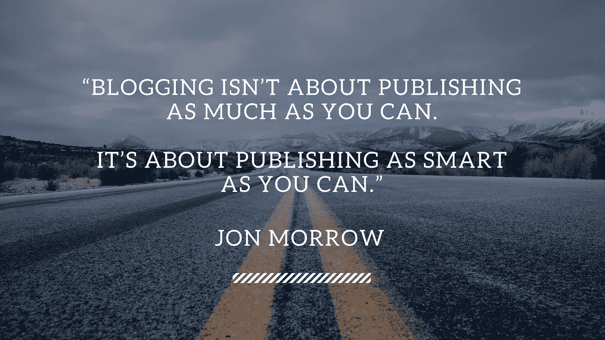

# 5 个值得订阅的最佳技术博客或时事通讯

> 原文：<https://medium.com/swlh/the-5-best-tech-blogs-or-newsletters-you-should-subscribe-to-1ba21553236>

除了书籍和 T2 播客，博客/时事通讯是了解科技行业的好方法。

那里有大量非常好的内容。我倾向于订阅我觉得稍微有趣的每一个博客或时事通讯(FOMO 的信息，你知道)。这很容易导致邮箱里的文章爆炸，几乎不可能处理所有的事情，每当我看到收件箱里未读邮件的数量时，都会有这种不安的感觉。

为了解决这种痛苦，几周前我实施了一个简单的规则:如果我不每天阅读出版物，我会退订，不管它有多有趣。这几乎立刻给了我一种内心的平静，感觉很好。

我花了一段时间才想出一个每日阅读的规律，但我很高兴我找到了一个对我很有效的规律。完成这个清单仍然需要一些时间和承诺，但是相信我，这是值得的。

这是我每天必读的 5 本书。

**1)信息**

彻底的高质量新闻。[信息](https://www.theinformation.com)提供深入挖掘的长篇文章。除了收集和解释事实之外，他们还就科技领域最热门的话题发表强烈且往往具有挑衅性的观点。我目前的首选。

**2)条款清单**

[条款清单](http://fortune.com/tag/term-sheet/)提供科技行业风险投资交易、首次公开募股、基金变现和人员流动的每日概览。这是掌握创业公司和风险投资最新消息和趋势的好方法。

**3)一个 VC**

风投是联合广场风险投资公司的风险投资家弗雷德·威尔逊的热门博客。日常的，简洁的，切中要害的，信息丰富的。我喜欢。

**4)费尔德的想法**

[Feld Thoughts](https://www.feld.com) 作者是 Foundry Group 的风险投资家 Brad Feld。除了一些对这个行业的深刻见解，我非常欣赏布拉德·菲尔德分享他的奋斗和情感的方式。写下他的抑郁症的勇气是非凡的，尤其是在这个社会媒体只通过肤浅的状态更新和过滤照片向我们展示完美生活的世界里。尊重。

等等，但是为什么呢

[等待，但为什么](https://waitbutwhy.com)不是每天都到。这是完全不可能的，因为蒂姆·厄本对他所写的每一个话题都进行了极其深入的挖掘。他将复杂的话题分解，并将其转化为任何人都能理解和掌握的更具体的类比。我多次重读他关于埃隆·马斯克、人工智能和拖延症的帖子。老实说，我对《等待》百听不厌，但为什么呢:有趣、易读、信息量大。

希望你喜欢它们！

## 这篇文章发表在[《创业](https://medium.com/swlh)》上，这是 Medium 最大的创业刊物，有 273，707+人关注。

## 订阅接收[我们的头条新闻](http://growthsupply.com/the-startup-newsletter/)。

