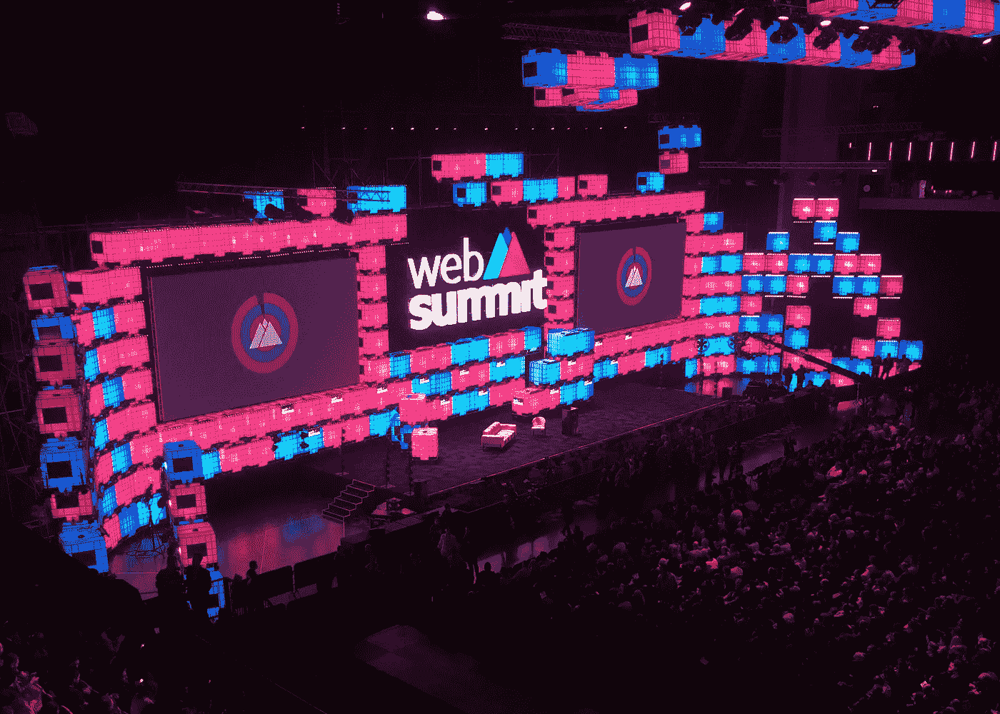

# 2018 年网络峰会的 5 大教训

> 原文：<https://medium.com/swlh/the-5-biggest-lessons-from-the-web-summit-2018-91f7a2e8fb86>

Web Summit opening

来自 160 多个国家的近 70，000 名与会者，1，200 多名发言人，1，800 多家有前途的初创公司，财富 500 强公司，24 条赛道和 200 多名员工努力筹备，网络峰会成为世界上最大的技术会议，并被称为全球最好的会议(福布斯)，T2 达沃斯(极客)(彭博)和 T4 格拉斯顿伯里(极客)(卫报)。里斯本 2018 版结束了，该外卖了。

# 规划就是一切

这是我第一次参加网络峰会，我学到的最重要的一课是计划是关键。怎么强调都不为过。我下载了官方应用程序，并在我的时间表中添加了一些项目，主要是讲座和一些研讨会，假设有一个粗略的指南会很好。事实上，这远远不够。各阶段之间的距离，有时穿过人群的困难，以及找到一个跟随演讲的地方——这些都使得在会议中导航比我想象的要复杂得多。

给未来的自己一个提示:如果两个有趣的讲座间隔不到 10 分钟，就选其中一个，除非是在同一个展馆或者两个相邻的展馆举行。

# 所有的演讲都可以在网上看到

并不是每个人都知道 24 条道路的所有演讲在会议结束后都可以在网上看到。目前，在网络峰会的 youtube 频道上有近 300 个上周的视频。

在实践中意味着什么？你可以放松一点，把你的注意力转移到网络或探索创业摊位上(这可能是整个会议最有趣的部分)。你也可以参加研讨会，这往往比讲座内容更重，更具体。最后，你可以逃离 FOMO。

# 这不是一个非常技术性的技术会议

网络峰会可能是世界上最大的科技会议，但肯定不是最高科技的会议。这次会议的想法是将技术人员和行业聚集在一起——这个目标年复一年地实现，并取得了巨大的成功。出席峰会的人数大幅增长——从 2010 年的 400 人增加到今年的 7 万人，聚集了科技公司的创始人、首席执行官、政策制定者、国家元首和初创公司。

这是一个获得灵感、结识有趣的人、问自己一些关于该领域未来的问题的绝佳机会。是真正学习新东西的地方吗？这取决于你做什么。如果你的公司很大，并且以相当保守的方式运营，你属于稍微年长的一代，或者你对技术一无所知，但想了解它——有很多东西要学。如果你比较年轻，有很强的技术背景，或者对创业生态系统有些熟悉——你可能不会在每个角落都发现新事物。是不是说你不应该去？绝对不是。像这样的会议是一个绝佳的机会，可以让你先睹为快，了解行业的未来，发现什么是新的潮流，或者只是与志同道合的人交流。只是确保调整你的期望:你不是来学习一个新的框架或掌握另一种编程语言的。

# 女性越来越多地出现在科技领域

…但事情并不都是阳光和彩虹。今年的网络峰会上，44%的与会者是女性，而五年前是 24%——这无疑是一个令人印象深刻的非常积极的变化。组织者试图让女性成为演讲者和主持人的努力也是显而易见的，对此我绝对赞赏。但这是否意味着在科技行业工作的人中有近一半是女性呢？可悲的是，仍然没有。如上所述，网络峰会并不是世界上最高科技的会议。与会者来自网络和移动开发、人工智能、增强现实等领域，还有营销、公关、用户体验、健康、旅游或项目管理等领域。其中一些领域在平价游戏中的表现比科技领域好得多。

性别差距仍然需要解决，谁应该解决这个问题——公司还是政府。就在网络峰会在里斯本召开的几天前，欧盟纪念了同酬日——根据性别薪酬差距，一年中普通女性停止收入的时刻，目前欧盟的性别薪酬差距为 16%。

女性在技术和领导层面的代表性也严重不足，所以即使我们肯定应该庆祝小胜利，网络峰会上女厕所的长队也不应该遮蔽我们的视线。让我们记住，就在去年，欧洲最大的 JavaScript 会议 dotJS 会议的组织者仅仅因为[包括女性 t 恤尺寸](https://blog.getkumbu.com/posts/our-thoughts-on-dotcss-dotjs-conference-2017-in-paris)就给与会者打分。

# 重要问题仍有空间

我猜想大多数大型会议都或多或少地受到营销的影响。在这方面，网络峰会也不例外。营销尝试遍布初创公司的展台——理由充分，因为主要目标是找到客户和投资者——但可悲的是，为了销售，很多谈话都跑题了。

好消息是大问题和重要问题仍有空间。以下是我认为最重要的几个例子:

*   什么是网络契约，我们需要网络契约吗？
*   据估计，明年将有史以来第一次超过 50%的全球人口连接到互联网。这意味着什么，我们在连接另一半的过程中有什么作用？
*   一个企业做好事能做好吗？
*   我们需要一份数字人权宣言吗？
*   我们能阻止假新闻的兴起，拯救媒体行业吗？如何在虚假信息时代建立信任？
*   科技正在扼杀民主吗？
*   科技能为解决全球气候变化和塑料污染做些什么？
*   如何鼓励女性创新？
*   什么是公平的数字经济，如何在网络威胁时代实现数字和平？

在接下来的几周里，我将回到这些话题中的一些。

网络峰会有一种清晰的天赋，可以把人们聚集在一起，激发人们去做伟大的事情。因为它将在里斯本呆上 10 年，所以这是一个参观这座神奇城市的好机会，尤其是如果你还没有去过的话。组织者的目标是让它每年都与时俱进、与众不同、更好。考虑到这一点，我希望我能在 2019 年亲自检查一下。

## 这篇文章发表在[《创业](https://medium.com/swlh)》上，这是 Medium 最大的创业刊物，有+388，856 人关注。

## 订阅接收[我们的头条新闻](http://growthsupply.com/the-startup-newsletter/)。

