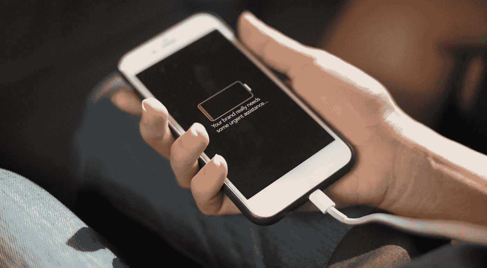

# 5 个最残酷的品牌重塑挑战，分解(60 秒内)

> 原文：<https://medium.com/swlh/the-5-most-brutal-rebranding-challenges-broken-down-in-60-seconds-1d93a48bde21>

## 如果你不给市场讲故事，他们会为你定义你的品牌故事。这仅仅是开始。

重塑品牌的挑战来自于使用错误的理由来开始重塑品牌或任意的(最多是有问题的)标准。例如:

*   某个新人进入公司，决定改变品牌以符合“我以前公司的工作方式”(没有观察新公司的工作方式)
*   有人只是有一种“我们需要改变”的直觉，或者某个家庭成员是“品牌专家”
*   有人看到其他公司在使用一些人人都在谈论的“新社交媒体渠道”，于是决定“我们必须做出改变来适应”

你明白了。

几年前，我在 Google worldwide organically 上写了一篇关于[品牌重塑](https://www.risingabovethenoise.com/how-to-rebrand-19-questions-ask-before-you-start/)(排名第一或第二)的排名最高的文章(换句话说，这不是付费广告)。

从那以后，我找出了五大*公司在重塑品牌时最常见、最令人沮丧、最痛苦、最令人虚弱的挑战*。

作为品牌重塑方面的专家，我决定解决 ***五大品牌重塑挑战和地雷*** ，这些挑战和地雷削弱了寻求在本周《周三一分钟》中重新定义自己声音和相关性的公司和品牌。

# 哪一个是你最纠结的？

1.  *被归入某个类别或感知价值？*
2.  *处理市场对你所做或所卖产品的误解？*
3.  尽管你尽了一切努力，还是停留在陈旧过时的印象中？
4.  不知道你想要和需要传达什么，最重要的是，向谁传达？
5.  做着同样的老一套事情，只是因为我们一直都是这么做的？

我会在这个视频中多讲一些:

那是五个杀手。说真的。

如果不知道你在解决哪些(或多少)问题，你的品牌重塑将很难执行，或者更糟，是一个令人沮丧的失败。

有一个确切的路线图，我已经完善了 30 多年。

很精确。

原因很简单，你的品牌不同于其他任何品牌，也不应该如此，除非你知道并真正理解品牌的本质(这就是*差异化*)。

# 让我们杀死这条龙(驯服重塑品牌挑战时至关重要)

第一步是这样的。

事实:如果你不给市场讲故事，他们会为你定义你的品牌故事。

你必须知道，没有人——没有顾客，没有“部落”，没有追随者群体——会为你定义你的品牌故事(是的，有一些罕见的例外，星星排成一线，发生了一些不寻常的事情，但那是 ***而不是*** 常态，是 ***而不是*** 可以依赖的东西)。

这一个落在你身上。一些公司在内部解决这个问题。其他人打电话给我，是因为我带来了一定的经验、业绩记录、罕见的技能组合，以及对现场的公正态度，这使得其他人在过于接近一个品牌、其历史和任何内部“噪音”时根本无法做到的事情。

需要更多见解？他们来了。

# 11 个品牌重塑案例研究

我整理了这些文章，以帮助你真正了解重塑品牌包括哪些内容。 ***这些帖子向你展示了*** 之前和之后的例子，而不仅仅是谈论更多的过程。

*   [*如何重塑品牌:开始之前要问的 19 个问题*](https://www.risingabovethenoise.com/how-to-rebrand-19-questions-ask-before-you-start/)
*   [*在耐克的 27 年:我对品牌的了解*](https://www.risingabovethenoise.com/nike-branding-after-27-years-with-david-brier/)
*   [*应对 1230 亿美元的产业:地标表演集团——避免最奇怪的品牌错误*](https://www.risingabovethenoise.com/branding-mistakes-to-avoid-tackling-123-billion-industry/)
*   [*邓恩兄弟*](https://www.risingabovethenoise.com/reintroducing-a-coffee-legend-to-a-new-generation/) *—再介绍一个咖啡传奇*
*   [*美国舞蹈学院——如何发现你的品牌不为人知的故事*](https://www.risingabovethenoise.com/brand-storytelling-case-study/)
*   [*“简单小吃”——卓越品牌的四大特质*](https://www.risingabovethenoise.com/the-4-traits-of-an-exceptional-brand/)
*   [*如何在最贵的街区吸引合适的客户*](https://www.risingabovethenoise.com/increase-traffic-by-attracting-the-right-buyer/)
*   [*重塑里程碑系统——一家 5000 强公司如何正确行事*](https://www.risingabovethenoise.com/how-to-rebrand-how-an-inc-5000-tech-company-did-it-right/)
*   [*大型合作社——一个新标识如何向其 66，000 名成员重新介绍合作社*](https://www.risingabovethenoise.com/new-logo-rebrand-fo-a-co-op-to-its-66000-members/)
*   [*真味——如何瞬间锁定客户的情感甜蜜点*](https://www.risingabovethenoise.com/branding-and-the-emotional-sweet-spot-of-your-customers/)

# 如果你喜欢这篇文章，请评论、鼓掌、分享。如果你需要重塑品牌的帮助，我们来谈谈。

*最初发表于*[*www.risingabovethenoise.com*](https://www.risingabovethenoise.com/the-5-biggest-rebranding-challenges-broken-down/)*。*

## 这篇文章发表在 [The Startup](https://medium.com/swlh) 上，这是 Medium 最大的创业刊物，拥有 338，320 多名读者。

## 在这里订阅接收[我们的头条新闻](http://growthsupply.com/the-startup-newsletter/)。

