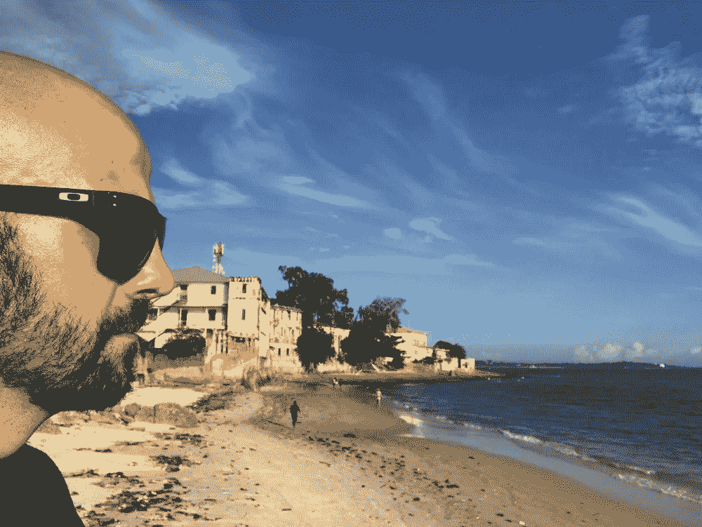

# 在生活和工作中成功的五步生产力系统

> 原文：<https://medium.com/swlh/the-5-step-productivity-system-to-succeed-in-life-and-work-e404e9c78155>

## [如何](https://www.success.com/blog/how-to-redesign-your-life-with-just-3-questions)重新设计生活和工作

如何重新设计生活和工作而不发疯？这是一个我一遍又一遍问自己的问题……旅程还在继续，我写这篇文章的时候在塔斯马尼亚，德文波特，在去科尔斯湾的路上，我睡在一辆三菱 ASX 的后座上，有一个床垫，一个枕头和一条毛毯，那是我打折买的。这是我连续禁食的第二天，我在黎明时在海边冥想了 31 分钟，我精确地工作了 195 分钟，我租了一辆自行车，我训练了 2 个小时。然后我参加了一个自我指导的力量瑜伽班，完成了身体活动……我可以说，我对自己的生活和工作有着几乎绝对的控制权。

# [如何](https://www.success.com/blog/how-to-redesign-your-life-with-just-3-questions)重新设计生活和工作

为什么有的人成大事，有的人不行？为什么有人能在更短的时间内获得三倍以上的结果？吃饱了的人和没吃饱的人之间会发生什么？我相信，有一种工具可以帮助你成为那样的人，我称之为生活-工作重新设计系统。

组成系统的五个参数:

1.  历史
2.  演员
3.  目标
4.  规则
5.  标记

这五个参数就是成分。拿着它们，将它们与你在生活和工作中所做的事情进行对比，你会开始发现你直到现在才注意到的习惯。

# 1.历史

你的工作经历是怎样的？我不认为你会出现，保持座位温暖，然后离开。但是深入下去，故事的部分还挺多的吧？示例:

你在网上玩*战场一*。你可能是一个在意大利山区战斗的枪手。你的小组正试图把坏人赶出地堡。

其他班试图避开山上的坦克。你的工作与战斗相比是微不足道的，与战争相比是微不足道的，但它是必不可少的，这里和那里的人们都指望你。

想想你需要做的工作。如何重新设计生活和工作并不容易，但也不是一件非常复杂的事情。你可以为一个 560 人的公司做广告，但你的工作是故事的一部分。这个伟大的故事，以及你在其中扮演的角色，全靠你自己去思考。

# 2.演员

也许你的团队。你的老板们。竞争对手。家庭成员。你的搭档。它们都是你生活和工作的一部分。他们的动机是什么？他们如何融入你的世界？谁应该成为你的盟友？

# 3.目标

目标是什么或者胜利在哪里？这个参数比较简单。也许一天能卖出一笔。也许是为了一天创造三个。每月获得 17 次引用，每两周写一首歌，或者一年写一本书。不管你的角色是什么，我相信总有值得追求的东西。这是什么？然而，记住这一点(这是一个问题):收入通常不是目标。收入是奖励，但胜利是不同的，更多的东西。

# 4.规则

哪些是规则？如果你想到这一点，你就会知道你的生活和工作的规则，容易。你必须发现的是为什么那些规则会存在。然后想想有哪些规律会帮助你赚得更多更好。这是关键，一旦你知道了规则，你就可以利用它们，甚至为自己创造新的规则。我们经常关注那些阻碍我们前进的东西，但有许多规则(核心技能、超级习惯、 [**、超生产力**](https://isragarcia.com/ultra-productivity-guide-basic-practices) 、 [**、高绩效**](https://www.inc.com/jeff-haden/the-6-high-performance-habits-only-the-most-extrao.html) )是显著的优势。找到那些。

# 5.标记

评分方法是什么？这里有一个很重要的，上班，早到早走才是目标。你比我更清楚这一点。你如何向那个目标前进？你如何着手这个故事？还有你是怎么提高分数的？

# 关键是重新设计

问题是我们的思想被分散了，很快就忘记了。保持在路上的一个方法是专注于为你的生活和工作重新设计的系统。它的行为更像一场游戏，决定你要付出代价才能赢。

试着在一张纸上，发现你生活或工作中的这些点。你可以找到答案和新的获胜方法。或者不是。如何重新设计生活和工作是你必须瞄准的目标。

【本帖首发于[**【isragarcia.com**](https://isragarcia.com/how-to-redesign-life-and-work)】

# 只有当你觉得值得的时候，才让这个故事震撼吧！如果你发现任何有价值的东西，请鼓掌。

> Isra Garcia = 53 个客户，48 家企业，400 次演讲，3.504 篇帖子，24 个项目，6 本书，380 场讲座，6 家公司，17 次冒险，25 次实验，∞失败。到目前为止…
> 
> [营销人员](https://isragarcia.com/wp/marketer)。顾问。扬声器。作家。教育家。经理。在 [IG](http://thisisig.com) 的负责人。博主。企业家。颠覆性创新。数字化转型。高绩效者和生活方式实验者。

# 行动号召>>订阅[此处](http://feeds.feedburner.com/isragarcia)更多类似的文章！

## 这个故事发表在[的创业](https://medium.com/swlh)上，这是 Medium 最大的创业刊物，有 330，853+人关注。

## 订阅接收[我们的头条新闻](http://growthsupply.com/the-startup-newsletter/)。

