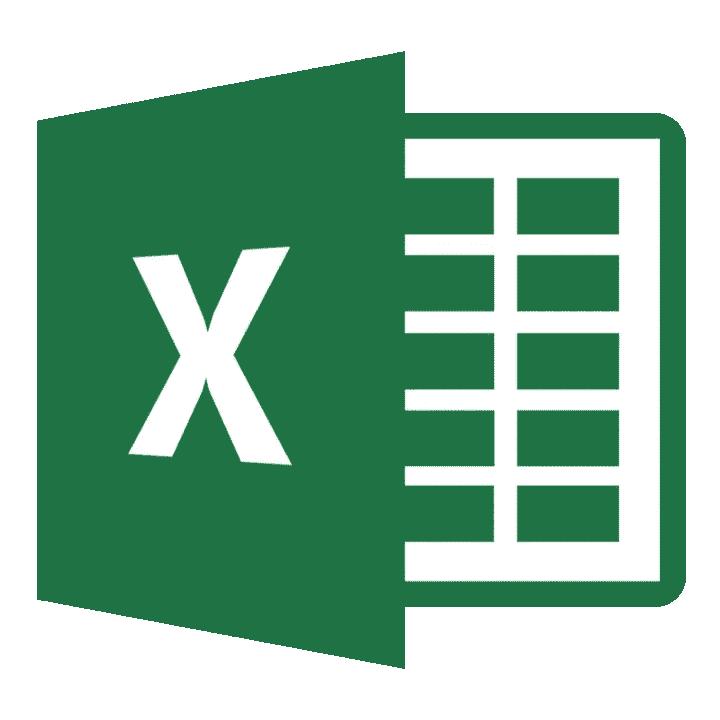
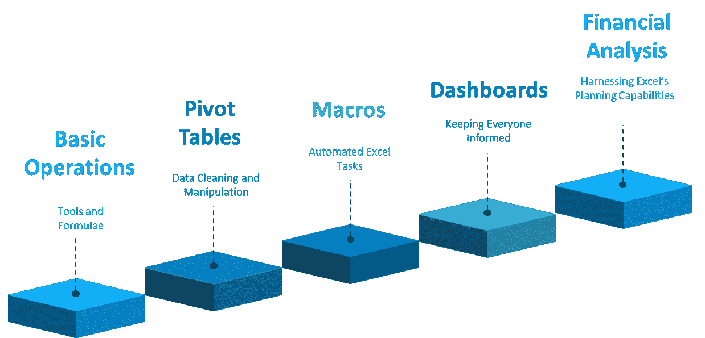
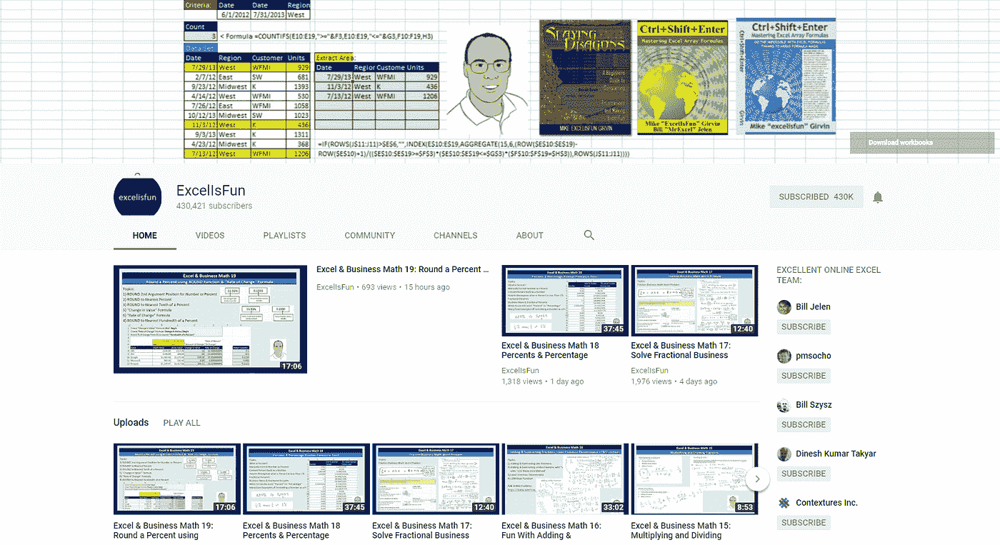

# 掌握 Excel 需要的 5 个步骤

> 原文：<https://medium.com/swlh/the-5-steps-you-need-to-master-excel-28e7264b23ff>

你需要掌握 Excel。做管理顾问让我很清楚这个事实。

但这还不是全部。无论你是在设计公司未来 5 年的财务战略，还是在策划你姐姐的婚礼，或者仅仅是在制定每月的家庭预算，你都需要学习 Excel。它是全世界数百万人的首选规划工具。

Excel 的核心优点是，前一分钟它还在为你的“餐巾纸背面”商业计划做简单的算术计算，下一分钟它就成了一家跨国公司的 5000 万行数据的数据库。Excel 可能是世界上唯一一个对 14 岁的孩子做作业和对一家价值数百万美元的公司副总裁一样有用的工具。

# 在 Excel 中你需要学习什么

但是，Excel 的强大功能也带来了一个问题。我们大多数人都不知道如何开始掌握它。不知道从哪里开始，我们经常放弃并依赖于我们所知道的，停滞我们的成长。

但不会再有了！！！

这是你在 Excel 中需要掌握的 5 大技能，以便更好地适应它。一旦你这样做了，你会发现你比你的武器库中的任何其他工具使用它更多。

所以现在开始。

# 掌握 Excel 所需的 5 项技能

# 你唯一需要去学习的地方

好消息是，你只需要一种资源就能掌握所有的 5 种技能。

这是[娱乐节目](https://www.youtube.com/user/ExcelIsFun) YouTube 频道。

那是因为

*   这是绝对的，没有任何附加条件，没有免费的电子邮件地址
*   他们给你 Excel 文件，你可以边看视频边处理，给你真实的世界体验
*   他们有成千上万个视频，涉及你能想到的每一个 excel 主题(谁知道你能做出一千个 Excel 视频？)

# 5 项技能中的每一项都需要的播放列表

## 基本操作

[**链接**](https://people.highline.edu/mgirvin/ExcelIsFun.htm) 到下面的跟随工作簿(它们链接到每个视频开头要跟随的文件，以防你感到困惑)。

## 数据透视表

[将](https://people.highline.edu/mgirvin/AllClasses/214_2013/214/Busn214_2013.htm)链接到下面的工作簿(它们链接到每个视频开头要跟随的文件，以防您感到困惑)。

## 宏指令

[将](https://people.highline.edu/mgirvin/AllClasses/218_2016/218Excel2016.htm)链接到下面的工作簿(它们链接到每个视频开头要跟随的文件，以防您感到困惑)。

## 仪表板

[链接](https://people.highline.edu/mgirvin/AllClasses/218_2016/218Excel2016.htm)到下面的工作簿(它们链接到每个视频开头要跟随的文件，以防你感到困惑)。

## 财务分析

[将](https://people.highline.edu/mgirvin/AllClasses/218_2016/218Excel2016.htm)链接到下面的练习册(如果你感到困惑，它们会链接到每个视频开头要跟随的文件)。

# 现在开动吧！！

记住，光看视频是学不会 Excel 的。为了成为真正的大师，以下是你需要遵循的步骤。

*   观看上面的视频
*   在链接的 Excel 表格中练习
*   一有机会就做 Excel(结婚只是为了练习 Excel 预算，如果有必要的话)
*   使用 Excel 作为您的每日计划
*   下载免费的模板，尽可能多地用它们做实验(下面提供了一些好的)

# 其他资源的链接

[**Excel fun 视频 Excel 基础播放列表**](https://www.youtube.com/watch?v=XmSp2-Fa4rg&list=PL1765005D6626A5BA)

[**Excel 透视表播放列表**](https://www.youtube.com/watch?v=e-yuYNgsHAk&t=5s)

[**Excel 宏播放列表**](https://www.youtube.com/watch?v=WKyN8e7XXjI&list=PL68B3F66EEB526D5B)

[**Excel 仪表盘播放列表**](https://www.youtube.com/watch?v=hYPwX_CfYv4&list=PLrRPvpgDmw0kYt4c50Sg7BXGLBAjiW6VQ)

[**Excel 财务类播放列表**](https://www.youtube.com/watch?v=qeWOy4Q-1n8&list=PL90E1F26C7B85E78F)

[**如何使用 Excel 进行大数据(超过 100 万行)**](https://www.youtube.com/watch?v=NHk-g_EChik)

[**模板 32 免费 Excel 电子表格模板**](https://www.smartsheet.com/32-free-excel-spreadsheet-templates)

[**备忘单帮助你掌握微软 Office 的 10 大备忘单**](https://lifehacker.com/top-10-cheat-sheets-to-help-you-master-microsoft-office-1768667500?platform=hootsuite)

[**Analytics Vidya Excel 教程**](https://www.analyticsvidhya.com/resources-excel/) **(这也是数据科学的一大资源)**

*本文原载于*[***Techonomics***](http://techonomics.io/)*。一个关于职业和商业策略的博客。更多战略善良，* [***订阅***](http://techonomics.io/the-strategy-pill/) *我们即将发布的简讯，* ***战略药丸。***

## 这篇文章发表在 [The Startup](https://medium.com/swlh) 上，这是 Medium 最大的创业刊物，拥有+400，714 名读者。

## 在这里订阅接收[我们的头条新闻](http://growthsupply.com/the-startup-newsletter/)。

