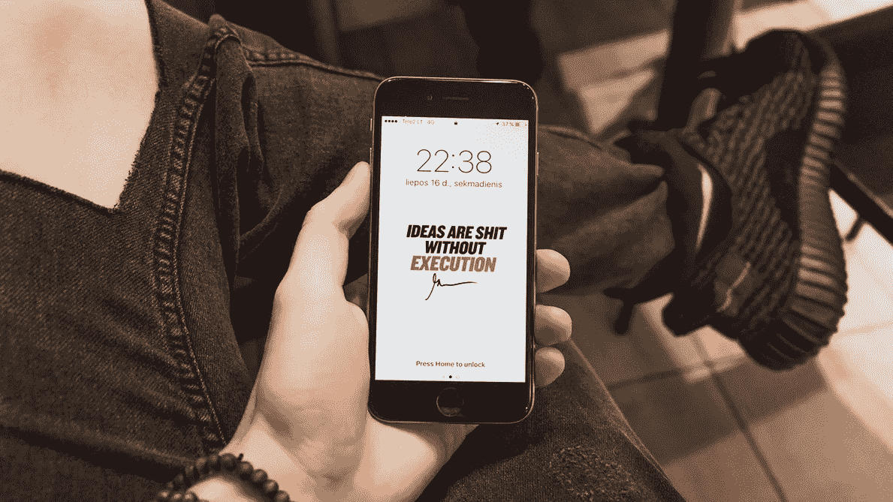

# 51/49 法则和如何留下你的遗产

> 原文：<https://medium.com/swlh/the-51-49-rule-and-how-to-leave-your-legacy-b5a51ea49807>

Photo by [Jonas Svidras](https://unsplash.com/photos/Yh0ar4hsEp0?utm_source=unsplash&utm_medium=referral&utm_content=creditCopyText) on [Unsplash](https://unsplash.com/search/photos/gary-vaynerchuk?utm_source=unsplash&utm_medium=referral&utm_content=creditCopyText)

你想因为什么而被人记住？

这是一个深刻但值得回答的问题。

这是我最近听到向加里·维纳查克提出的一个问题。

大多数人会结结巴巴地问这样一个哲学问题。不是加里。

他脱口而出“51/49。”

51/49 是指在每一段关系中(生意或私人)，他都想付出至少 51%的价值。为什么？他想产生影响，留下遗产。更不用说把别人放在第一位会带来严重的投资回报。

他不只是这么说，他是这么做的。他的职业是免费提供自己最好的秘密，不断发布高质量的内容，并在电子邮件和社交媒体上逐一回复粉丝。

因为 51/49 原则，他花费了大量的时间去攀登不可攀登的高峰。那是奉献。

> “生活给予给予者，也从索取者那里索取。”—吉米·罗恩

加里的观点很有道理。如果你决定全力以赴实现你提供的价值，你的生活会变得多好？我想象自己拥有更亲密的关系，赚更多的钱，真正地更加充实。

这在理论上看起来不错，但在每种情况下都要尽力增加价值，这是一项艰巨的工作。

这里有几种方法可以做到:

**写一封手写的感谢信** —你上一次给客户或曾经亲自帮助过你的人写感谢信是什么时候？

**放下电话**——当你排队买三明治时，没必要呆在 Instagram 上。像正常人一样抬头和收银员说话。如果你要和某人见面或一起吃饭，把手机拿开。给他们你一心一意的关注。

**创造内容** —找到你喜欢做或擅长做的事情，并与世界分享你的激情。一开始这很吓人，但人们希望听到同龄人的声音。

**跟进** —人们总是在销售中说:承诺不足，交付过多。但是，我们真的会比我们说的更快地跟进，或者提供比最低要求更多的细节吗？

建立联系——人们喜欢媒人。你认识的两个人中有谁会从见面中获得巨大的价值？连接它们。如果他们发现了价值，他们会永远记住它，而且绝对不会花你一分钱。

**分享你的想法** —这是加里非常喜欢的一个概念:免费提供你最好的想法。为什么？因为每个人都会因此而爱你，而且 99%的人都懒得付诸行动。

这个清单可以一直列下去，但是我想你已经明白了。

如果有人问我这个问题，我会说，我希望人们记住我是一个最大限度地发挥了自己的全部潜力，并帮助别人也这样做的人。

那么我今天要做什么？

我沉思了。我写这篇文章是为了(希望)启发你，让你思考。我要为我的销售工作打很多电话。我的播客有新客人了。我要去健身。我要带我的女朋友出去约会。

简单的事情——但是如果我今天能在所有这些事情上提高 1%,我将朝着正确的方向前进。

现在，我们把这个问题反过来。

你希望因为什么而被人记住？如果和 Gary 类似，你现在有一些简单的方法来应用 51/49 原则。

很有可能是其他的事情——赚很多钱，做一个伟大的父母，为无家可归的人服务——这个清单是无限的。

把这个第一目标放在心上。让它来指导你的决定。

> *“分清主次，执行”—乔科·威尔林克*

# 想让你的游戏更上一层楼吗？

# [在这里注册我的时事通讯](http://eepurl.com/c-46aj)

# 关于作者

Tom Alaimo 是一位充满激情的 B2B 销售专家。他目前是 [*TR Talk 播客*](https://soundcloud.com/ryan-warner-799706255) *的主持人，在这里他帮助千禧一代快速跟踪他们的个人发展。Tom 也是 TechTarget 的客户经理，住在旧金山。*

[网站](http://tomalaimo.com/) | [播客](https://soundcloud.com/ryan-warner-799706255) | [邮箱](mailto:thomasalaimo7@gmail.com) | [推特](https://twitter.com/TomAlaimo_TTGT)|[LinkedIn](https://www.linkedin.com/in/tom-alaimo-573a1878/)*|[脸书](https://www.facebook.com/thomas.alaimo.12) | [Instagram](http://instagram.com/talaimo7) | [媒体](/@TomAlaimo_TTGT) |*

**

## *这篇文章发表在 [The Startup](https://medium.com/swlh) 上，这是 Medium 最大的创业刊物，有 321，672+人关注。*

## *在这里订阅接收[我们的头条新闻](http://growthsupply.com/the-startup-newsletter/)。*

**