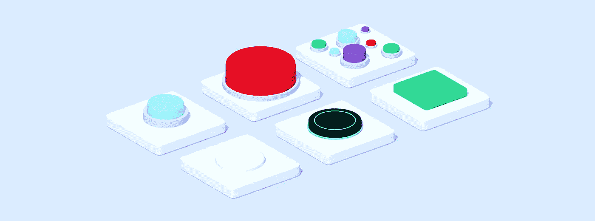

# 您将工作的 6 种产品团队

> 原文：<https://medium.com/swlh/the-6-types-of-product-teams-youll-be-working-in-e6f6e300834d>

当我收到加入产品团队的邀请时，我会在接下来的几天甚至几周内考虑许多不同的参数。我认为这是一个非常重要的决定，它将极大地影响我的生活。

我通常首先考虑的是愿景——公司的长期使命。第二件事通常是团队——我未来合作伙伴的个性、抱负和技能。

在考虑报价时，对我来说第三重要的事情是我的短期任务——每个[冲刺](https://searchsoftwarequality.techtarget.com/definition/Scrum-sprint)或季度的 [KPI](https://en.wikipedia.org/wiki/Performance_indicator) 。团队的动力是什么？团队在接下来的一年中能取得什么样的成就才意味着成功？团队在内部会议上讨论最多的是什么？这与我的个人目标和抱负有什么关系？

我发现有趣的是，大多数团队的工作和思考方式都非常不同。每个团队对短期成功的评价不同。我决定对每种团队的特征做一个小小的分解，以帮助我自己和其他人在未来做出更好的选择。

# 1.以用户为中心的团队

Press the button. It will improve your life

以用户为中心的团队是将用户置于所有其他 KPI 之上的团队。用户体验设计是公司的主要价值观。我们投入了大量的时间和精力来想出让用户最满意的解决方案。团队非常清楚自己的用户，他们的需求，他们的痛点，团队的大部分“燃料”都用来提高整体满意度，让用户更爱产品。新功能会被仔细检查，只有当它们给用户带来足够的价值时才会被添加。

**例句**:中，多林哥

**优点:**良好的用户满意度可能有助于[口碑增长](https://qz.com/249222/slacks-explosive-word-of-mouth-growth-in-one-amazing-chart/)和保持。

缺点:当以这种方式工作时，成功有时很难衡量。即使许多用户喜爱该产品，也不意味着该产品是盈利的，它最终可能会因此而关闭。

# 2.以成长为中心的团队

Only 9 hours left to press the button!

以增长为中心的团队是主要关注数字的团队。公开的 sprint 会议将会谈论很多术语，如*收购*、*转换*、*参与*和*保留*。路线图优先考虑更有可能影响数字的任务，而不一定是对用户最好的事情。这可以通过改进产品和增加价值来实现，但也可以通过增加促销、推送通知，在某些情况下甚至是[黑暗模式](https://darkpatterns.org/)。员工的奖励主要是根据他们对数字产生影响的成功程度。

**例子**:Booking.com、LinkedIn

**优点:**如果公司成功发展，新的资源将有助于雇佣有才华的员工，并有助于打造更好的产品，在以后的阶段快速前进。

**缺点:**用户满意度可能会下降，这将使更关注用户的竞争对手更容易占领市场。

# 3.以功能为中心的团队

Look at all of these buttons we’ve built for you.

以功能为中心的团队是一个有很多新想法的团队。路线图对每个特性都有最后期限，团队的重点是按时发布讨论的特性。这些特性通常来自用户的请求、利益相关者的需求，或者销售团队希望将特定的特性作为卖点。

**示例** : Wix、Atlassian

**优点:**增加功能可能有助于销售团队带来新的受众。

缺点:拥有许多功能可能会降低产品的可用性。此外，当团队总是致力于新功能时，可能会忘记[改进产品的其他方面](/swlh/the-problem-with-roadmap-first-teams-21775e9d4c31)。

# 4.以设计为中心的团队

Introducing: Button X. Our best button yet.

以设计为中心的团队是一个将产品的美观和奢华放在首位的团队。它的重点是运送令人印象深刻的产品。设计师受到高度重视，并花费大量时间研究，构思和草图。

**例子**:苹果、耐克

**优点:**用户可能会变成超级用户，或者“粉丝”,并且变得非常忠诚于公司所有当前的&未来版本。

缺点:好的设计往往不便宜。如果大众不采纳这个设计，公司可能会失败。此外，美观可能是以牺牲可用性为代价的，这会降低用户满意度。

# 5.以技术为中心的团队

Once you press the button, our AI algorithms will do its magic

以技术为中心的团队是一个主要致力于改进和维护公司技术的团队。它可能会花大量时间来重构代码、修复错误、切换到更好的框架，有时还会花大量时间来研究和拓展新技术的边界。

**例子**:亚马逊，谷歌 AI

**优点:**快速稳定的产品可以带来更好的用户满意度。此外，有时这些公司有助于改变世界。

**缺点:**花费大量的时间为简单的产品编写更好的代码，而这些产品“足够好”会拖团队的后腿。

# 6.天真的团队

Well… We’ve built a button. It kinda works. Now what?

一个幼稚的产品团队是一个在没有明确的短期 KPI 的情况下开发产品或功能的团队。有人提出了一个想法，这个想法被团队采纳了，现在人们正在努力使它生效。花在研究、设计或开发上的时间不多。这通常是一种验证想法的惯例，或者对于一个团队来说，他们可以允许自己在没有明确目标的情况下从事创造性的工作。

**例子**:黑客马拉松项目，早期创业公司

**优点:**团队可以更有创造力，行动更快。这个想法可以给很多人带来价值，并且可以在以后的阶段被货币化和改进。

**缺点:**结果可能是人们不需要的东西，或者是将来需要重新考虑的低质量产品。

# 那么，你应该加入哪个团队呢？

答案不是非黑即白。作为一名产品设计师，我可能会在一个以用户为中心或以设计为中心的团队中非常开心，而许多开发人员可能更喜欢以技术为中心的团队。这是否意味着你不应该加入那些不迷恋你的激情的团队？不。团队可以，也需要根据所处的阶段而改变。我认为，通常情况下，UX、设计、技术和增长之间的良好平衡非常重要，可以通过合适的人来实现，最大的关注点是公司当前阶段最重要的事情。

除此之外，作为团队成员，我们有能力影响他人。例如，即使我最大的热情是用户体验，并且我加入了一个主要关心技术的团队——作为团队中的设计师，我可以利用我的沟通技巧和经验来展示更加以用户为中心的价值观。

在我看来，更有意思的问题不是问这是什么类型的团队，而是问每天和你一起工作的人是谁，他们是否会关注你认为重要的事情。

**感谢阅读！**如果你喜欢，你可能也会喜欢:

[A/B 测试案例研究:iOS 应用购买屏幕](/joytunes/a-b-test-case-study-ios-app-purchase-screen-7137a3f65df4)

[“路线图优先”团队的问题](/swlh/the-problem-with-roadmap-first-teams-21775e9d4c31)

[给我发送问题，而不是线框](/swlh/send-me-problems-not-wireframes-fc5b4f66f081)

## 这个故事发表在[的创业](https://medium.com/swlh)上，这是 Medium 最大的创业刊物，有 344，974+人关注。

## 订阅接收[我们的头条新闻](http://growthsupply.com/the-startup-newsletter/)。

