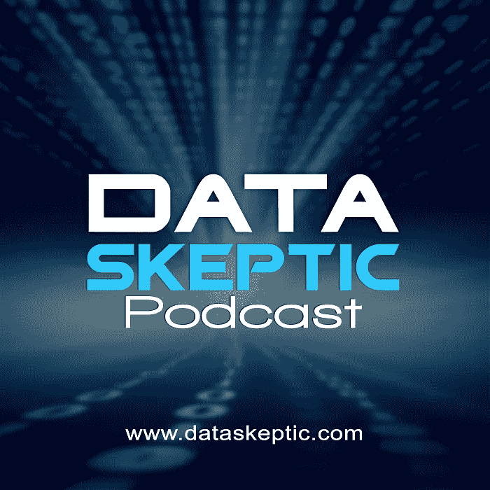
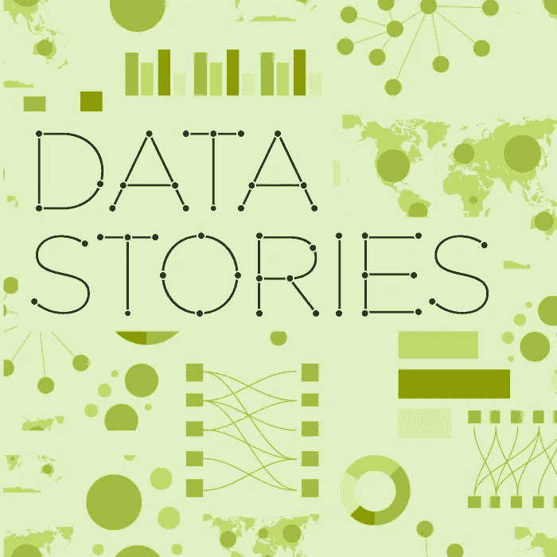
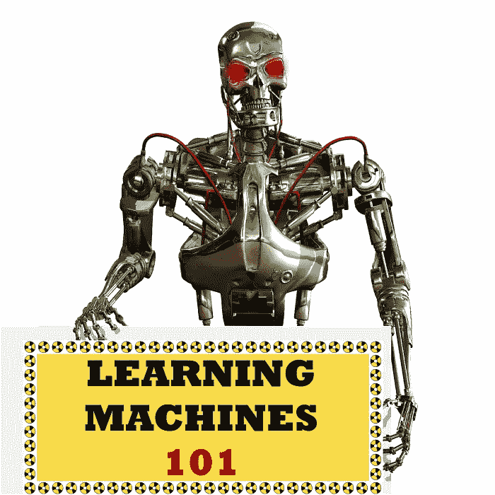
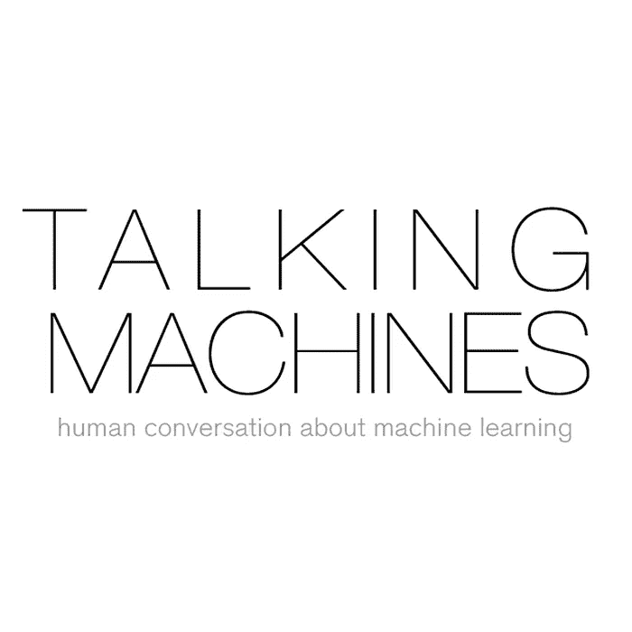

# 7 个最佳数据科学和机器学习播客

> 原文：<https://medium.com/swlh/the-7-best-data-science-and-machine-learning-podcasts-e8f0d5a4a419>

## 通过收听这些伟大的播客，学习基础知识并跟上数据科学、机器学习和人工智能的最新消息

数据科学和机器学习一直是我的兴趣所在，但现在我正在研究 [Fuzzy.ai](https://fuzzy.ai) 并试图让所有开发人员都可以使用人工智能和机器学习，我需要了解这两个领域的所有新闻。

我更喜欢的方式是通过听播客。在过去的几个月里，我听了很多机器学习和数据科学播客，所以我想分享一下我的最爱:

# 更新(2016 年 11 月):为了更新这份名单，请查看这篇文章:[十大最佳人工智能，数据科学&机器学习播客](/@mattfogel/the-10-best-ai-data-science-and-machine-learning-podcasts-d7495cfb127c#.b4s8ngq3i)

# [数据怀疑论者](http://dataskeptic.com/)

关于数据科学和机器学习的一些基础知识的一个很好的起点。每隔一周，他们会发布一集 10-15 分钟的节目，主持人 Kyle 和 Linda Polich 会就 k-means 聚类、自然语言处理和决策树学习等主题进行简短介绍，通常会使用与他们的宠物鹦鹉 Yoshi 相关的类比。这是您通过放置鹦鹉粪便了解 k-means 聚类的唯一地方。

[网站](http://dataskeptic.com/) | [iTunes](https://itunes.apple.com/us/podcast/the-data-skeptic-podcast/id890348705)

# [线性题外话](https://www.udacity.com/podcasts/linear-digressions)

由在线教育初创公司 [Udacity](https://www.udacity.com/) 的 Katie Malone 和 Ben Jaffe 主持，这个每周一次的播客涵盖了数据科学和机器学习的各种主题:教授像隐马尔可夫模型这样的具体概念，以及它们如何应用于现实世界的问题和数据集。它们让复杂的话题变得非常容易理解。

[网站](https://www.udacity.com/podcasts/linear-digressions) | [iTunes](https://itunes.apple.com/us/podcast/linear-digressions/id941219323)

# [偏导数](http://www.partiallyderivative.com/)

每周，主持人克里斯·阿尔邦和黄邦贤·摩根都是经验丰富的技术专家和数据科学家，他们在喝酒时谈论数据科学的最新消息。听偏导数是了解最新数据新闻的好方法。

[网站](http://www.partiallyderivative.com/) | [iTunes](https://itunes.apple.com/us/podcast/partially-derivative/id942048597?mt=2)

# [奥莱利数据显示](http://radar.oreilly.com/tag/oreilly-data-show-podcast)

在本播客中，O'Reilly Media 的首席数据科学家 Ben Lorica 与其他专家讨论了大数据和数据科学主题。它经常变得非常技术性，但是讨论的主题总是非常有趣。

[网站](http://radar.oreilly.com/tag/oreilly-data-show-podcast) | [iTunes](https://itunes.apple.com/us/podcast/oreilly-data-show/id944929220)

# [数据故事](http://datastori.es/)

Data Stories 比 data science 更关注数据可视化，但是两个主题之间经常有一些有趣的重叠。每隔一周，Enrico Bertini 和 Moritz Stefaner 都会与他们的嘉宾讨论不同的数据主题。最近几集关于智能城市和尼古拉斯·费尔顿的年度报告特别有趣。

[网站](http://datastori.es/) | [iTunes](http://itunes.apple.com/de/podcast/data-stories/id502854960?l=en)

# [学习机 101](http://www.learningmachines101.com/)

该播客自称为“人工智能和机器学习的温和介绍”，但仍可能变得相当专业和复杂，涵盖的主题包括:“如何使用模糊集理论和模糊测度理论对不确定事件进行推理”以及“如何使用逻辑规则表示知识”。

[网站](http://www.learningmachines101.com/) | [iTunes](https://itunes.apple.com/us/podcast/learning-machines-101/id892779679?mt=2&uo=4)

# [会说话的机器](http://www.thetalkingmachines.com/)

这份名单上的最新播客，在撰写本文时已经发布了 8 集。每隔一周，主持人凯瑟琳·戈尔曼和瑞恩·亚当斯都会和一位嘉宾谈论他们的工作，以及与机器学习相关的新闻故事。

[网站](http://www.thetalkingmachines.com/) | [iTunes](https://itunes.apple.com/us/podcast/episodes-talking-machines/id955198749?mt=2)

觉得我不公平地把一个播客从这个列表中漏掉了？给我留个便条让我知道。

*发表于* **创业、旅游癖和生活黑客**

-