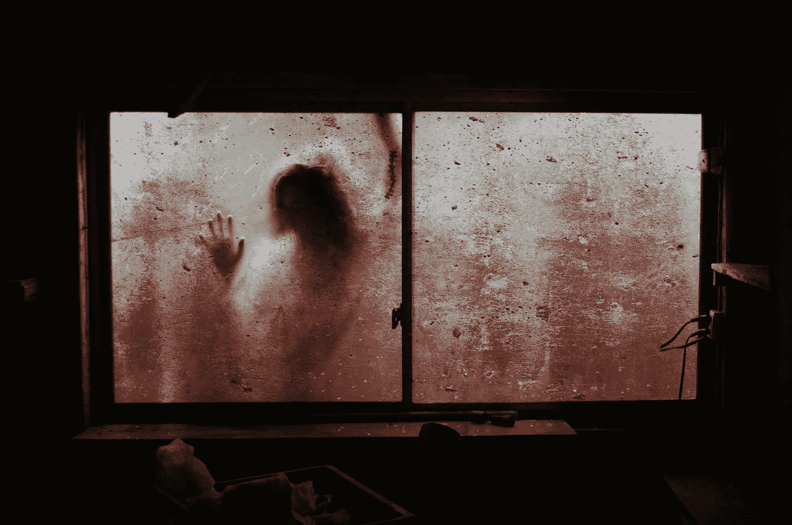

# 高效僵尸的 7 个习惯

> 原文：<https://medium.com/swlh/the-7-habits-of-highly-effective-zombies-6cf6b1d9630b>

## 我们可以从亡灵朋友身上学到很多东西。

Photo by [Priscilla Du Preez](https://unsplash.com/photos/ksMmG5vk9pE?utm_source=unsplash&utm_medium=referral&utm_content=creditCopyText) on [Unsplash](https://unsplash.com/search/photos/zombies?utm_source=unsplash&utm_medium=referral&utm_content=creditCopyText)

高效人士的 7 个习惯？嘘。那是*所以*80 年代。还有另一个来源，虽然可能性很小，但我认为你可以从中学到更多。

是的，**我说的是僵尸**。它们可能看起来不漂亮，但不可否认，它们仍然是最…