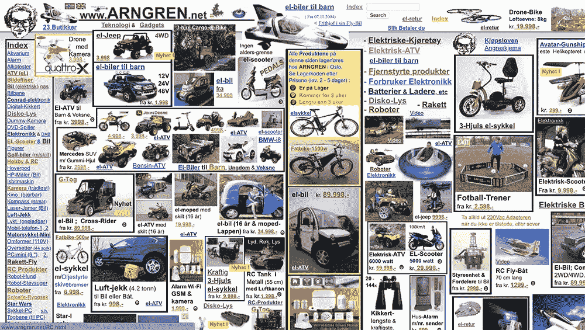
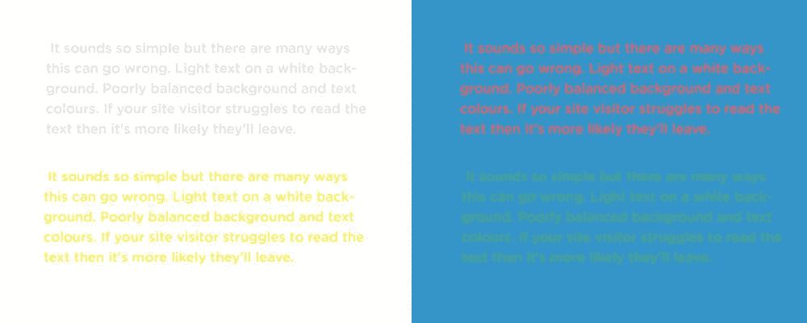
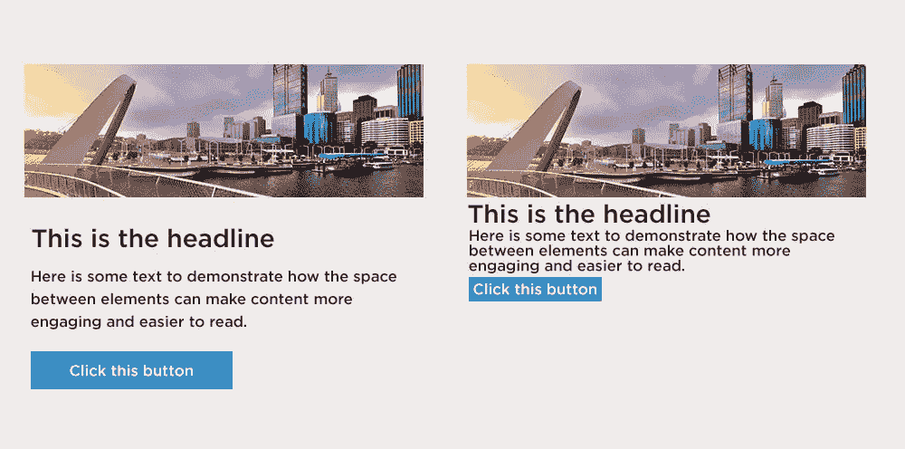

# 网页设计的七宗罪

> 原文：<https://medium.com/swlh/the-7-sins-of-web-design-2db7498eec53>

www.ARNGREN.net

设计很难。没有公式或算法能够提供“正确”的设计——至少不是每次。虽然我们作为设计师要遵守一些规则，但不管我们喜不喜欢，这仍然是一个主观的问题。同样的道理也适用于任何涉及右脑思考的事情。小野洋子的音乐和达米安·赫斯特的艺术区分了不同的观点，证明了一个人的垃圾是另一个人的财富。

在网络空间中，99%的网站都有相同的元素。我们知道，在大多数情况下，它们都需要图像、文本和颜色。然后，网页设计就变成了如何选择、使用、扩展、重新组合、构建和编码这些简单的元素——这就是问题所在。

有一些[设计精良、考虑周全的网站](https://startdigital.com.au/6-sites-to-check-out-this-november/)，以尽可能最好的方式展示企业。还有[眼睛出血，恐怖秀网站](https://www.theworldsworstwebsiteever.com/)，它们犯下了网页设计的以下 7 宗罪。

# 1.文本平衡

你在网站上使用的字体对它的表现起着很大的作用。文本大小、行高和页面上使用的字体数量都会影响展示效果。

*   尺寸很重要。根据我们的经验，14px 到 18px 是标准正文的合适尺寸，标签和标题等支持文本通常在 13px 到 14px 左右。虽然很难确定所有标题标签(主要标题)的最佳大小，但 h1 通常是 36px 到 50px，H2 在 36px 到 30px 之间，并且随着层级的降低，大小会减小。确定你的视觉层次是否需要修改的一个好方法是眯着眼睛直到所有的单词都变得模糊不清。如果你不能区分文本，你可能要重新考虑使用的尺寸。
*   **行高。**根据所选字体的不同，无论是正文文本还是标题文本，最佳的行高通常是字体大小的 1 到 1.5 倍。如果你在这个范围的任何一边，你都是罪人。
*   **颜色。**这听起来很简单，但也有很多可能出错的地方。白色背景上的浅色文本。背景和文本颜色不均衡。如果你的站点访问者很难阅读文本，那么他们很可能会离开。
*   **字体数量。有大量的字体可供我们使用，很容易想把它们都用上。过去，我们在网站上使用了过多的字体，但我们已经认识到了自己的错误。保持使用的字体数量最少为 2 种。超过这一点，事情就会变得一团糟。**

# 2.不必要的动画

如果使用得当，动画可以增强网站设计，帮助吸引网站访问者。微妙的动作，图像悬停状态，甚至视频都可以大大改善用户体验，创造出有趣的交互方式。

如果用错了方法，动画可能会让你分心，还会碍眼。随着网页速度的提高和设计功能的改进，企业和设计师都想让一切都动画化，但这并不意味着你应该这样做。微妙的动画有助于给最无聊的网站带来一些活力，但这是一种微妙的平衡，很容易出错。

我们的建议是，避免为了制作动画而制作网站内容。使用移动来帮助把访问者的目光带到你网站的特定区域，并帮助创造参与度。

# 3.蹩脚的图像

正如我们在文章[好图片的重要性](https://startdigital.com.au/importance-of-good-images/)中所讨论的，正确的图片会吸引访问者的注意力，向他们传达特定的信息，让他们参与进来。在一个注意力短暂的世界里，古语“一幅图像胜过千言万语”在今天比以往任何时候都更加贴切。

找到与你的品牌一致、传达信息、看起来真实可信的图片并不容易。如果你想寻找时间真空，我们建议你花半个小时在 Shutterstock 上。它可以摧毁一个人的灵魂。有很多很棒的[免费股票网站](https://startdigital.com.au/15-best-free-stock-image-sites/)值得探索，也有一些很棒的付费股票网站——但它们可能会变得很贵。

除了不切实际的库存图像，上传全分辨率未经优化的图像可以说是最常见的错误之一。我们经常看到高分辨率图像的网站比手持设备更适合全尺寸广告牌。在 Start Digital，我们调整并压缩所有的图片，以确保网站在不损失质量的情况下快速加载。我们的全屏图像宽度不超过 2000 像素，理想情况下，应该低于 250kb。更重要的是，所有的图片都应该有标签，这样搜索引擎才能理解每张照片代表什么。这本身几乎就是一个帖子。

# 4.杂乱的结构

一个网站在访问者离开之前有 [7 秒的时间来吸引他们的注意力。真相！一旦他们走了，就再也不会回来了。很重要的一点是要清楚地表达你是谁，你在做什么，并且尽量不要大惊小怪。少往往就是多，但这是一种微妙的平衡。无论哪种方式，如果你试图沟通太多或太少，那么你可能会疏远你的观众。](https://www.tributemedia.com/blog/you-have-7-seconds-what-a-visitor-should-know-about-your-website-within-moments)

一旦你吸引了访问者的注意力，确保他们能够找到他们想要的信息是非常重要的。一个干净、简单的菜单结构和直观的导航有助于增强用户体验，创造更多的参与，并引导网站访问者找到他们需要的信息。

想看看怎么不做吗？看看阿恩格伦……..

# 5.弹出窗口

“我喜欢那个弹出屏幕”，从来没有人说。

弹出广告仍然被广泛使用，尤其是在销售产品和服务的网站上。我们认识到，一旦访问者在网站上停留了一段时间或试图离开网站，企业就会受到使用弹出窗口的诱惑。我们的建议是不要——除非绝对必要。没有人喜欢咄咄逼人的销售人员，我们已经越来越了解在线营销策略。

> **“平均而言，小企业主需要 1319 人才能看到他们的弹出窗口，才能获得一个点击其电子邮件链接的订户”**

它们不仅令人讨厌，而且[的统计数据显示](https://gillandrews.com/popup-statistics-beyond-conversion-rate/)转化率非常低。更糟糕的是，谷歌不喜欢弹出窗口，它们会影响你的搜索引擎优化。

# 6.空白使用不当

空白是所有优秀设计不可或缺的一部分，但也是网站展示中最容易被误解的部分之一。网站设计者希望使用空白空间，企业主希望填充空白空间，并认为这是对空间的浪费。

空白让你的内容空间可以呼吸。内容之间的间距使文本更易读，标题更突出，导航更直观。

# 7.DIY 设计

对一些人来说，这种诱惑难以抗拒。毕竟，家庭 DIY 工作很容易——可能会出错。

有这么多的 DIY 网站平台，从 Wix 到 Squarespace 以及这两者之间的任何东西，让你自己的网站变得前所未有的简单。但这并不意味着你应该。2019 年，企业将根据其网站的外观进行评判，如果你想赢得客户并击败竞争对手，确保网站的专业性至关重要。

DIY 网站建设者会让你到目前为止，但不可避免地，你的网站会看起来自制，除非自制是你的事情，它不会是你可以自豪地展示给你的客户。在这里阅读更多关于 DIY 网站的危险。

网络世界比以往任何时候都更好看，也从来没有如此苛刻或竞争如此激烈。正因为如此，[任何设计机构](https://startdigital.com.au/our-services/web-design-perth/)或设计师或[企业](https://startdigital.com.au/portfolio/)都不应该犯任何罪——更不用说 7！

如果你的企业正在寻找一个没有罪恶的网站，[给我们写封短信](https://startdigital.com.au/contact-start/)——我们在这里就是天使！(除非有人忘记储备咖啡豆……)

本文原载于 [Start 数字网站](https://startdigital.com.au/7-sins-of-web-design/)。

## 这篇文章发表在 [The Startup](https://medium.com/swlh) 上，这是 Medium 最大的创业刊物，有+391，714 人关注。

## 在这里订阅接收[我们的头条新闻](http://growthsupply.com/the-startup-newsletter/)。

