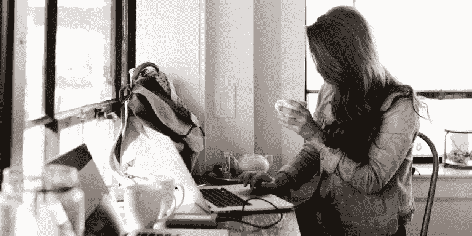

# 有助于 Spotify 首席执行官、畅销书作家和佛教禅宗信徒提高工作效率的 7 个工作习惯

> 原文：<https://medium.com/swlh/the-7-work-habits-that-help-spotifys-ceo-best-selling-authors-and-a-zen-buddhist-have-more-f89bda1e4e5a>

## 你生活中多达 50%的时间是由习惯驱动的。但是你造对了吗？

Get more tactical advice on building productive habits at [Rescuetime.com/blog](https://blog.rescuetime.com/)

生活中的一些事情比你的工作习惯更能提高(或降低)你的工作效率。虽然他们可能需要时间来建设，他们可以有一个巨大的时间投资回报。*如果*你造出正确的，那就是。

虽然我在过去写过关于如何培养更好的习惯的文章，甚至还写过如何用更好的习惯取代你的坏习惯的文章，但这并没有回答你应该培养哪些习惯的问题。

为了帮助你开始，这里收集了一些世界上最有效率的人使用的最佳工作习惯。

# 每天晚上检查你的每日、每周和每月目标

音乐流媒体服务 Spotify 的首席执行官丹尼尔·埃克(Daniel Ek)在十多年的时间里，从一名卧室网站设计师成为了音乐界最有影响力的人。这是一个不小的壮举。在最近的一次采访中，他解释了他养成的最重要的工作习惯之一，这是为了让自己每天都保持专注并获得最大收益:

> “我写下我每天、每周、每月的目标，每天晚上检查我做得怎么样。然后我就过度分配我的时间(以符合目标)。”

这是一个简单的做法，但埃克说，这帮助他没有淹没在一个高调首席执行官的日常会议日程中。

> *“人们认为创造力就是这种没有边界的自由精神。不，事实上世界上最有创造力的人会安排他们的创造力。这就是讽刺之处。所以我也试着这么做。我只是没有你想的那么多会议。相反，我有很多自己的时间，我只是在思考。如果我有一个电话或另一个会议，如果我在状态中，我会屏蔽掉它。”*

***RescueTime 通过跟踪你的进展，并在你偏离轨道时提醒你，来帮助你实现目标。*** [***这里免费报名***](https://www.rescuetime.com/) ***。***

# 每天抽时间锻炼身体

很少有人能否认良好的日常锻炼或其他健康习惯的好处。然而，当我们感到压力很大时，T2 被工作压得喘不过气来，或者 T4 感到筋疲力尽时，体育锻炼通常是第一个从我们的清单中删除的。

然而，根据作家、健美运动员和习惯教练詹姆斯·克利尔的说法，保持健康的习惯有深远的好处。

> “对我来说，最大的习惯就是健身。不仅仅是因为这是我喜欢的事情，还因为它影响了我生活的许多其他方面。当你经常锻炼时，你会吃得更好，睡得更好。你对自己的时间更有意识。你有更高水平的能量。”

Clear 将健身描述为一种“基本习惯”[——这种习惯会对你的一生产生级联效应。参加体育活动不仅仅是锻炼的时刻，而是它迫使你在生活方式上做出的其他改变。](https://blog.rescuetime.com/how-to-build-good-habits/)

正如 Clear 解释的那样，一旦你养成了锻炼的习惯，大多数人会开始吃得更好、睡得更多、喝得更多——这些小行为结合起来会提高你的能量水平、意识和全天的注意力。

# 多休息，多出去走走

你能养成的最有效率的工作习惯之一不是多做，而是少做。

事实证明，休息不仅能保护我们远离疲劳和过度劳累，还能让我们在工作时更专注、更有创造力、更有效率。

对于《纽约时报》专栏作家兼财务规划师卡尔·理查兹来说，休息已经成为做好工作的必要条件:

> “在旧的框架中，我们认为休假是对努力工作的奖励。但现在，我认为我们需要重新定义这一点，并意识到要做高质量的知识工作，休息和休假是先决条件。这不是奖励。”

具体来说，理查兹说，我们应该努力养成每天出去走走的习惯。当来自几所美国大学的研究人员在中国最大的在线旅行社之一考察接触新鲜空气与生产率之间的关系时，他们发现随着空气质量恶化，生产率急剧下降。

接触新鲜空气不仅有助于我们保持全天的工作效率，而且[研究表明](https://blog.rescuetime.com/weekly-roundup-meaningful-breaks/)简单地让你周围充满自然元素有助于缓解精神疲劳，甚至可以帮助你睡得更多。

# 午饭前处理你最重要的工作

当谈到培养良好的工作习惯来支撑你的一天时，很少有比良好的开端更有力量的了。这并不意味着仅仅创造[一个富有成效的早晨惯例](https://blog.rescuetime.com/morning-routine-benjamin-spall/)(尽管那肯定有帮助)。但是，在我们的工作日，首先要专注于做重要的、有意义的工作。

根据 *Zen Habits* 创始人 [Leo Babauta](https://zenhabits.net/purpose-your-day-most-important-task/) 的说法，养成处理你的 MITs(最重要的任务)的工作习惯——第一件事可以带来巨大的好处:

> 很简单:你的 MIT 是你今天最想或最需要完成的任务。在我的例子中，我稍微调整了一下，这样我就有了三个 MITs——我今天必须完成的三件事…
> 
> 对我来说，MITs 的关键是:至少有一个 MITs 应该与我的一个目标相关。另外两个可以是工作内容(通常都是)，其中一个必须是下一步行动的目标。这确保了我在那天做了一些事情来推进我的目标…这让世界变得不同。
> 
> “每一天，我都在努力实现我的梦想。这已经成为我早上的惯例:为我的一个目标设定下一步行动。所以它每天都在自动发生。”

当你开始工作的时候，你采取的第一个行动可以决定你对一天剩余时间的感觉。当你养成了先在有意义的工作上取得进展的习惯，它会让你走上正确的道路。法纳姆街的谢恩·帕里什[写道:](https://blog.rescuetime.com/morning-routine-benjamin-spall/)

> “如果我早上起床后做的第一件事就是查看电子邮件，那我就是在允许别人决定我一天的优先事项。”

# 养成“一触即发”的电子邮件习惯

不让电子邮件占据你的一天几乎是不可能的。事实上，当我们查看来自 50，000 多名加班用户的数据时，我们发现大多数员工不能超过 6 分钟不查看电子邮件或即时消息。

你将永远离不开电子邮件。但这并不意味着你不能建立一个更好的电子邮件习惯。

对于 Intuit 首席执行官布拉德·史密斯来说，这意味着使用一个他称之为“阅读、行动、归档或删除”的系统。一天中，史密斯会定期查看他的收件箱，强迫自己用以下四种方式中的一种来处理每封邮件。

“这需要真正的承诺，”[他解释道](https://www.fastcompany.com/40407454/how-the-most-productive-ceos-keep-email-in-check)。“但是我从来不会碰一个东西超过一次。”

你自己的电子邮件习惯将决定你是花几个小时在收件箱里，还是快速有效地浏览它。*(如果你是 Gmail 用户，请查看我的*[*Gmail 掌握指南*](https://www.rescuetime.com/guides/gmail) *以获得一些有用的提示和技巧。)*

# 下班后创造一个放松的仪式

就像我们需要在工作日休息一样，工作结束后适当地断开连接是一个需要养成的强大习惯。

[研究人员发现](http://psycnet.apa.org/record/2010-16971-001)那些能够从心理上脱离工作的人更少疲劳，更少拖延，更有活力，工作生活更平衡。

虽然有很多方法可以脱离工作，Salesforce 首席执行官马克·贝尼奥夫建议练习正念:

> “我喜欢冥想，我已经坚持了十多年——可能是为了缓解我在甲骨文工作时的压力。”

除了正念练习，许多最有效率的人使用所谓的[刻意休息](https://blog.rescuetime.com/deliberate-rest/)——让你在工作之余重新充电，同时仍然保持思维效率的活动。这可能意味着养成画画的习惯(像温斯顿·丘吉尔一样)或者拉小提琴的习惯(像铁路巨头詹姆斯“帝国缔造者”希尔一样)。

无论你选择什么，关键是要找到吸引人的活动，让你远离随时可用的需求，让你休息，恢复思维，为富有成效的明天做好准备。

# 更快更早地做出决策

许多事情会拖慢你的工作日。但很少有人能像决策僵局那样嘎然而止。相反，一些最有效率的人养成了快速决策的工作习惯。这样，他们就可以花更少的时间去思考，而花更多的时间去测试、学习和迭代。

正如 ghSmart 领导力咨询公司的合伙人 Elena Lytkina Botelho 解释的那样:

> *“高绩效的首席执行官不一定总能做出伟大的决策；相反，他们因更果断而引人注目。他们更早、更快、更有信心地做出决定。他们始终如一地这样做——即使是在含糊不清、信息不完整和不熟悉的领域。”*

她举了一个灰狗公司前首席执行官斯蒂芬·戈尔曼的例子。在带领公司进行重大转型时，他经常表示“一个糟糕的决定总比没有方向好。”

这并不意味着你应该为了快速行动而做出草率的决定。相反，你应该深入你的[决策过程](https://blog.rescuetime.com/roundup-making-better-decisions/)，想办法简化它，这样你就不会陷入困境。

我们的生活由习惯驱动。世界上最有效率的人都知道这一点，并花时间培养正确的工作习惯来支持他们。

你也可以。浏览一下这个列表，试着为自己养成一些新的工作习惯。随着时间的推移，他们会帮助你把你的生产力自动驾驶。

***这篇文章的一个版本最初发表在***[***rescue time 博客上。***](https://blog.rescuetime.com/7-work-habits/) ***查看我们关于如何提高你的生产力、注意力和动力的更多战术建议。***

## 这篇文章发表在 [The Startup](https://medium.com/swlh) 上，这是 Medium 最大的创业刊物，拥有+366，291 人关注。

## 在这里订阅接收[我们的头条新闻](http://growthsupply.com/the-startup-newsletter/)。

