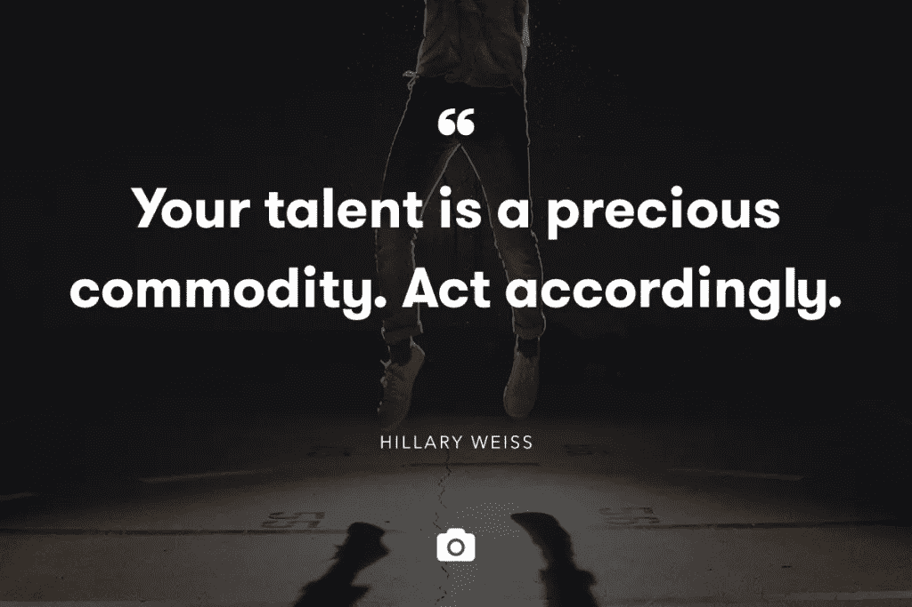

# 70%的下滑:如何在长期项目中保持动力

> 原文：<https://medium.com/swlh/the-70-slump-how-to-stay-motivated-during-long-haul-projects-cc192f05b772>

有两个词可以让任何自由职业者的心漏跳一拍:

保证。收入。

(你感觉到那小小的颤动了吗？我也是。)

然而，对于许多自由职业者来说，只有两种可靠的方法可以将这些甜言蜜语变成工作现实:与客户签订长期项目或聘用合同。

虽然这听起来很容易，但像这样的项目可能很难实现。代理公司以外的大多数客户只是没有现金流，或者没有足够的必要工作来获得持续 4 或 5 位数的合同。

这就是为什么，当一个努力工作的自由职业者被给予长期发展的机会时，我们大多数人都会欣然接受。

只有一个问题:

> “大型项目伴随着同等规模的挑战。”

我最喜欢引用“产品人”贾斯廷·杰克逊的一句话是关于[项目中最难的部分是最初和最后的 10%](http://justinjackson.ca/heads-down/) 。但是在这两点之间还有很多工作要做。

当你达到 70%的时候，你想做的只是在上面插一把叉子，然后就说完成了，那怎么办？你是如何在一个项目进行了 3 个月后保持动力的？还是 6？还是一年？当你日复一日沉浸在同一个品牌中时，你是如何不断提出新的想法的？

去年，我建立了自己的公司，几乎专门与客户签订长期合同。

这是一次我不后悔开始的冒险，但它也让我看到了那些甜蜜的、甜蜜的保证收入项目可能会很快变得很糟糕。

接受一个长期客户就像进入一段长期关系。成功的秘诀归结为仔细选择，良好的沟通，保持事物的辛辣，并在需要的时候刷新你的奉献。

# 无论你如何开始，都要小心谨慎

资深创意人会一遍又一遍的告诉你:“不要追钱”。

这是可靠的建议。直到一个客户每月给你 5000 美元加入他们的团队。当然，它们不是你的最爱，但是当你看到那个美元数字时，你会想:我怎么能说不呢？

简短的回答？你当然可以说不。

但是长的答案以一个重要的提醒开始:如果你要这样做，你需要决定你的理智对你来说到底值多少钱。

例如，我签的第一份聘用合同绝对是一场噩梦。虽然这位特殊的客户非常可爱，想要帮助别人，但他们也不知道自己在做什么。

他们出现在我们的第一次见面——在一家非常好的餐厅——基本上穿着睡衣。他们显然不熟悉基本的内容策略，而且在一个需要比他们多得多的生活经验的领域中非常年轻。我也感觉到这份工作会让我厌烦到流泪。

但是当我发现她愿意付我多少钱时，我毫不犹豫地答应了。我真的真的很需要钱。

如你所料，在我生命中的三个月里，混乱无处不在。我挣扎着通过草案和电话，以及一路走来的每一步。但是当我坚持到合同期结束时，我再也没有接他们的项目。

如今，我为长期客户制定了非常具体的标准:

*   他们绝对必须建立在他们的领域，我们必须在承诺之前完成一个短期项目
*   他们背后必须有一个训练有素的团队和项目经理
*   他们必须有对我真正有意义的概念、项目和信息

我也很重视与那些让我做我想做的事情的客户保持一致。找到你感兴趣的项目是拓展你的利基市场的重要部分。

最终，拖延症和动机归结于我们与工作的联系以及我们从中获得的价值(除了金钱！).因此，开发一个你喜欢的工作领域可以帮助你确保你不会在一开始就陷入低谷。

虽然这个“必须具备”的标准列表对你来说可能看起来不同，但我强烈建议你列出一个，并坚持下去。不管桌上有多少现金，没有什么比你的心理健康和幸福更珍贵的了。

(当然，你可以测试那个理论。但我几乎可以保证你会得出同样的结论)。

# 当你处于长期工作的痛苦中时，沟通是关键

为了让这个长期项目保持积极、互利的体验，你必须从第一天开始就清楚你将如何让事情发生。

这包括设定界限，概述典型的项目时间表，并确保您的客户非常清楚您的整个过程。

就像一段浪漫关系的开始一样，你和你的客户需要学会“说对方的语言”，并找到你喜欢的沟通方式。

就适合你的流程对他们进行培训，比如给你出主意、提供反馈的最佳方式等等

例如，你更喜欢在一周开始时得到一个项目的大纲，然后在下一个星期五交你的工作吗？你的问题需要多久才能得到回答？对你来说，评论的速度够快吗？

对我来说，避免[完全沟通失败的最好方法](http://blog.crew.co/how-to-handle-communication-breakdowns/)是尽可能频繁地与客户通电话——可能是每周，也可能是每两周，视情况而定。这是因为我越久不和一个活生生的人说话，我就越觉得自己远离这个项目。

尝试一下，找出适合你的方法。

# 项目常规变得太…常规？准备好让事情变得更有趣。

找到正确的客户和正确的流程是一回事，但是一旦你深入到一个项目中，什么样的过程会帮助你重新注入灵感呢？

> “当你感到动力下降时，你需要尽快找回最初的热情。”

为此，我建议采用双重方法:

*   培养你和客户之间的人际关系，这样你就可以在需要的时候拜访他们，随便聊聊这个项目(这将帮助你更新你的想法和角度)
*   使用一些你最喜欢的工具，这样你的客户就能不断给你提供新鲜、坦率的信息

如果一份草稿让我趴在桌子上打瞌睡，那就意味着在某个地方有一个缺口。我发现最好的唤醒方式是获得一些关于项目答案的新问题。

在我的情况下，这意味着发送一份季度调查，询问他们在业务中的位置，他们在项目中的表现，他们希望自己和他们的观众在未来有什么变化，他们对自己提供的解决方案有何感受，以及他们接下来会发生什么。

但是这种方法或者使用它的方式是没有限制的！如果你是一名设计师，你可以邀请你的客户创建一个季度“灵感板”，或者给你发送一个他们最喜欢的当前曲目的播放列表，这样你就可以更好地感受他们当前的氛围。

总的来说，我会邀请我的长期客户给我发送他们喜欢的任何其他东西:激发他们灵感的图片、意识流邮件(按照特定的时间表，这样你就不会被这些邮件压得喘不过气来)等等……随心所欲。

它帮助我保持参与、兴趣和问正确的问题。

# 但是等等:当你达到最后的 10%时，你如何保持专注于穿过终点线的最后冲刺？

伟大的创造性工作有一个共同的要素:投入。

对截止日期的投入，对想法的投入，对你负责的项目的投入。

> *“永远记住:理智第一。工作第二。钱，最后。”*

但是投入需要艰苦的工作和大量的精力来维持，并且难以置信地难以“赶上”。因此，为了保持你的注意力新鲜，并进行最后的冲刺，提前准备好你需要的一切，以便回顾过去，获得新的想法，并保持动力(也就是把我们刚刚讨论的策略准备好！)

*   仔细选择你的客户，这样你就知道你能度过最艰难的时刻
*   诚实地说出你喜欢什么，这样你就不会想在关键时刻把自己的眼睛戳出来
*   为客户期望、反馈和最终确定准备好清晰的系统
*   建立稳固的关系，准备好工具，这样你就可以在需要的时候获得额外的“推动”灵感

# 最后，永远不要忘记:你的才能是一种珍贵的商品。据此行动。

尽管尽快寻找长期客户似乎很有吸引力，但这不是一个仓促的过程——为了你自己，也为了你的客户。

相反，一步一步来。

通过密切关注你为之做短期项目的人来寻找理想的客户。一年后谁会长期需要你？谁已经需要一个更大的团队，和你的专业知识？谁真正相信你和他们对你的投资？

然后，当你准备好了，带着一个长期的提议去接近他们。

相信你的直觉。如果你锁定了，你就长期锁定了它。所以如果你有好的感觉，那就拿出来吧。看到危险信号了吗？相信你自己。

永远不要为了追逐金钱而追逐金钱。即使你得到了一份工作——如果还不合适，耐心等待。你可以在接手短期项目的同时慢慢建立你的预聘名单，当你准备好的时候(如果这是你想要的)，慢慢进入预聘系统。

永远记住:理智第一。工作第二。钱，最后。

图片来源:[黄少祺](https://unsplash.com/erichuang78910)