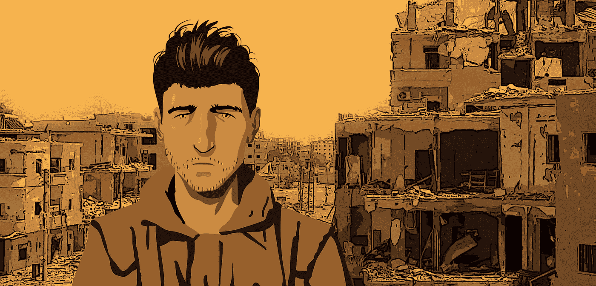

# 第八大罪

> 原文：<https://medium.com/swlh/the-8th-deadly-sin-9c4151ee95dc>

如果你不知道对你的生活影响最大的行为，那么你只会继续你罪恶的方式。

有些行为比其他行为更明显有害，但有一种行为凌驾于其他行为之上。

这是一种隐藏得如此之好的罪恶，它甚至不在 7 大罪恶之列。这使得它更加致命，因为直到我们能给它命名，我们才能在我们的行为中识别它。

如果我们不能识别它，我们就无法改变它。

那么第八宗罪是什么，为什么它很重要，我们能做些什么呢？

## 第八宗罪:反应性思维

当你因为上班迟到而对交通感到沮丧时，你就进入了被动的思维模式。

当你因为一个项目没有按时完成而责怪同事时，你就陷入了被动的心态。

当你责备…嗯，任何事情…那么你就屈服于被动的心态。

我们都做过。不幸的是，这并没有减少它对我们生活和幸福的危害。

从根本上说，反应性思维模式是从一个将我们的不幸归咎于外部环境的地方开始运作的(从而免除了我们个人的责任)。

很容易默认这种操作模式。事实上，大多数人完全不知道他们是如何在这种思维模式中进进出出的。

然而，我们都知道那个人几乎从未离开过被动的思维模式。这个人经常抱怨这个世界是如何与他们作对的。

其他人都不称职。其他人*和*都在拖他们的后腿。

想一个你认识的有这样行为的人，然后问自己:

> 那些抱怨给他们带来了什么？

然后问自己:

> *我真的想和他们一样吗？*

这些问题的答案可能是:“*不远*”和“*绝不可能*”。

但是在我们对这个人恨之入骨之前，重要的是要认识到，在某个时候(往往比我们愿意承认的要多)*我们*就是这样的人。

*那么还有什么选择，我们该如何改变我们的行为模式呢？*

好吧，在我们回答这个问题之前，让我们先了解一下反应性思维模式到底是从哪里来的。

为此，我们需要谈谈生物学。

## 反应性的演变

被动心态是一种进化的生存机制。正是交感神经系统战斗或逃跑的膝跳反应让我们得以生存。

当羚羊遇到狮子时，立即获得飞行能力是非常有用的。被更高层次的思维过程绊倒肯定会成为晚餐的结束。

此外，当我们需要转身战斗时，制造瞬间的愤怒是非常有用的。

从进化的角度来说，我们大脑中参与这种反应模式的部分(也就是杏仁核)已经非常古老了。

但是，将人类与其他动物区分开来的是在我们的额叶皮层中形成的神经回路，你知道，这是我们大脑中能够分析评估某一情况所造成的实际危险的部分。

也就是说，如果有必要，我们可以批判性地思考并降低警戒级别。

一种伟大的能力，但它只能通过意向性和正念来帮助我们。

> 当我们的思想从感知到的危险的紧张性刺激中脱离出来时，很难做到这一点。

现在，我们可能已经远离我们的祖先几千年试图在野外猎杀老虎，但是我们的大脑仍然感觉到威胁无处不在。

最终，这就是我们责备的结果。我们在应对一个感知到的威胁。

通过指出会计部的朱莉是错过最后期限的原因，我们免除了自己的责任、责备，最重要的是，惩罚。

当我们审视生活中犯错会带来直接后果的领域时，这一点似乎更为明显，但这种被动的心态是潜移默化的，会延伸到生活的各个领域。

以至于我们中的许多人总是默认被动的心态。

## 另一种选择:积极心态

如果被动的心态是从责备的立场出发，那么另一种选择是采取主动的心态，从接受个人责任的立场出发。

积极的心态与正念密切相关，因为只有通过正念和意向性，我们才能客观地分析一个情况，并理解我们在某个特定场景中的角色。

积极主动意味着充分意识到我们周围的环境和导致你当前处境的事件。

有了这些知识，你可以积极地追求个人责任(*一些让我们处于权力地位的事情*)，而不是与指责相关的强烈情绪反应(*一些让我们处于弱势地位的事情*)。

> “权力越大，责任越大。”
> 
> —本叔叔

这是第一部**蜘蛛侠**电影中的一句催人泪下的台词，但对于这段对话的上下文来说，它可能更适合说:

> “责任越大，权力越大。”

真正成功的人有一个共同的特点:他们专注于他们控制范围内的事情。

如果超出了他们的控制范围，就不值得关注。

这是有意义的，因为你的结果完全取决于你在任何特定情况下所能集中注意力的质量。

对你无法控制的事情大惊小怪是浪费注意力…浪费精力。

顶尖的表演者不会浪费他们的注意力。他们不会责怪自己，因为他们明白被动的心态不会让他们更接近目标。

通过拥有自己的决定，并且只专注于你控制范围内的事情，你会变得有力量。

你不再生活在别人的摆布下。

你在控制中。

> 这是责备和承担责任的区别。
> 
> 完全的个人责任是授权。

也很恐怖。

当你完全控制时，意味着你也完全有错。

当然，这很可怕，但是唯一有精神力量承受生活的打击并继续前进的人，是那些能够每天照镜子并接受自己是命运的主宰的人。

不可避免的是，你会搞砸并陷入被动的心态。仅仅一次积极主动地生活是不够的。

这是一种持续的、坚定的实践。

关键是保持正念。当你在寻找自己以外的东西或人来责备时，要注意。

当你发现自己有这样的想法时，不要责备自己。平静地接受你犯的错误，然后重新承诺自己。

积极主动地生活是很难的，如果你是这个概念的新手，我建议找一个朋友、导师或教练来帮助你保持责任感。

你会惊讶于他们会注意到多少。你会惊讶于你的反应。

不过没关系。每一刻都是改变的新机会。

每一刻都是成长的机会。

所以停止被动的生活。为你的幸福负责。掌控你的生活。

**感谢阅读！如果你喜欢这篇文章，帮我一个忙，拍一下**👏**几十次！**

此外，如果你想学习如何建立更牢固的关系、提高生产力、实现财务自由，那就参加这个免费课程吧。

[**点击此处参加免费的五个势力范围电子邮件课程！**](http://www.thehyperfocusedmind.com/)

## 这个故事发表在 [The Startup](https://medium.com/swlh) 上，这是 Medium 最大的企业家出版物，拥有 306，072+人。

## 在此订阅接收[我们的头条新闻](http://growthsupply.com/the-startup-newsletter/)。

