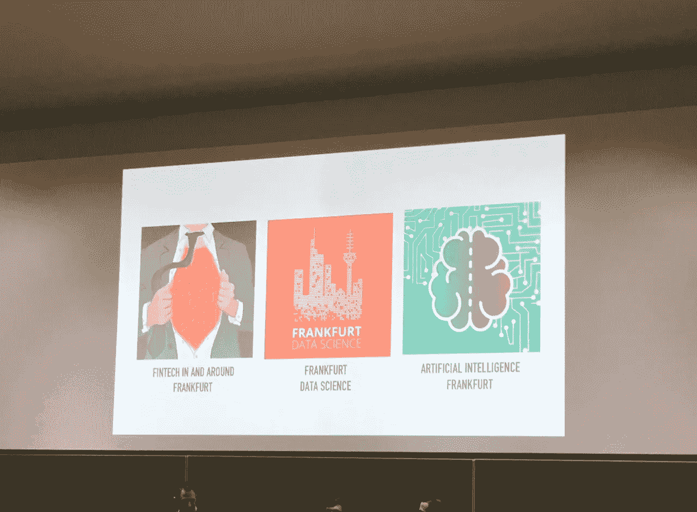

# 人工智能:自动化、API、分析

> 原文：<https://medium.com/swlh/the-a-s-of-artificial-intelligence-automation-apis-analytics-b9f93329c40d>

法兰克福聚会的组织者取得了多么大的成功！1 月 24 日，三个已成立的 meetup 社区及其领导者联手打造了一场特殊的活动，在“法兰克福金融学院”举办。之前有 400 多名数据科学家(或想要成为数据科学家的人)注册过——看起来他们都真的出现了。这所全新的商学院非常宽敞的房间非常拥挤。在这次活动中，我学到了什么？当谈到人工智能时，需要关注的主要方面是什么？我想分两部分来描述这一点:首先是对活动本身的一些观察(议程，观众&氛围)，其次是对人工智能发展方向的一种总结(自动化，API &分析)。

**议程** 议程承诺了主题演讲、简短的闪电谈话和创业推介的组合。这就是一个活动的魅力所在:它必须在主题和预期技能水平方面多样化，以便为大部分观众提供学习体验。主持人(法兰克福金融学院 Gergory Wheeler 教授)的欢迎词为晚会定下了开放的基调。他自己教授计算机科学和理论哲学，在最相关的方面提供了专家知识的原型来跟随人工智能的讨论。

然后三个 20 分钟。接下来是演讲:
-建立一个自我学习的档案袋构建系统，以及如何训练它。Jonathan Masci——NNAISSENSE[https://nnaisense.com/](https://nnaisense.com/)
的联合创始人——用于自动预测加密时间序列的 API。作者 Sebastian Heinz——stat worx[https://www.statworx.com](https://www.statworx.com)
首席执行官——人工智能如何应用让你更聪明地储蓄。作者:https://www.savedroid.de/ save droid[的亚辛·汉基尔](https://www.savedroid.de/)

通常足以让一个社区开心。房间里有如此多的观众，直接互动的可能性是有限的。议程排得满满的，每次发言只允许 3 到 4 个问题。

作为议程上的一个额外内容，这些以主题为中心的演讲之后是三个非常不同的创业推介活动
-do monda——企业的智能财务流程(维也纳)
-in naas——人工智能驱动的创新(罗马)
-raden Brock——基因进化与资本市场相遇(法兰克福)[http://radenbrock.com/](http://radenbrock.com/)
所以你有一个很好的机会来把握金融科技、加密货币、人工智能、建模方法、人工智能的真实世界用例等方面的许多不同角度

观众这些演讲很受观众的欢迎。组织者之一的马文在第一部分之后进行了一次传统的心理测试，以便问一些问题。只有三分之一的观众是学生，只有一小部分是数据科学领域的长期专业人士。许多商业顾问，一些招聘人员，一些求职者——一群非常有兴趣的人。每个人都很好奇，思想开放，愿意分享他们知道的东西，以及他们不知道或不理解的东西。

**气氛**
为什么会引起如此巨大的兴趣？几件事凑在一起。有一种新的炒作叫做人工智能。很高兴看到，越来越多的人开始关注幕后，了解这一切到底是怎么回事。在作为德国银行业之都的法兰克福，区块链/金融科技的炒作也可以加入进来。这三家初创公司用金融用例推销他们的机器学习专业知识。其中一个较长的演讲也有这样的背景。在这个群体中，似乎很难定义 USP。所以“每个人”都在发明模型来预测股票市场，并自动构建表现最佳的投资组合……所以开源技术被证明是为非常商业化的用例服务的。

自动化
如果要总结我对人工智能的了解，我必须从自动化说起。人工智能的基本思想是通过让机器做所有必要的任务来解决问题，从而独立于人类交互。因此，机器人顾问将自动开发股票价格预测，并将其付诸行动，而不是手动阅读报纸和计算数学。只有决策的自动化才具有真正的价值。INNAAS 的聊天机器人例子也是如此:他们解释了银行客户通过简单地提问——甚至通过选择一个由算法提出的非常可能的问题——来获得对其私人财务状况的更多洞察是多么容易。
用技术术语来说，开发人员今天的梦想是创造一个*自我*-学习系统，它*自动*-调整自己做出*自动*自主决策。

**API**
另一点是，并不是每个人都可以自己开发预测模型，但可能会有可以解决的问题。所以来自 Statworks 的人展示了他们的方法，为一种通用的预测方法提供一个 RESTful API。为此，开发人员可以通过简单地在云中调用这些模型来利用它们，提供所有必要的输入并返回结果。当然，这让我想起了 SAS Viya 的概念，正是它提供了这些功能。r、Python 或 Java 程序员能够以这种方式非常容易地用分析来丰富他们的应用程序。

**分析学**
最后观察:其关于分析学，蠢。很明显，即使是业务部门也应该自学基本术语。有监督的机器学习、无监督的机器学习、不同算法中的约束、训练数据、测试数据、模型的准确性和稳定性——这些主题只是触及了表面。哪种方法适合哪种问题？你如何评价和信任机器的自动决策？如果没有数据科学方面的背景知识，几年后可能很难做出任何商业决策。

总结:值得一游！在这个领域还有很多东西要学。

如果你想更多地了解人工智能在欧洲公司的地位，我建议你学习一下[“企业人工智能前景”](https://www.sas.com/sas/offers/17/the-enterprise-ai-promise.html)。

## 这个故事发表在 [The Startup](https://medium.com/swlh) 上，这是 Medium 最大的创业刊物，拥有 290，182+人关注。

## 在这里订阅接收[我们的头条新闻](http://growthsupply.com/the-startup-newsletter/)。

