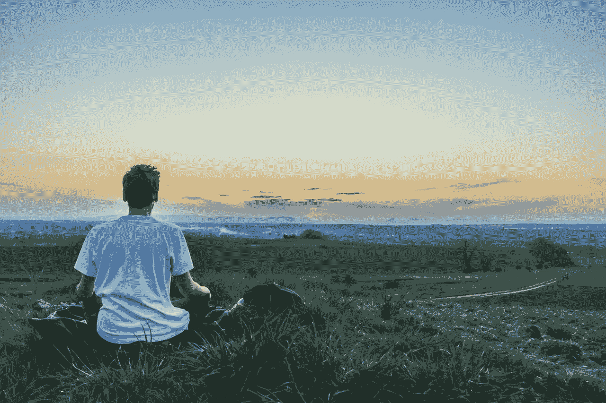

# 放弃好习惯和积极的做法

> 原文：<https://medium.com/swlh/the-abandonment-of-good-habits-and-positive-practices-e9a5815b3c05>

In search of peace (credit: pixabay.com)

我开始了寻求更多、更好、更快乐的个人发展之旅。我现在已经意识到，通过更大的洞察力和理解，这不是对其他东西的追求，与我已经拥有的不同的东西。通过感激、欣赏和更现实的生活方式，我开始珍惜我已经拥有的。我从中获得了更大的快乐。尽管如此，对…的追求