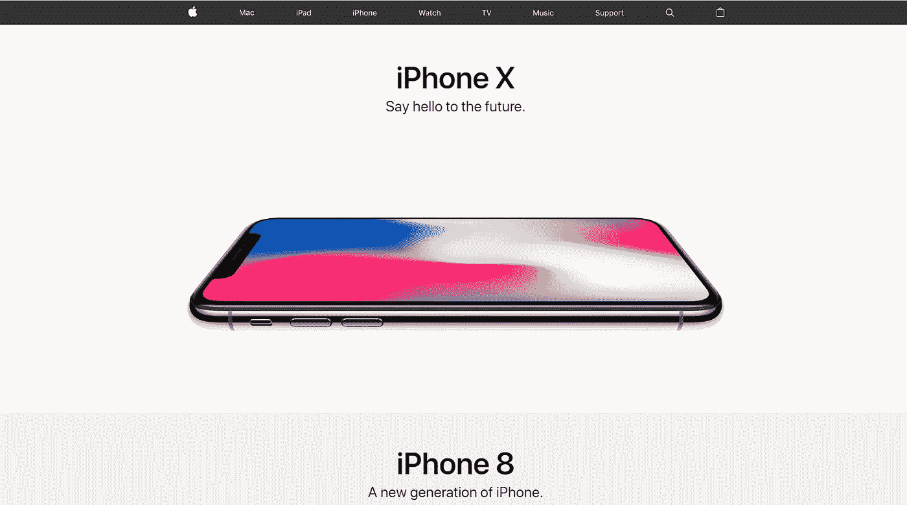
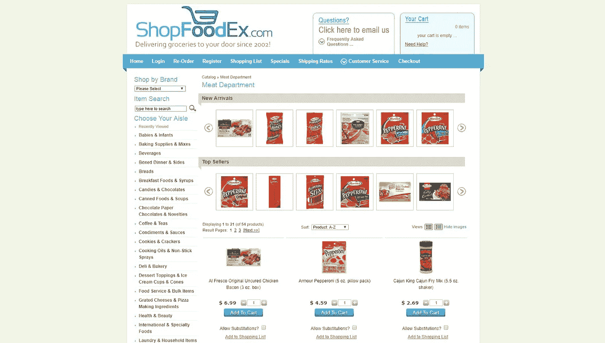
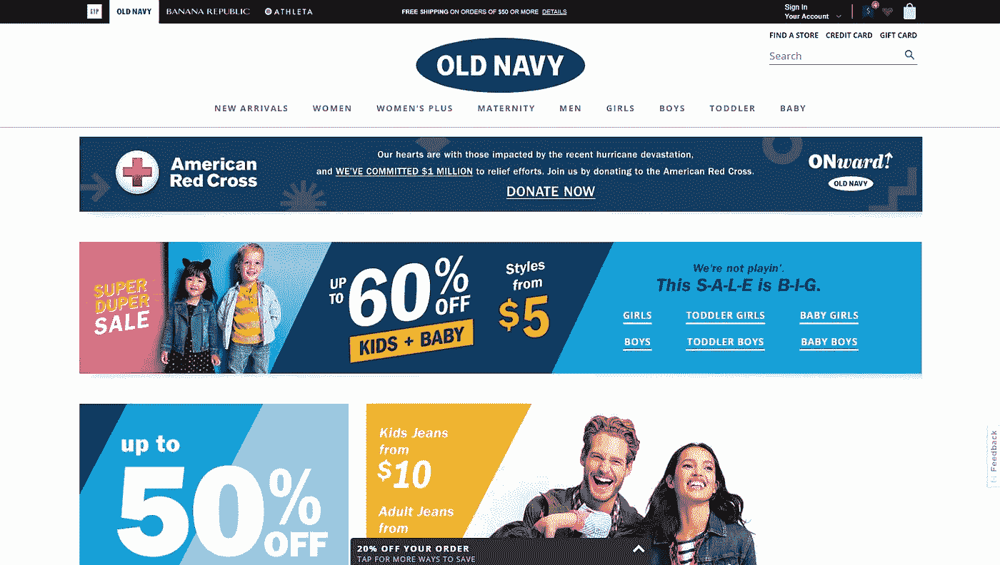
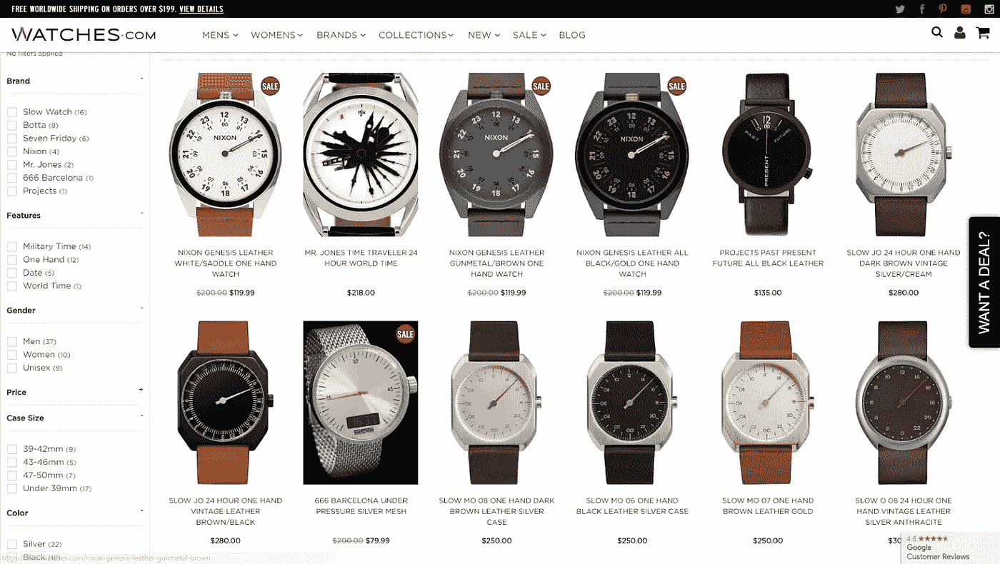
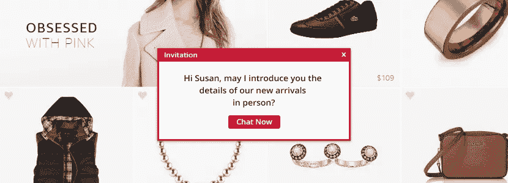
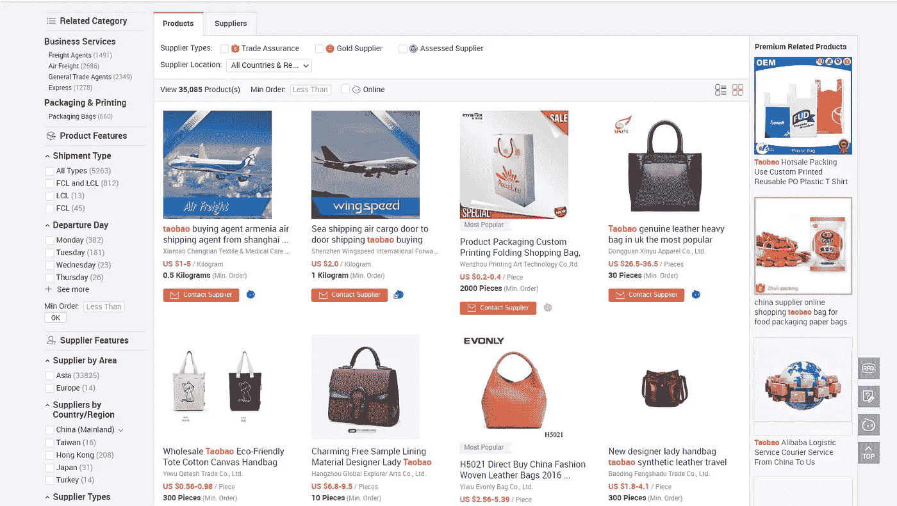
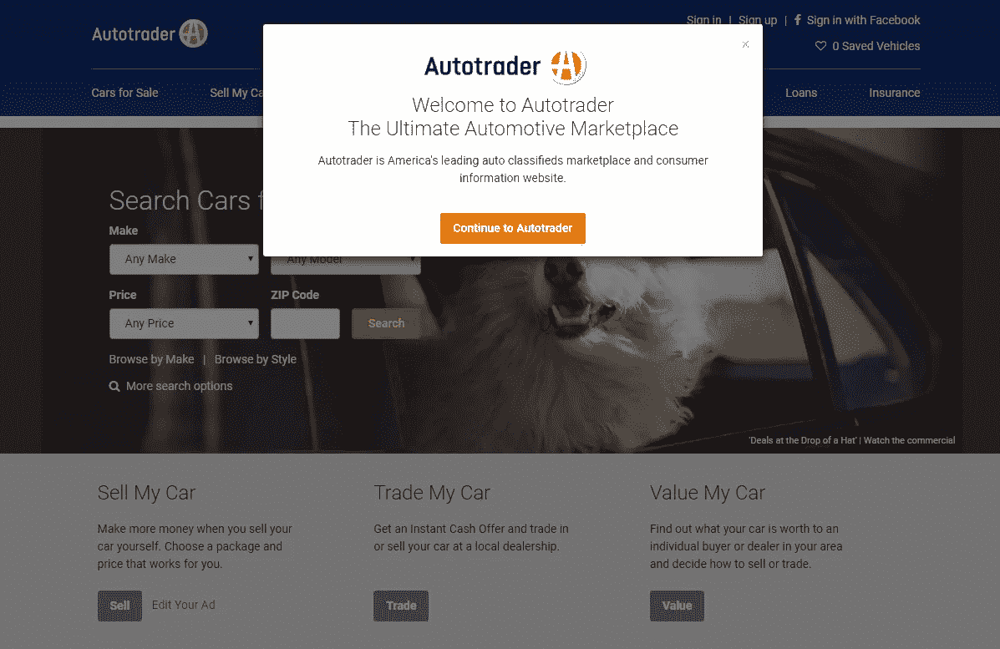
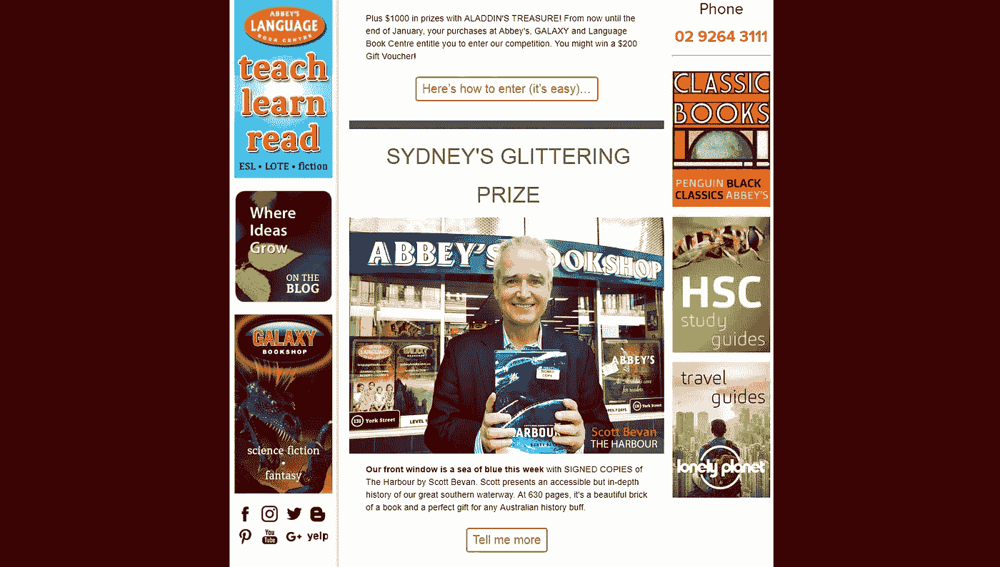

# 电子商务沟通中的基础知识

> 原文：<https://medium.com/swlh/the-abc-in-e-commerce-communication-8021a7c61672>

很久以前，当互联网还很年轻，术语“智能手机”还不存在的时候，在线电子商务就像火箭科学一样。很少有人设法在网上购物车里添加商品，更少有人敢于输入自己的信用卡号码。

如今，我认识的每个人都时不时地在网上购物。一些交流模式——或刻板印象——已经出现。如果你经营一个数字电子商务网站，你必须知道这种语言。

这是电子商务常用语手册的第一页。

*   **大图像和空白区域**

那可以翻译成:*“这个产品很贵，你会为这个奢侈品买单”*。比如参观 apple.com 的[。现在，折页上方只有一张 iPhone X 的图片(还有很多空白)。](https://www.apple.com/)

*   **小图片、大量文本和按钮**

所有的东西都紧紧聚在一起，意思是:“我们给你提供市场上最低的价格”。就像人多的地方的菜市场。或者，网站所有者干脆放弃了它，不关心更新。

*   **总销售额**

所有商品的销售就像在说:“这个地方是一个旅游景点”。除非是假日季节，所有的商店都渴望顾客。

*   **独家折扣**

几个产品的限时促销意味着:*“我们想让您保持兴趣，请经常回来看看”。*折扣只有 5%或 10%的时候，没人当回事。如果是 25%+，客户真的会停下来思考。

*   **全天候实时聊天**

与顾问的在线实时聊天翻译过来就是:*“我们已经足够成熟，可以让员工回答你的问题”。*

立即弹出的实时聊天询问:*“我能为您做些什么？”*实际上的意思是:*“我们真的真的很想做成一笔买卖，我们不怕让人讨厌”*。最有可能的是，这个弹出窗口会在这个网站的每个页面上困扰你。

*   **奇怪的产品名称**

怪异的产品名称和描述，从字面上看，是从外语翻译过来的。在大多数情况下，这是因为卖家的英语知识很差，或者没有足够的资源投入到适当的产品展示中。这也是产品质量的一个指标。

*   畅销书名

称自己是最好的终极绝对超级畅销无论什么意思:*“我好想卖”*。不管它是什么，有多好。有经验的购物者会直觉地避开这样的标题。

*   **讨厌的广告**

满店的广告意思:*“我们自己的商品无法盈利，正在寻找其他赚钱的方法”。*可悲的是，如果你的产品不够好，你就得不到好的流量。所以，广告不会给你带来钱。

*   **高级选项**

多种货币/语言可供选择是一个强有力的积极信息:*“我们的客户遍布世界各地，我们希望确保他们都能方便地使用网站”。*

这个清单可以一直列下去，但真正的信息是…我们都知道这一点。每次我们打开新的电子商务网站，我们都会快速浏览它，并在 7 秒钟内将图像翻译成我们自己的语言。

如果店主会说我们的语言——太好了。如果我们看到一些奇怪的东西，我们不会信任这个网站，我们会离开。再见，店主。有经验的店主知道他们应该研究顾客的语言，否则他们就有失去收入的风险。

一个月前，一个客户找到我，他说:

瞧，我所有的顾客都是艺术家。他们不想被网站上的颜色或图形分散注意力。我希望我的新网站是纯黑白的，只有最少的图形元素。”

起初，我不想答应这些要求。但我想了想，意识到这个人非常了解她的顾客，她真的和他们很合得来。说顾客的语言比低价和折扣更重要。你想要更多的销售？首先，用客户的语言和他们交谈。

我也可以在 Twitter 上谈论公共关系，在脸书上迅速回应的重要性，或者实时聊天的最佳实践。所有这些交流领域都很重要，但不如第一印象重要。你与潜在客户交流的第一条信息决定了他们是会在你的网上商店购物，还是会转向你的竞争对手。

Zfort Group 的客座博文最初由[insightssuccess.com](http://www.insightssuccess.com/the-abc-in-e-commerce-communication/)发布

## 这个故事发表在 [The Startup](https://medium.com/swlh) 上，这里有 263，100+人聚集在一起阅读 Medium 关于创业的主要故事。

## 在此订阅接收[我们的头条新闻](http://growthsupply.com/the-startup-newsletter/)。

