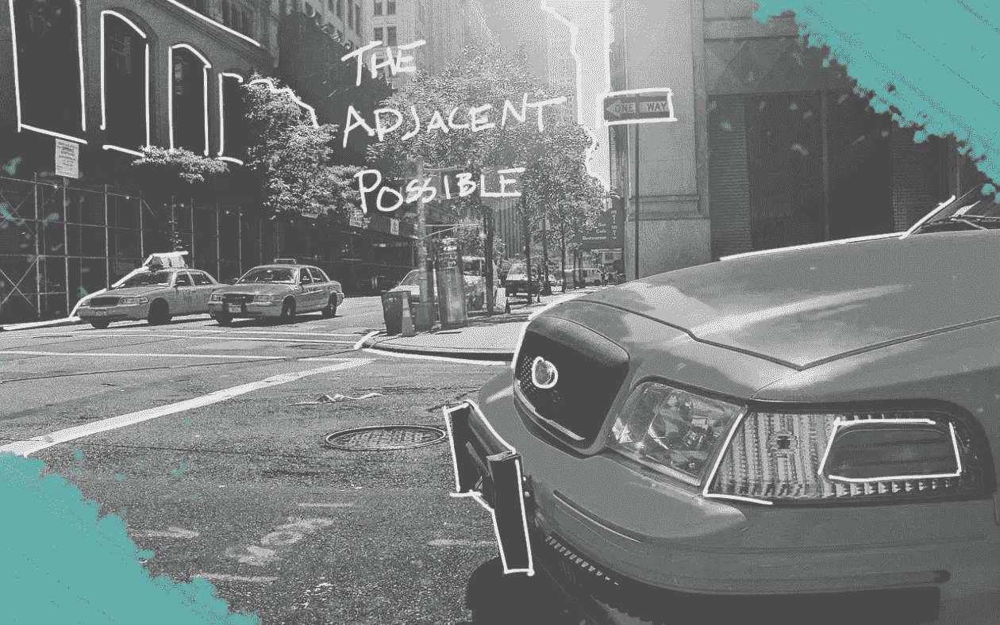

# 邻近的可能

> 原文：<https://medium.com/swlh/the-adjacent-possible-7e79b1e4cf3>

The Adjacent Possible: The Intersection of Innovative Ideas

企业背后的理念通常是一个最重要的因素，它有助于创始人在不失去动力和失败的情况下启动、获得动力和发展企业。那么，当创始人难以想出完美的商业点子时，他们该怎么办呢？考虑“相邻的可能”

# 邻近的可能

在史蒂文·约翰逊的畅销书《好主意来自哪里的 [*:创新的自然历史*](http://amzn.to/2BW1liR) 中，他解释说大多数创新实际上是*而不是*灵感的瞬间。相反，它们是其他现有创新以新的有趣的方式相互结合的自然结果或进化。他引用了历史上“多重”或世界不同地区同时创新的存在作为证据。这些例子包括:

*   查尔斯·达尔文和阿尔弗雷德·罗素·华莱士在 19 世纪 50 年代都提出了类似的自然选择和进化观点
*   查尔斯·克罗斯和路易斯·杜科斯·杜隆都在 19 世纪 60 年代“发明”了彩色摄影
*   古列尔莫·马可尼和尼古拉·特斯拉都在 19 世纪 90 年代“发明”了无线电

你可能在自己的生活中经历过这种情况，提出一个你认为很棒的想法，却发现它已经存在。我知道我有。我曾经“发明”了一种磁性耳塞线固定器，可以帮助你在慢跑时防止耳塞掉落，但是在我之前几个月[克林贡](https://gadgetmac.com/news/2011/8/1/klinggon-a-stylish-magnetic-earphone-holder.html)也发明了这种东西…

不过这是件好事。这意味着想法是丰富的，等待被发现，而不是凭空变出来的。通过在一个空间开始一个想法(最好是你感兴趣并了解很多的东西)，你可以将它与另一个空间看似不相关的东西(可能是趋势或新的东西)合并，以提出一个全新的想法。

# 亚马逊的例子

Amazon.com 的创始人杰夫·贝索斯在 2003 年的 ted 演讲**中阐述了邻近可能性的原理，将当时互联网的现状比作 19 世纪晚期的电力工业。在一篇相关的文章[2]中，他分享了一个去比利时一家历史悠久的啤酒厂旅行的趣闻。在旅程的一部分，导游带领团队参观了啤酒厂的发电机。在 19 世纪，欧洲几乎没有电网基础设施，所以电力用户有责任自己建造电网。**

**贝佐斯将酿酒厂在 19 世纪自己发电的需求与科技初创公司必须管理自己的数据基础设施的现代需求进行了比较。当酿酒商能够不再担心电力，专注于自己的核心竞争力时，他们和几乎所有其他行业都受益匪浅。正如贝佐斯所说:**

> **“自己制造动力并不能让你的啤酒变得更好喝。”**

**这种洞察力促使贝佐斯启动了亚马逊网络服务(AWS ),以无缝可扩展的方式虚拟化运营一家科技公司所需的数据硬件基础设施。通过采用一种现有的创新，即集中式公用事业，并将其与另一种技术创业公司相结合，贝佐斯利用相邻的可能性来创新一种服务，这种服务为当今的互联网提供了动力。**

****2016 年，AWS 代表了亚马逊总运营收入的 56%[3]。****

# **在实践中**

**那么，在创业的背景下，如何考虑邻近的可能性呢？有时候，一个想法的核心需要和另一个结合起来。在我在格伦布鲁克南高中经营的企业孵化器中，我考虑了许多想法的邻近可能性，这些想法引导我的创业学生走向他们充满热情、能够采取行动并扩大规模的商业想法。这里有几个例子:**

*   **家庭健身和越来越受欢迎的长曲棍球的交集=长曲棍球运动员的健身设备— [**PowerShott**](https://www.youtube.com/watch?v=t4dWeC9AD1w)**
*   **推荐引擎和购买衣服的交集=找到最适合你体型的衣服的算法— [**BestFit**](http://bestfit.titanstartup.com/)**
*   **小众滑冰公司的交集，如 [Penny Skateboards](http://www.pennyskateboards.com/us/) 和 snowboarding =一种为雪橇山设计的便携式滑雪板— [**Boardable**](http://www.instagram.com/boardable_co)**

# **结论**

**真正的新想法非常罕见。幸运的是，创业并不等同于发明。相反，把创新的自然进化看作是寻找机会的透镜，并且在知道一个创新经常导致两个或更多创新时感到安慰。**

## **引文**

1.  **[http://amzn.to/2BW1liR](http://amzn.to/2BW1liR)**
2.  **[https://www . information week . com/software/information-management/the-cloud-electric-generator-analogue/d/d-id/1075830](https://www.informationweek.com/software/information-management/the-cloud-electric-generator-analogy/d/d-id/1075830)**
3.  **[https://www . nytimes . com/2016/04/29/technology/Amazon-Q1-earnings . html](https://www.nytimes.com/2016/04/29/technology/amazon-q1-earnings.html)**

> **"这篇文章最初发表在我在 mmacfadden.com 的博客上. "**

**

mmacfadden.com** ****

## **这个故事发表在 [The Startup](https://medium.com/swlh) 上，这是 Medium 最大的创业刊物，拥有 273，384+人关注。**

## **在这里订阅接收[我们的头条新闻](http://growthsupply.com/the-startup-newsletter/)。**

****