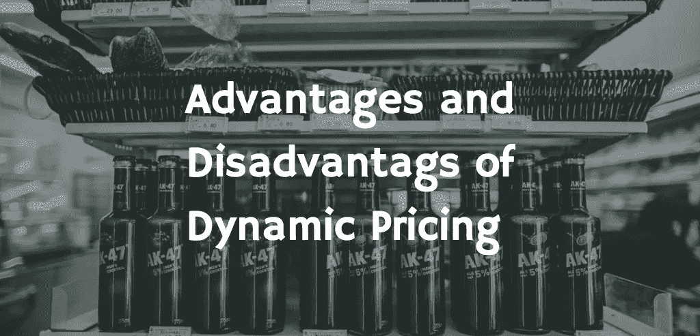
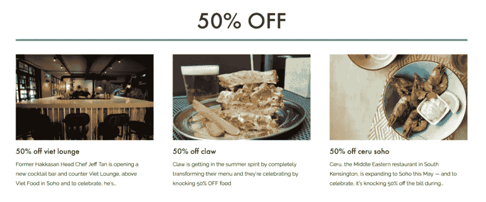
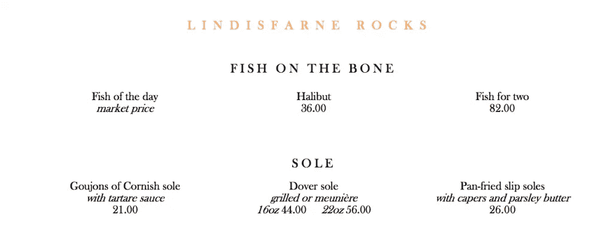
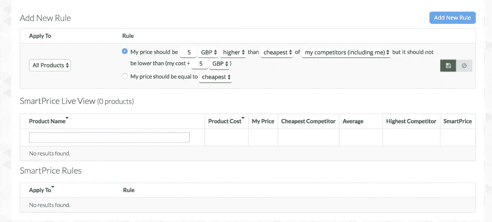

# 动态定价的优点和缺点

> 原文：<https://medium.com/swlh/the-advantages-and-disadvantages-of-dynamic-pricing-c2d914fe644f>

动态定价是一种 [**价格歧视**](https://blog.prisync.com/price-discrimination-dynamic-pricing/) 的概念，即你的价格根据你自己的产品成本以及你的竞争对手的价格而变化，以在任何时候找到最佳价格点。

听起来不错，是吧？

但是动态定价的缺点呢？使用它会阻碍你的定价吗？

在这篇博文中，我们将深入探讨使用动态定价的优势和劣势。

如果您决定采用动态定价，我们将评估最佳方法。

我们开始吧，

# 有了正确的动态定价软件，您可以实现利润最大化

[动态定价](https://www.business.com/articles/what-is-dynamic-pricing-and-how-does-it-affect-ecommerce/)的一个核心优势是能够从每个客户那里获得最大利润。可以这样想——如果最初对你的产品的需求很低，你需要处理掉你的库存，你可以降低价格来促进这一点，并尽可能产生额外的收入。

同样的，如果需求很高——比如说一个 [**季节性产品**](https://blog.prisync.com/dynamic-pricing-is-your-seasonal-marketing-savior/) ，你可以根据需求提高价格。

圣诞宫殿目前以 69-699 美元的价格出售他们的圣诞树。

但是你需要记住的是现在是六月。每年的这个时候，考虑购买圣诞树的人会少得多。然而，在 12 月份，他们会而且应该提高价格。

这样，任何推迟购买圣诞树的人都更有可能支付高价，因为他们不想错过拥有圣诞树和参加庆祝活动的机会。

# 保持领先于你的竞争对手

在之前的内容中，我们花了很长时间思考或谈论跟踪你的竞争对手在做什么的重要性。我的意思是，最终我们的整个软件都是建立在这个概念上的。

因此，实施动态定价策略，默认情况下，会迫使你考虑竞争对手的定价，让你跟踪关键行业和市场趋势。

Forrester 的研究表明，使用价格优化软件来跟踪你的竞争对手和趋势，可以将你的毛利率提高 10%。更重要的是，使用动态定价的利润增加了 25%。

你真的没有理由不考虑实施你的电子商务商店的战略。

# 将动态定价与销售和优惠结合使用

尽管动态定价有一些缺点，但请记住，自然地，客户习惯于为他们的产品支付不同的价格。

使用 [**折扣和促销**](https://blog.prisync.com/discounting-and-promotion-strategies-in-ecommerce/) 通常会导致客户为相同的产品支付不同的价格，因此，如果您担心动态定价策略的缺点，请考虑将动态定价与您的销售和折扣策略结合起来。

我们已经了解了动态定价的一些优势，在很大程度上，这似乎是一个用于您的电子商务商店的好策略，但缺点是什么呢？使用动态定价策略实际上会如何阻碍您的利润和收入增长？

# 使用动态定价会导致客户疏远

没有人喜欢觉得自己做了一笔糟糕的交易。他们也不喜欢感觉自己为同样的产品或服务付出了比其他人更多的钱。如果你的顾客发现他们的朋友花了一半的价格买了同样的东西，你就有疏远他们的风险。

这往往会导致差评、投诉或更糟的情况，要求退款。

更糟糕的是，如果你想让你的客户保持忠诚，疏远他们不是办法。任何电子商务商店的最终目标都应该是留住客户，特别是因为对你来说，留住一个现有客户比获得一个新客户要便宜得多。

解决这个问题的一个方法是让顾客知道价格将在当天确定，以满足需求。

这种方法在餐馆里很常见，在那里食物是按重量出售的。

因为他们无法预测当天的具体鱼的价格，所以他们使用当天的市场价格。

这意味着两个人可以点同样的东西，支付不同的价格。

然而，这种策略不太可能疏远顾客，因为餐厅已经对潜在的价格变化采取了一定程度的透明度。

看看你是否可以在你的电子商务商店使用这个想法。

# 竞争加剧

你已经在一个高度竞争的市场中运作了。你不想做的是把你的客户推向你的竞争对手。

很明显，你在提高价格，你的客户更有可能货比三家，看看他们是否能在其他地方找到更便宜的相同或相似的产品。

因此，在许多情况下，使用动态定价实际上可以将您的客户转向您的竞争对手。

我敢肯定，大多数电子商务供应商不希望发生的事情。

# 你需要依靠好的技术

动态定价不使用先进的 [**电子商务价格比较技术**](https://prisync.com/) 来帮助根据数据而不是感觉优化您的价格是一个糟糕的决定。

这是因为当全年自动进行 [**价格优化**](https://blog.prisync.com/artificial-intelligence-dynamic-pricing/) 时，最好使用动态定价策略。不仅仅是因为手动操作会花费太多的时间，而且你可能会错误地解释数据并得出错误的结论。

记住，动态定价就是为你的产品找到最优价格，而不仅仅是最高或最低价格。

使用良好的动态定价技术的另一个额外好处是，你可以确保你不会采用竞相杀价的方法。你可以设定指导方针，这样你的最低价就不会低于你能承受的销售价格，而且还能获利。

***来源:***[***Prisync.com***](http://prisync.com/)

# 动态定价的优点和缺点

虽然这篇博客文章探讨了动态定价策略的优点和缺点，但是肯定有克服缺点的方法。

如果有的话，缺点更像是你应该意识到的事情。

我们仍然是动态定价策略**的大力提倡者，但我们确实相信，你应该以可控的方式实施这一策略，使用数据作为你价格优化的基础。**

**你曾经为你的电子商务商店使用过动态定价吗？在下面留言。**

****

## **这个故事发表在 [The Startup](https://medium.com/swlh) 上，这是 Medium 最大的创业刊物，拥有 332，253+人关注。**

## **在这里订阅接收[我们的头条新闻](http://growthsupply.com/the-startup-newsletter/)。**

****