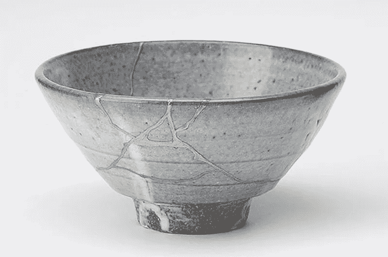

# 失败的美学

> 原文：<https://medium.com/swlh/the-aesthetics-of-failure-d08e416dad49>

在日本，有一种艺术叫做[近月术](https://en.wikipedia.org/wiki/Kintsugi)。在这种传统的修复方法中，破碎的陶瓷用涂有或混合有金粉、银粉或铂粉的漆粘合。它们不是以最好的方式隐藏裂缝，而是被突出显示。瑕疵被视为物品历史的重要组成部分，正是在这种独特的瑕疵中才能看到真正的美。这一艺术修复作品清楚地展示了 [Wabi-Sabi](https://en.wikipedia.org/wiki/Wabi-sabi) 的原理，佛教作家 Taro Gold 恰如其分地将其描述为“不完美的智慧和美丽”。

> 我没有失败。我刚刚发现了一万种行不通的方法。
> 
> *~托马斯·A·爱迪生*

这是一个*美学*的问题，在希腊语单词αἴσθησις *的原始意义上，它与美无关，而是意味着*感知*。一方面，一个破碎的茶碗可以被认为是一场灾难和碗的终结，或者是向另一个甚至更美好的存在状态的过渡。破碎的茶碗总是保持原样，只是我们对它的看法和对待它的方式发生了变化。*

> 成功不是最终的，失败也不是致命的:重要的是继续下去的勇气。
> 
> *~温斯顿·丘吉尔*

这种不完美的美学可以转移到我们如何对待失败。我们是否在一次尝试的失败中，在我们生活的异常中，在一部不简单的传记中，或者在一个失败的商业想法中看到了一个让我们感到羞耻并隐藏起来的污点，或者我们是否从中看到了一次重要的经历，这种经历有助于我们独特的个性并让我们自豪地强调？我希望看到更多的公司和社会，在这样的社会中，我们重视努力和学习，至少与我们汽车的完美间隙一样。我希望我们认识到失败是一个机会，是对我们发展的重要贡献，而不是一场悲剧。我希望，除了我们所有的知识和工程技能之外，我们将有勇气以这种[增长心态](https://fuehrung-erfahren.de/en/2018/01/growth-mindset-the-key-to-a-learning-culture/)应对我们时代的巨大挑战。

> 展望未来，你无法将这些点点滴滴联系起来，你只能在回顾过去时将它们联系起来。所以你必须相信这些点在你的未来会以某种方式连接起来。你必须相信一些东西:你的勇气，命运，生活，因果报应，等等。因为相信这些点会在路上连接起来会给你信心去追随你的心，即使它会让你偏离熟悉的道路。
> 
> *~乔布斯*

*原载于 2018 年 1 月 17 日*[*fuehrung-erfahren . de*](https://fuehrung-erfahren.de/en/2018/01/the-aesthetics-of-failure/)*。*

## 这个故事发表在 [The Startup](https://medium.com/swlh) 上，这是 Medium 最大的企业家出版物，拥有 290，182+人。

## 在此订阅接收[我们的头条新闻](http://growthsupply.com/the-startup-newsletter/)。

