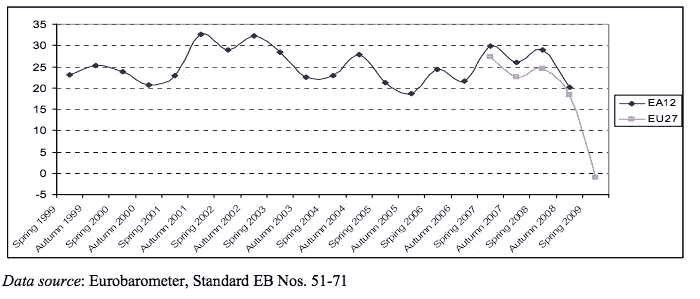
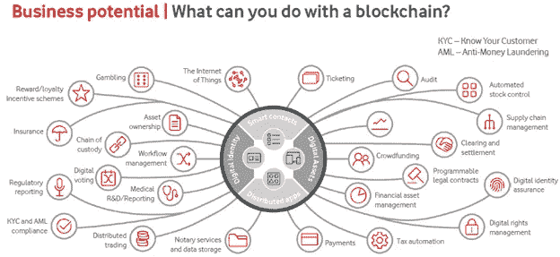

# 信任的时代——区块链解决了其他人无法解决的问题。

> 原文：<https://medium.com/swlh/the-age-of-trust-the-problem-blockchain-solves-that-others-cannot-6024ebf47cad>

区块链过去的 10 年和今后的 10 年

当你搜索“区块链是什么？”互联网会给出很多定义。然而事实是，没人关心区块链的定义；人们只关心区块链能为他们化解什么问题。所以问题是“区块链做了什么在其发展之前不可能的事情？”

**开头**

2007-2008 年，世界经历了一场全球金融危机，事后看来，这似乎是向世界介绍区块链的完美场景。全球金融危机期间损失的 8.3 万亿美元令人震惊，这让人们更深入地寻找所有问题的根源，金融监管的失败，金融机构和评级机构的不道德行为？答案比你通常预期的要深刻得多，但也简单得多***——金融危机的根源在于世界金融体系中如何建立和维持信任的结构*** *。这场危机给许多个人造成了巨大的经济损失，并从根本上损害了公民对其机构的信任。下图突显了金融危机前后欧洲公民对欧洲央行的信心水平。*

危机过后，人们一直在寻找一个更值得信赖的系统，直到他们发现了中本聪在 2009 年 2 月 11 日晚上带给世界的东西:“我开发了一个新的开源 P2P 电子现金系统，叫做比特币。它是完全分散的，没有中央服务器或可信方，因为一切都是基于加密证明而不是信任。试试看，或者看看截图和设计纸。”你已经熟悉的故事的其余部分。因此，我们有生以来第一次有了一个不信任的信任机制。换句话说，它独立于它所在的位置和操作它的人，因为信任机制已经在数学上得到证明。这完全消除了对信任系统的人为干预的需要。我的朋友，这就是区块链为世界解决的问题——在它之前没有人能够解决的问题。

**10 年后…**

可以说，到目前为止，比特币没有实现其作为大众货币的意图。相反，它更多地被用作价值储存手段(在投资的意义上)和投机工具。ICO(初始硬币发行——基于加密货币的筹资方式)的兴起及其争议给区块链的未来蒙上了阴影。一些极端反区块链的技术未来学家呼吁，“十年过去了，除了货币投机和非法交易，没有人想到区块链的用途”。这显然不是真的。例如，阿里巴巴/蚂蚁金服于 2018 年 6 月 25 日在香港推出了全球首个区块链电子钱包跨境汇款服务。话虽如此，确实这个世界除了比特币之外，缺少区块链的杀手级 app/用例。为什么？

是因为交易速度吗？比特币平均每秒处理 7 笔交易，而 Visa 每秒处理 24000 笔交易；

保安？Mt. Gox 成立于 2010 年，曾是世界上最受欢迎的比特币交易所，处理全球超过 70%的 BTC 交易，因 2014 年损失约 85 万 BTC 而申请破产。按今天的 BTC 价格计算，损失价值约为 47 亿美元；

复杂？区块链让密码学变得更加主流，但这个高度专业化的行业充斥着行话。

同样，原因比你想象的更深刻但更简单——这是关于金钱如何运作的！

当你不能从中获利时，做生意的动机是什么？由于区块链被设计为一个无信任和 100%分布式和去中心化的系统，这意味着没有一个中央实体可以从该系统中受益。相比之下，如果优步或 Airbnb 不能向使用平台的用户收费，他们如何运营(不改变商业模式)？

**10 年后…**

Gartner 预测，到 2026 年，区块链的商业价值将达到 3600 亿美元，到 203⁰将飙升至 3.1 万亿美元。不管你相不相信，预测未来的最好方法是回顾过去，因为是过去孕育了未来。早在 1965 年，互联网就在麻省理工学院的一个实验室中诞生了，当时只有两台计算机使用分组交换技术 ARPANET 相互通信，这是 1969 年发布的互联网的最早形式，由美国国防部使用。互联网这个术语是在 1973 年伦敦大学学院(英格兰)和皇家雷达研究所(挪威)连接到阿帕网后诞生的。1983 年 ARPANET 采用 TCP/IP 套件后，互联网的基础和商业方面得到了显著增强。最后，当欧洲核研究组织(CERN)于 1991 年向公众介绍万维网(WWW)时，互联网的第一个杀手级应用程序诞生了。

请记住，我并不是建议区块链作为互联网的替代品，而是作为互联网的补充。为什么？因为互联网和区块链解决的是两个不同的问题。互联网解决了获取信息的问题，而区块链解决了信任的问题，并从等式中去除了人为干预。

在今天的区块链世界中，我们有 TCP/IP 的等价物吗？答案是否定的，但我们正在努力。然而，它将有两个版本，因为区块链有两个世界，即:

**公共区块链**——维护交易不可变记录的公共网络。任何人都可以通过遵守一套公布的规则来公布交易和参与网络。例子:比特币

**私有区块链**——维护交易共享记录的私有网络。只有有权限的人才能访问网络，管理员可以编辑交易。例如:Ripple、Hyperledger 和 R3 Corda。他们也倾向于称自己为分布式账本技术(DLT)，而不是区块链。

在开放的区块链领域，它将继续发展和出现，即以太坊 2.0 (Casper + Sharding)、Stellar 等。我觉得还需要几年才能知道哪个会成为标准。

在封闭的区块链世界里，它进步得更快更远。例如，Hyperledger 的 Fabric 和 R3 的 Corda 都吸引了跨国公司的可观投资组合。这是一场谁将成为世界上最有影响力的财团的竞赛；资本的游戏。例如，R3 从现有会员手中购买了超过 1 亿美元，使其能够在不必完全依赖会员费的情况下大量投资于建筑技术。

不管谁来制定新标准，最大的问题仍然是第一个杀手级应用将在何时何地出现，以及它将把我们带向何方。在今年的 coin desk Consensus 2018 大会上，以太坊公司 Consensys 的创始人约瑟夫·卢宾(Joseph Lubin)同意与区块链资本(Blockchain Capital)的吉米·宋(Jimmy Song)打赌“任何数量的比特币”，在五年内，区块链将有许多服务于真实用户的工作应用程序。像摩根大通、巴克莱、IBM、谷歌和 Visa 这样的跨国公司都在尝试，并投入了数百万美元，认为分散式账本可以做其他形式的技术做不到的事情。我个人认为，这个价值百万的问题还会再保留几年。然而，类似于互联网如何演变，它会慢慢地，但肯定会暴露自己。

在上述所有的商业潜力中，解决基本问题的潜力将胜过其他潜力——信任是最需要的，但也是最难获得和维持的。

## 在上述所有的商业潜力中，解决基本问题的潜力将胜过其他潜力——信任是最需要的，但也是最难获得和维持的。

**参考**

1.2007-2008 年的金融危机，维基百科，[https://en . Wikipedia . org/wiki/Financial _ crisis _ of _ 2007% E2 % 80% 932008](https://en.wikipedia.org/wiki/Financial_crisis_of_2007%E2%80%932008)

2.基于区块链的转型:Gartner 趋势洞察，Gartner，2018 年。[https://www . Gartner . com/doc/3869696/block chain based-transformation-Gartner-trend-insight](https://www.gartner.com/doc/3869696/blockchainbased-transformation-gartner-trend-insight)

3.为区块链联合起来，德勤，2017 年

[https://www2 . Deloitte . com/insights/us/en/focus/signals-for-strategists/emergency-of-区块链-consortia.html](https://www2.deloitte.com/insights/us/en/focus/signals-for-strategists/emergence-of-blockchain-consortia.html)

## 这篇文章发表在 [The Startup](https://medium.com/swlh) 上，这是 Medium 最大的创业刊物，有+398，714 人关注。

## 在这里订阅接收[我们的头条新闻](http://growthsupply.com/the-startup-newsletter/)。

