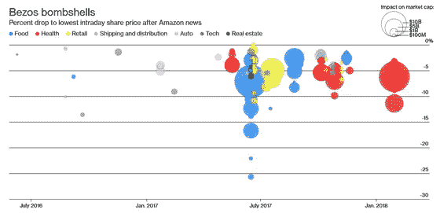
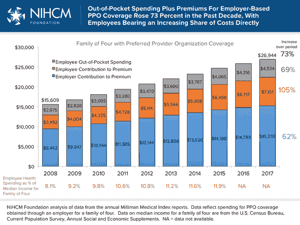
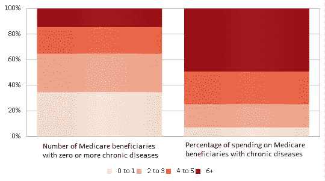
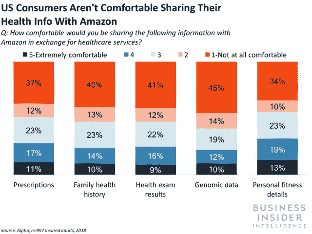

# 亚马逊的医疗保健方式

> 原文：<https://medium.com/swlh/the-amazon-approach-to-healthcare-b06498e094b4>

## 近距离观察贝佐斯的大赌注

[Source](https://sanvada.com/2018/01/31/amazon-others-create-new-healthcare-company/)

听到亚马逊进入一个新的市场已经不再是一个惊喜，但仍然令人兴奋。我喜欢下图，因为它完美地捕捉到了亚马逊对医疗保健市场的恐惧程度。令人惊讶的是，仅仅是公告和战略收购就可以从其他公司的估值中抹去数十亿美元。

[Source](https://gigazine.net/gsc_news/en/20180316-amazon-nightmare/)

我们仍然处于亚马逊医疗保健故事的早期，但我想分解亚马逊迄今在更广泛的医疗保健市场中所做的事情，并分析事情可能的发展方向。

# 亚马逊医疗保健

**一、医疗用品市场模式**

今天，亚马逊通过亚马逊商业销售许多基本的医疗用品，这是我们作为消费者使用的亚马逊平台的商业等价物。与他们的核心产品类似，亚马逊业务直接销售以及通过第三方卖家销售，因此现在医院是他们的直接客户。

虽然亚马逊几乎提供了美国消费者需要的一切，但很难在医疗保健领域提供全面的产品，因为产品的监管审批水平和流程各不相同。医院需要各种各样的供应品，许多竞争对手通过建立强大的产品组合建立了自己的竞争优势。

此外，医院需要一致、及时的产品供应，亚马逊仍在努力通过试点项目来证明这一点。亚马逊建立了卓越的供应链，但消费者和医院的需求是不同的。

时间会证明亚马逊是否能够建立一个庞大的产品组合并持续提供服务，但它们似乎并没有超出亚马逊的能力范围。亚马逊正在进行的更大赌注是他们的*市场模式*，与今天支配医疗用品采购的承包模式形成对比。

今天，大型医院系统通过代表许多医院与经销商谈判合同来巩固购买力。因此，分销商愿意放弃一些利润，以确保高销量。亚马逊希望解决的挑战集中在“85-90%的供应商，他们只占支出的 5-10%”([链接](http://spendmatters.com/research/fix-tail-propel-procurement-attacking-tail-spend-problem-b2b/))。医院与许多供应商合作，这通常使合同模式变得繁琐且难以管理。

亚马逊希望打破这种模式，允许企业一次从不同的供应商那里购买商品。其理念是，不要通过聚集需求来协商更好的价格，而是通过清晰简单的选择来节约成本，尤其是对于低产量的产品。

尽管如此，竞争是激烈的，像 McKesson、Cardinal Health 和 Medline 这样的公司都拥有庞大的供应链、庞大的产品目录和不仅仅是分销的服务。亚马逊显然在医疗用品领域处于落后地位，但如果他们能够证明市场模式具有成本效益，这将是一个巨大的竞争优势。

**二。不具名的医疗保健公司**

亚马逊医疗保健宣传列车在年初达到顶峰，宣布他们将与伯克希尔哈撒韦公司和摩根大通公司合作，以更好地解决员工的医疗保健需求。目标似乎是通过利用技术及其集体规模来更广泛地改善医疗保健体验。

这三家财富 50 强公司拥有大量员工(合计超过 100 万)，员工医疗费用昂贵且仍在增长。在某种程度上，像这样的大雇主已经成为医疗保健生态系统的一部分，但这个新的企业旨在看看这种支出是否可以减少。

自最初宣布以来，除了几个关键的雇员之外，没有多少东西实现了:首席执行官阿图尔·加万德——杰出的外科医生和作家，以及首席运营官·杰克·斯托达德——康卡斯特前数字健康经理。两人在医疗实践和成功地将技术整合到医疗保健服务方面拥有丰富的经验。

> 医疗保健中许多问题的解决方案——从质量到成本——是一种面向团队的系统方法……当医学更简单的时候，牛仔很好，我们需要的是医疗队，为病人服务的医疗队。“—阿图尔·加万德

亚马逊总是优先考虑客户，特别是通过低成本、速度和客户服务来提供价值。这些也是医疗保健领域的一些最大问题，所以我预计亚马逊将会像对待零售业一样，采用同样的以客户为中心的理念。鉴于他们的广泛目标，很难推测这家合资企业将专注于什么，但我更感兴趣的是这如何融入亚马逊更大的商业战略。

亚马逊进军医疗保健似乎类似于亚马逊网络服务，事实证明这种服务非常有利可图。AWS 是出于需要；亚马逊的业务正在增长，他们需要更好的技术基础设施来运营他们的“真正”业务。很快，他们开始了 AWS(在其他人有类似产品之前)，向从大型财富 500 强公司到政府机构的每个人销售他们的基础设施即服务。如今，AWS 已经不再是亚马逊的摇钱树，而是通过解决他们自己的业务需求，并将其转化为其他公司也需要的产品。

同样，如果亚马逊(和 JPM 的伯克)能够为自己的员工建立一个医疗保健解决方案，那么就有一个巨大的机会向其他雇主出售这个解决方案。超过一半的美国人参加雇主赞助的计划，这是一个跨越行业和地域的问题。也就是说，短期内可能会专注于利用现有的技术和服务，而不是从头开始创建一些改变游戏规则的解决方案。

总的来说，这有点像三家大公司说他们想解决一个共同的问题，但没有一个大的想法或细节。这更像是一份宣言，标志着亚马逊对更广泛的医疗保健市场的长期兴趣。

**三世。未来的数字药房体验**

今年 6 月，亚马逊以略低于 1B 美元的价格收购了在线药店 PillPack。最初，我对沃尔玛收购该公司的前景感到兴奋，认为这是一个在现有客户基础上发展在线业务的机会。出于类似的原因，我认为亚马逊会从这次收购中获益不少。

至少，这在一些投资者中产生了巨大的恐慌，沃尔格林和 CVS 的股票都因为这个消息下跌了 9%。

此次收购至关重要，原因如下:

1.  *Reach*——pill pack 将在美国所有 50 个州开展业务，与 CVS 等传统药店展开直接竞争。亚马逊可以专注于在全国范围内推广，而不必跨越 PillPack 已经经历的监管障碍。
2.  *制药专业知识—* 在医疗行业严格的监管环境下，建立数字化企业绝非易事。收购一家已经克服了这些最初障碍的公司当然是有利的。
3.  *关键客户群—* 相对于大型连锁药店，PillPack 没有太多的客户，但他们已经建立了专注于慢性病患者客户群的业务。如下图所示，患有多种慢性疾病的患者在医疗保健支出中所占比例过高，因此亚马逊希望专注于满足这一群体的独特需求是有道理的。

[Source](https://healthitanalytics.com/news/analyzing-medicare-chronic-disease-prevalence-spending-rates)

通过此次收购，亚马逊获得了数字药房体验，他们可以通过其卓越的分销网络来改善这种体验，并扩大现有的客户群。这可能会与亚马逊 Prime 会员资格挂钩——最初，向现有 Prime 用户推广 PillPack 产品，但理想情况下也吸引新的 Prime 用户。

此外，它使他们能够建立关系并了解慢性病患者，这反过来又使他们能够长期扩展到相关的医疗保健服务(例如，向这些患者销售医疗设备)。

我喜欢这次收购的原因是，它很好地发挥了亚马逊的优势和当前的商业模式，同时也将他们推进了一个巨大的新市场。

**四。全进开设备**

最新消息是，亚马逊已经与阿卡迪亚集团合作，推出了一个医疗设备品牌，专注于这些非常相同的慢性病患者，特别是糖尿病和心血管疾病患者。

现在很明显，战略重点是建立一套旨在满足这些患者需求的解决方案。从管理复杂的药房订单到为他们提供管理和跟踪健康的工具，亚马逊正在充实他们的产品组合。

有趣的是，他们选择了*而不是*来称呼这个自有品牌，但承认这是亚马逊独有的。当然，销售医疗器械通常比销售贴有私人标签的商品化产品更复杂。我不禁想知道，以一个单独的品牌名称“Choice”推出产品的决定，是否是为了与现有的亚马逊品牌分离，以防作为一家技术公司的内涵与作为一家值得信赖的医疗设备公司的内涵不一致。如下图所示，消费者对传递过多信息持谨慎态度。

亚马逊正在这里建立一个非常引人注目的生态系统。

在我的上一篇[文章](/@nanduanilal/amazons-next-win-is-in-voice-95ea72af0990)中，我提到了亚马逊 Echo 的低价位和积极的营销是他们获得市场份额的超级焦点的一部分。我认为我们可能会在这里看到类似的策略——使用设备作为切入点，让客户更多地参与亚马逊医疗保健产品组合。

通过 Alexa 的语音集成可以通过提醒、分析测量结果等促进坚持，从而使这些简单的设备更加强大。不难想象这将如何越来越多地为亚马逊提供更有价值的健康数据，就像 Apple Watch 为更广泛的消费者群体捕捉这些信息一样。

如果每个制造商的硬件在性能上都不相上下，那么 Alexa 的价值就成为了亚马逊的差异化，其他设备制造商将很难复制这一点。

# 结束语

亚马逊的扩张故事似乎从未停止。从网上书店到现在销售一切，提供云服务，无收银商店等——该公司愿意探索的领域是无限的。

该公司在零售领域的最大优势是其分销网络和强大的亚马逊 Prime 客户群——这两者都有利于转向 B2B 和 B2C 医疗保健。

随着大量投资和战略在整个领域的到位，观察亚马逊如何优先考虑这些不同的机会以及竞争对手如何适应非常重要。至少，我认为亚马逊进入这些传统市场会加快创新的步伐。

如果你觉得这篇文章有趣，请鼓掌，并发表你对这篇文章的看法！

## 这篇文章发表在[《创业](https://medium.com/swlh)》上，这是 Medium 最大的创业刊物，有+387，966 人关注。

## 订阅接收[我们的头条新闻](http://growthsupply.com/the-startup-newsletter/)。

