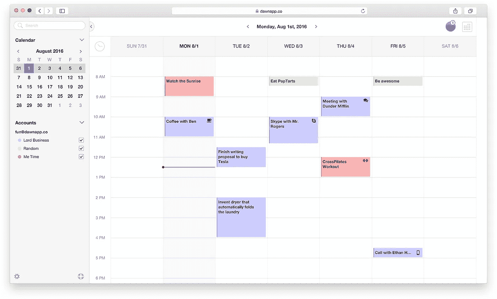

# 开始一个新项目的剖析

> 原文：<https://medium.com/swlh/the-anatomy-of-starting-a-new-project-6b9180e947c5>

有些项目你想开始，有些项目你认为有机会开始。

像许多人一样，当 Sunrise 宣布他们将关闭日历时，我很沮丧。我真的很喜欢他们创造的美丽的日历体验。

与大多数人不同，我没有坐以待毙，对不得不使用不太好的日历无动于衷，而是决定做点什么。

进入，黎明日历。但是在我们具体谈论黎明之前，让我们先来分析一下它是如何产生的。

# 验证想法和客户需求

很难验证任何项目的需求。在接受任何项目之前，我都会问自己几个常见的问题:

1.有人抱怨我的项目可以解决的问题吗？

2.是否有足够多的人在抱怨，而不仅仅是一小撮大嘴巴？

3.这是一个我能解决的问题吗(或者能找到能解决的人)？

对于这个项目，谈论 Sunrise 关闭的人和媒体的数量足以回答问题#1 和#2。只要在 Twitter 上搜索短语“[日出日历](https://twitter.com/search?f=tweets&vertical=default&q=sunrise%20calendar&src=typd)”，你就会看到多得数不清的推文(特别是如果你滚动回官方宣布的日期)。

写这篇文章的那天，我发现了几条相隔几分钟的推文:

**大声喊出来***他是第一批向我展示 Twitter 搜索功能的人之一，这种功能可以验证人们谈论一个想法的数量。**

*第三个问题的答案有点复杂，但我想很多阅读这篇文章的人都会有这样的答案…*

# *我没有任何技术技能怎么办？*

*我一点技术技能都没有。其实不是这样的，我还可以用 HTML 创建表格(感谢 Dreamweaver！).我不是开发人员、程序员或全栈工程师。最后一个和煎饼有关吗？嗯，煎饼。我甚至不知道描述一个技术人员的恰当方式是什么！*

*所以，我怎么可能有胆量去考虑启动一个需要大量技术魔法的项目呢？我使用了我们所有人都拥有的最有价值的资产之一:**我现有的人脉。***

*当我决定要接受创建一个替代的日出日历的挑战时，我立即开始研究我的联系人列表。我知道我需要几个不同的人:*

*   *一个项目经理/有项目眼光的人(就是我！)*
*   *有人来处理 UX 和用户界面(设计和人们如何与设计互动)*
*   *工程煎饼的完整堆栈(拜托，这很有趣！)*

*在这个项目中，我最近在 Skype 上和一个正在寻找新项目的朋友聊天(他是一个 UX/UI 人员)。他的名字立刻从埋藏在我大脑中的某个地方跑到大脑中告诉我的手指给他发短信的部分。我做到了。*

*我找到了一个更懂技术的人，一个会做很多前期繁重工作的人，于是我联系了两个我认识的技术人员。他们两个都已经在从事相当大的项目，但是我想他们至少可以给我指出正确的方向。这就是事实。几封电子邮件之后，我得到了一份经过审查的介绍，是一位才华横溢的工程师。*

*从那以后，我安排了一次 Skype 通话，把这个团队召集到一起，讨论一起承担一个新项目。有趣的是，我向他寻求技术介绍的那个朋友想加入这个电话，并作为一名顾问留下来。在项目的这个阶段，我很乐意帮忙，因为额外的脑力在任何项目的开始都是重要的。*

*你可能不认为你和有才华的人有联系，但是你会对你认识的人感到震惊。现在就打开你的邮箱，你会发现有 25-50 个人你可以发邮件给他们，他们信任你，并且可能认识有才华的人。*

# *初步讨论并达成共识*

*你，100%可以雇一个开发商，一个设计师，完全不在乎你们处得好不好。许多人就是这样做生意的。然而，我想享受我参与的每一个项目。和其他人一起享受任何项目意味着更多地了解他们。*

*在最初的 Skype 通话中，我分享了我创建一个替代日出日历的想法，并想听听我未来潜在的队友会有什么反应。我们讨论的一些话题:*

*   *每个人都有时间致力于这个项目吗？*
*   *每个人都对此感兴趣吗？*
*   *我们对这个项目有什么期望的结果？*
*   *每个人的角色是什么？*

*当与其他人一起开始一个新项目时，我想强调其中两个主题的重要性:*

***1。人们必须工作的可用时间***

*你需要绝对清楚工作时间表。如果一个人全职工作，其他人兼职工作，这是可行的，但也可能成为以后的紧张点。我们决定都同意这是一个兼职项目，这可能会成为一个全职项目，这取决于我们的预购结果(一分钟后会有更多)。*

***2。项目的长期目标***

*我对任何项目的投资者都不感兴趣。当涉及到我的项目决策时，我没有兴趣回答任何其他人的问题。我也对建立数百万美元的公司不感兴趣。我们讨论这些事情，让每个人都达成共识，这很重要。我们一致认为，我们希望建立一个可持续的项目，带来良好的经常性收入(一分钟后还会有更多)。*

*有一件事没有作为话题在电话中讨论，但却非常重要，那就是每个人如何交流以及对彼此的感受。这不是一次直接的对话，但如果你和志同道合的人在一起，你可以很容易地感受到一种联系和感觉。这是一个巨大的优势，尤其是当涉及到一个新项目，而这个项目是由一群以前没有一起工作过的人组成的时候。*

# *如何评价先做什么*

*这个想法是有效的。队伍到位了。现在你到底在做什么？*

*首先，我们希望了解我们将要面临的技术障碍，以及我们将如何完成创建一个日历应用程序。这与明确定义项目中每个人的角色有点关系。我们又进行了一次 Skype 通话，讨论了接下来的步骤。*

*我们的技术负责人看了看 Sunrise 的内脏，对他所看到的感到很舒服(也很兴奋)。我们决不会抓取代码或复制代码，但是知道我们在看什么是很好的。他不是一头扎进代码，而是要为阶段化和产品化建立一个基础(看看我的术语！)，并调查我们开始时的最佳行动计划。*

*我们的设计/前端领导开始关注 Sunrise 上的交互。事件的发展。活动邀请函的外观。简单的日历导航。然后他花了几个小时模拟出我们美丽的日历。*

*

Dawn Calendar Mockup* 

*这里很容易深入到最深处，但是我们想在投入太多时间之前从基础的东西开始。*

*我们还做出了项目中最重要的决定:在人们打开钱包并通过支持我们项目的预购来显示需求之前，我们不会开始实际构建黎明日历。*

# *为什么我们要求人们预先付费，为什么你不必免费工作*

*成千上万的人对日出日历即将消失感到不安。但是，他们有没有难过到愿意花钱买一个新的日历呢？*

*我们想测试一下这个问题。*

*进入:[黎明日历预购。](http://dawnapp.co)*

***我们要求 500 人在 6 月 10 日之前承诺每年 10 美元。***

*我喜欢创建 MVP(最小可行产品)的想法，但我想创建 MVI(最小可行利益)。预购页面正是如此。*

*如果你相信这个项目，你想支持它，少量的钱(10 美元)应该是不需要考虑的。如果我们能从 500 个人中创造出一个 MVI，我们就要蹲下，在 8 月 1 日之前创造出黎明日历。*

*我们决定以 10 美元/人的价格雇佣 500 人，因为我们都认为 5000 美元已经足够用来制作第一版网络日历，并有足够的运营成本(服务器、主机等)。我们都在这个项目上投入了大量的时间，所以这些都是打折的。当一个项目开始时，这是所有项目创建者的奢侈。*

*我们项目的预购也为我们做了几件事:*

*1.它给了我们一个核心反馈小组。人们对这个项目非常感兴趣，并将在向公众推出之前帮助我们测试东西。*

*2.让我们真正了解了人们对这个项目的兴趣。是的，我们的团队以前从未构建过日历应用程序，但我们都有很棒的简历([这里](http://benrabicoff.com)、[这里](https://twitter.com/pfarrar1)和[这里](http://jasondoesstuff.com/about))。*

*3.让我们对这个项目感到非常兴奋！每一个支持者都成为我们可以添加到我们的项目中的一点额外的燃料——火。*

*如果在最坏的情况下，我们在 6 月 10 日之前没有达到 500 个预购订单，我们将退还每个人的钱。这就是在线构建东西和使用 Stripe 等服务的美妙之处。几下点击，它会像我们的项目从来没有开始，没有太多的时间或金钱损失。*

# *做梦可以激励人，但也很危险*

*陷入一个项目的“如果”中是非常容易的。如果我们有 5 万名支持者呢？如果有人提出购买我们的日历应用程序会怎么样？如果呢？如果呢？如果呢？*

*我发现，陷入困境并花时间担心这些场景是对项目动力的彻底破坏。*

*你开始担心，并把时间/精力集中在所有可能永远不会发生的边缘情况上，而不是专注于与你能找到的最好的人一起开发最好的产品。*

*我们现在不担心远大的梦想。我们专注于眼前的任务(获得 500 份预订单)，一旦任务完成，我们将着手下一个任务。当然，我会继续关注我们项目的后续步骤，但我不会让它们分散我们的注意力。*

**更新(2016 年 6 月 10 日):我们没有达到预订目标。哭丧着脸。不过没关系。我们提前了解到，人们不愿意支付替换日历的费用(好吧，没有我们需要的那么多来负担建造黎明日历的费用)。感谢那些预购的人，今天早上你们都被退款了。**