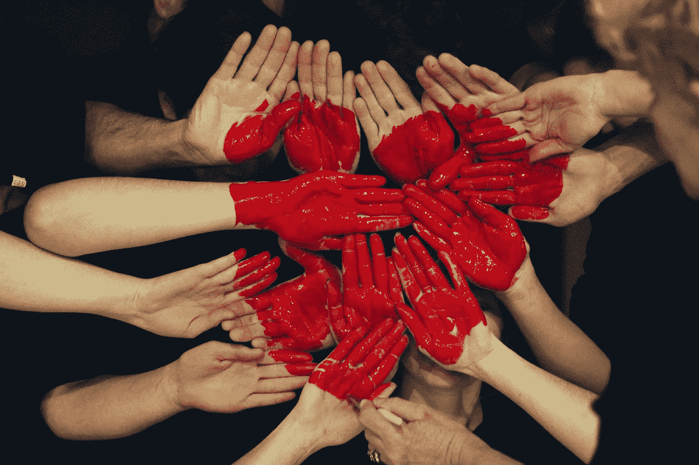
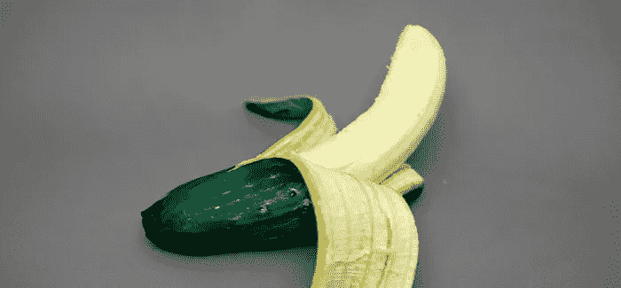

# 势的出现

> 原文：<https://medium.com/swlh/the-appearance-of-potential-ea29984209d1>

## 从未到来的身份危机

会变得很奇怪的，坚持住。果汁是值得榨的…如果你让自己相信它是值得的。

在构建叙事和身份的过程中，假设它们来自并依附于我们过去的经历，然后我们将这些经历与现在联系起来并应用于现在。如果是这样，我们的生存本能和预测天性有多大关联？我们是否在用过去来冲淡现在，以此来安慰我们对自己创造的未来的恐惧，以及对自己身份的不断防范？

我们的身份是掩盖不安全感的保护机制。我们创造、采纳、呈现，然后根据过去的经验将其编织进我们想象的未来。我们不断地试图向前看，隐藏或更好地实现潜力，如果我们没有参与创造这样一个想象的叙事和它带来的我们的不安全感的主观性质，其中大多数永远不会发生，甚至永远不会被认为会发生。我们生活在自己创造的幻觉的阴影中。为什么呢？因为别人在看。

从他人的角度来看，我们的骄傲、声誉、身份和外貌对我们来说是如此重要，以至于我们愿意用我们的好奇心、存在感和意义(我们到底是谁)来换取权力和控制的幻觉。我们不敢想在别人眼里被认为是愚蠢的、无关紧要的、不够好的或不够好的。为了自我和一体的出现，我们放弃了自我和一体的意识。

我们不断地比较，不断地积累成就，并适应于编织成我们的身份，供“我”这个角色的外部观众观看。这只会加剧我们每天面临的不安全感。也许我们的成就和过去的经历最好还是作为片段留在过去。这纯粹是娱乐，对我们来说无关紧要。

要完全投入并享受生活中的当下，让过去成为过去，不要浪费时间担心可能永远不会发生的事情，对未来保持好奇。

未来将会是惊人的…如果你允许自己顺其自然。

# **原始的想法..**

> “30%的几率意味着 10 次中赢 3 次。体面。”

健身到底是什么

对人们来说，了解什么是真正的健康很重要:持续追求个人健康。尽管我们定义的 ho 的细节是个人和群体之间以及随着时间的推移而发生的变化，但健身是我们参与的支持性旅程的原则是超越性的。旅程永远不会停止，追求也不会停止。

你的“快乐之地”是狗屎

你的“快乐的地方”是一个暂时的虚幻的逃避，逃避你真正是谁，你是你、我和我们的一部分。快乐是暂时的，完整是永久的。不要用故事、分心和个人形象/身份来欺骗自己，什么是“正常”的，或者我们已经知道并渴望/渴望呈现和定位我们自己。做你自己，活下去，让其余的一切围绕着你。把你自己和你自己从我们所在的美丽世界中塑造出来。

这正在发生

你可以来凑热闹，也可以做出贡献，或者你可以看着，不管怎样，这正在发生。它要么会变得不可思议，要么我们会从中学习和发展……我们希望你能成为我们正在创造的一部分。

被误解

当其他人不明白你在说什么/做什么，或者不能预见或理解这个概念时，你要么需要花时间澄清和诊断核心原则，然后做出适合他们的感知和主观现实的解释，要么接受并承认无知是一个信号，表明你在不同的道路上，做着不寻常的事情，出于更远的原因和更多的横向宏观目的，而不是直接和明显的性质。

其中一种立场是微观/局部的同理心，是对自己的地位和目的的不安全感的衍生物，而另一种立场是集中承诺的宏观/全球同理心的衍生物。被误解，成为你寻求改变世界的人，成为机遇的原因和贡献者，而不是手段的症状。

## 这篇文章发表在《创业公司》杂志上，这是 Medium 最大的创业刊物，有 301，336 人关注。

## 订阅接收[我们的头条新闻](http://growthsupply.com/the-startup-newsletter/)。

