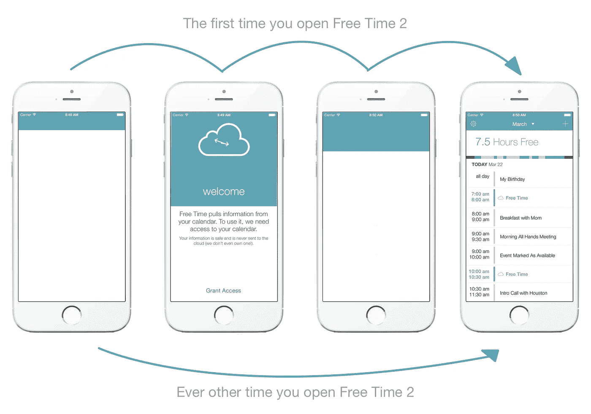

# 每个应用程序都忽略的苹果人机界面指南

> 原文：<https://medium.com/swlh/the-apple-human-interface-guideline-that-every-app-ignores-91fe24fcad32>

## 为什么我们关心，为什么您也应该关心

*我们想分享我们在开发* [*空闲时间*](http://signup.freetimeapp.com) *时发现的一些知识，这是一款日历应用，你会在本文中多次看到。*

## 为什么苹果不喜欢你的应用程序的启动图像

从 App Store 诞生之初，苹果就一直宣扬这样一个理念，即一个应用的启动画面(无论你何时启动一个应用都会看到的初始画面)只需要是一个中间画面，仅此而已。从苹果的人机界面指南中引用这句话。

> 启动文件或图像提供了一个简单的占位符图像，iOS 会在应用程序启动时显示该图像。占位符图像**给用户的印象是，你的应用程序很快** **并且反应迅速**，因为它会立即出现，并很快被你的应用程序的第一个屏幕取代。
> 
> *启动图像，苹果人机界面指南*

问题是，几乎每个人(包括我自己)都忽略了这条指导方针。如果你想知道这种情况有多普遍，看看上面的封面图片，或者关掉所有在后台运行的应用程序，然后重新启动它们。我很确定你会发现大多数人不遵守苹果的指导方针。

更糟糕的是，大多数应用程序开发人员可能同意苹果的建议(谁不想“给用户留下你的应用程序速度快、响应快的印象”)，但在开发应用程序时，我们很容易忽略这条准则，而喜欢用漂亮的启动图像和有趣的初始动画来取悦第一次使用的用户。即使在我的咨询工作中，发布图片也是进行更多品牌推广的绝佳渠道，我们的客户非常喜欢。

一些应用程序开发者(也包括我自己)将这些入门体验用动画和视频推进了一步。早在 2010 年，我就为我的日历应用第一版[空闲时间](http://signup.freetimeapp.com)建立了这个启动序列。我们对此非常自豪:

Free Time Onboarding Animations in 2011

如果你看视频，你会看到一个很好的介绍动画，很多人第一次看的时候都很喜欢。你不会看到的是，每次你启动应用程序后，它总是会先显示那些云和 Default.png，然后过渡到应用程序的界面——虽然它起初很可爱，但很快就失去了吸引力。

> *品牌发布图片和动画只会碍事和浪费时间*

苹果是对的，我们不应该忽视他们的指导方针，因为这些品牌发布图像起初充其量是可爱和有趣的，然后令人讨厌，最糟糕的是占用了使用我们软件的真实用户的大量时间(见下文)。

这不仅仅是 2010 年开发的应用程序仍在做的事情，这正在 2015 年的今天发生。以 Food Network 的最新应用程序更新为例(苹果几周前刚刚推出了它们，所以对它们进行挑剔是公平的游戏)。

每当你加载应用程序时，这个视频就会出现(它大约有 5 秒钟长)！

在常规使用后，我甚至开始觉得这个应用程序慢得令人难以置信，但我知道在内心深处它是一个制作精良的应用程序(实际上是由 Bottle Rocket 的优秀人员构建的)。App Store 的评论也反映了这一点(上次我检查时大约是 4.5 颗星)，但这里浪费了太多时间。

有趣的思维练习:在每次加载 5.5 秒的情况下(每周约 3 次)，100 万人定期使用该应用程序，人类在接下来的一年中将损失超过 8.2 亿秒。

> *美食网的 app 将在未来 12 个月内浪费人类生命的* ***26 年*** *。*

## 找到品牌启动屏幕的解决方案

多年来，我并不真正关心苹果的发布图像指南，但现在我关心了，因为我们找到了一种简单而有趣的方法来两全其美。在这个世界里，品牌可以得到他们的品牌，苹果可以得到他们无聊的发布图像(是的，他们知道他们很无聊):

> 如果你认为遵循这些指导方针会导致一个简单、乏味的启动图像，那你就对了。记住，发射图像并没有给你提供艺术表现的机会。它的唯一目的是让用户觉得你的应用程序可以快速启动并立即投入使用。
> 
> *发布图片，苹果人机界面指南*

这是我们开发的入职动画视频。我们的目标相当简单:

1.  获取我们需要的权限(日历访问和通知)
2.  不要碍事(有些入职体验可能会很无聊)
3.  取悦第一次用户，但仍然安抚苹果 UX 神和遵守规则。

经过多次迭代后，我们最终得到了以下结果:

平面 UI 设计的趋势现在更容易允许应用程序提供初始品牌序列，即使启动图像遵循人机界面指南。

在以前的 iOS 版本中，粗渐变使这变得很困难，但现在一个扁平的导航栏可以很容易地扩展并兼作应用程序上线的画布。使用动画导航条或标签栏可以很容易地向外扩展，占据整个屏幕，然后后退，不影响实际的应用程序体验。

更好的是，这不会感觉笨重或强迫，它感觉完全自然。

下面是用户第一次启动时会看到的内容，以及以后每次打开空闲时间时会看到的内容。

因此，这就是解决方法——只需遵循以下四个步骤:

1.  如果你的应用有一个顶部导航栏或标签栏(我们现在假设有一个顶部导航栏)，使用纯色并创建一个符合苹果规则的简单启动图像。
2.  在第一次启动时，向下扩展并动画显示该条到视图中，以创建一个“onboarding canvas”。
3.  插入有品味的品牌(关键词有品味)，请求权限，欢迎人们加入你的应用，然后迅速闪开。
4.  动画画布回到导航条，并淡出到应用程序的第一个屏幕。

你的用户会很高兴，在随后的启动中，他们不会注意到任何事情，但他们可能会有一种难以察觉的感觉，你的应用程序可以快速启动，并立即准备好使用。

赢了。赢了。

[在本月晚些时候《自由时间 2》发布时得到通知](http://signup.freetimeapp.com)

*感谢你阅读这篇文章！如果你喜欢这篇文章，我会很感激你点击下面的******按钮*** *。也可以在 Twitter*[*@ scoober*](http://www.twitter.com/scoober)*或*[*@ freetime app*](http://twitter.com/freetimeapp)*与我联系或者在 medium 上关注我阅读未来的帖子。***

****

***发表于* **创业、旅游癖、生活黑客****

************

**-**