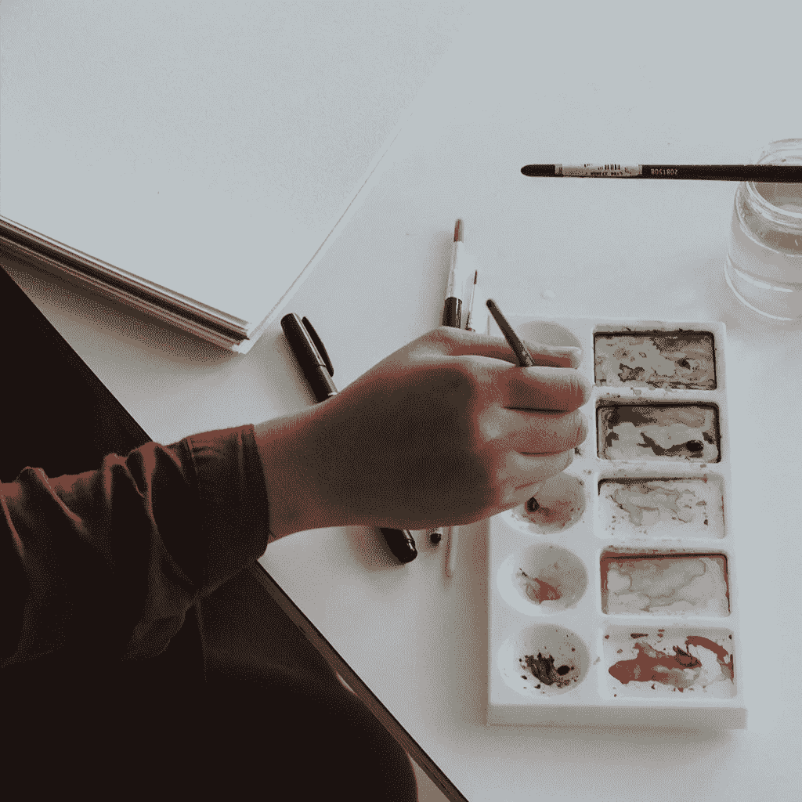

# 创造纪律的艺术:运动员、禅宗大师、舞蹈家和小说家关于一致性的 12 句名言

> 原文：<https://medium.com/swlh/the-art-of-creative-discipline-12-quotes-on-consistency-from-athletes-zen-masters-dancers-8076bcc14fb5>

> “为什么我从来没有厌烦过？五十多年来，我从未停止过工作。”——亨利·马蒂斯

1943 年，一小撮纳粹士兵坐在亨利·马蒂斯的地下室里。法国被占领，第二次世界大战正在撕裂这个国家，与意大利的盟军发生冲突。马蒂斯本人已经 73 岁了，病得无法行走。挽救他免于癌症的手术使他卧床不起，健康状况不佳。然而，尽管他周围的黑暗和他可怕的身体状况，他是一个忙碌的人。

由于无法像以前那样画画，马蒂斯开始用彩纸和剪刀创作“剪纸”。马蒂斯在这一时期创作的作品是鲜活的。他们充满活力地歌唱，丝毫没有暗示出他所面临的挣扎。用最基本的材料和技术，他继续着他毕生的实践:艺术创作。

马蒂斯生命的终点布满了障碍。然而，这也是他创作一些最佳作品的时候。不管他周围发生了什么，马蒂斯找到了一种方式出现并继续做他的事情。当他 70 多岁的时候，他已经每天都这样做了将近 50 年。让他创作出这些剪纸作品的，不是灵光一现，也不是侥幸。这是一生的一致性。对过程的承诺。以及一种信念，不管他的境遇如何，“工作能治愈一切”。

# 为什么一致性很重要

我们可以从马蒂斯和他无论如何都要坚持下去的热情中学到很多。他对工作的奉献不仅是个人的承诺，也是为了寻找有意义的东西。这是历史上许多最多产和最深刻的创造者共有的特征。

有创意的人有一种浪漫而过时的想法。只有灵感迸发时才工作的画家。这个冷漠的摇滚明星有更多的时间喝酒而不是弹吉他。还是那种轻而易举就创作出杰作的神童。

但是，我们发现的往往是相反的。每天付出努力就更接近所需要的。例如，杰克·凯鲁亚克曾告诉《人物》杂志，他在为期三周的毒品冲刺中完成了他的小说《在路上》。他没有遗漏的是，在那之后的六年里，他花了六年时间精心编辑它。

生活是不可预测的。有些日子很好。其他的会比较粗糙。当你学会不顾这种情况出现并做你的事情时，你就到达了一个转折点。因为现在那些可能曾经变成借口的外在因素不再阻止你。

一致性很重要，因为它能在不确定性面前释放个人自由。它消除了借口和拖延。它培养耐力、决心和性格。一次又一次的行动，我们塑造了自己。如果我们能掌握这一点，那么生活就由我们来塑造。

下面是一些鼓励我在自己的生活中找到一致性的名言。我希望他们为你做同样的事情。

# 12 条关于一致性、纪律和日常实践的引言

> “一致性胜过强度。一致性胜过音量。一致性战胜激情。一致性决定结果。一致性是性格的定义。”—富辊

激情是短暂的。成交量不可持续。强度应该通过持续的练习来增加，否则我们会有爆炸的危险。当我们练习一致性时，我们能够达到更高的高度。

> “世界的创造不是一劳永逸的，而是每天都在发生。”—塞缪尔·贝克特

每一天都是一张白纸。我们必须再次出现，像我们以前多次做的那样做这项工作。没有昨天，没有明天，只有现在和我们需要创造的作品。

> “我们都必须练习，我们必须在有生之年尽全力练习。”―夏绿蒂·净香·贝克

你的做法是什么？你需要坚持做什么？你愿意奉献一生的事情是什么？意义和快乐就在这些问题的另一边。

> “真正重要的自由包括关注，意识，纪律和努力，以及能够真正关心他人并为他们牺牲，一遍又一遍，每天以无数琐碎的方式。”—戴维·福斯特·华莱士

以似是而非的东方哲学的方式:自由是通过纪律找到的。努力只会带来轻松。开始可能是发展你自己，但最终总是让别人受益。

> "创造力是一种习惯，最好的创造力是良好工作习惯的结果."—特维拉·塔普

在你的工作中寻找创造力——无论你的工作是什么，你都可以创造性地去做——重要的是让它成为一种习惯。如果没有别的原因，仅仅是因为每天出现，我们就增加了创造力迸发的几率。

> "无论我们始终关注什么，我们都会在生活中表现出来."——托尼·罗宾斯

这是生活的基本数学。每天写作，你就会成为作家。每天画画，你就会成为一名画家。一致性是等于我们成为什么的总和。

> “要有那个。不是蓄水池，而是永久的泉水。怎么会？通过努力赢得你的自由。一小时又一小时。通过耐心、诚实、谦逊。”—马库斯·奥勒留

持续流动的泉水比每天见底的水壶更有价值。我们通过耐心地完成任务并每次都尽最大努力来打开这个春天。不多也不少。

> "成功只不过是每天练习的几门学科."—梅尔·罗宾斯

当你始终如一，生活变得简单。每天做同样的事情，你会建立起比每个单独行动更大的东西。

> “我写了多少页？我不在乎。他们好吗？我想都不敢想。重要的是我投入了我的时间，尽我所能去完成它。重要的是，为了今天，为了这次会议，我已经克服了阻力。”―史蒂文·普雷斯菲尔德

别管输出了。一致性是关于过程的。这是关于赢得每天的战斗去做你该做的事。有些日子你可能会出类拔萃。其他时候你可能会制造垃圾。重要的是今天你坐下来做了你该做的。

> “我们应该记住两个词，并通过交替运用和克制自己来遵守，这两个词将确保我们过上基本上无可指责和无忧无虑的生活:坚持和抵制。”—爱比克泰德

在我们的工作中保持一致的纪律要求我们找到奉献的力量和对干扰说不的焦点。

> “天赋只能决定你运动潜力的极限。正是奉献和自律的意愿让你变得伟大。”—比利·简·金

天赋能让你走得更远。但是伟大是建立在对工作的投入上的。每天遵守纪律，你就会踏上寻找最佳自我的道路。

> “现在是时候扭转这种对有意识努力的偏见，把我们通过实践和训练获得的力量视为非常鼓舞人心甚至是奇迹。”―罗伯特·格林

对工作的投入不仅仅是完成工作。而是对比你自己更重要的事情做出承诺。它是说每天都有值得做的事情，我会用我的一生去做。

## 链接和参考

[剪纸作品](https://www.moma.org/interactives/exhibitions/2014/matisse/the-cut-outs.html)——这是 Moma 的一件伟大的互动作品，展示了马蒂斯用来创作剪纸作品的技术。

[常年卖家](https://www.amazon.com/Perennial-Seller-Making-Marketing-Lasts/dp/0143109014)——我在瑞安·哈乐黛(Ryan Holiday)关于制作永恒作品艺术的书中找到了凯鲁亚克花六年时间编辑《在路上》(On The Road)的内容。

[Rich Roll](http://www.richroll.com/)——激发这篇文章的人(上面引用了他的话)。查看他的网站和播客寻找灵感。

## 这篇文章发表在 [The Startup](https://medium.com/swlh) 上，这是 Medium 最大的创业刊物，有 355，974 人关注。

## 订阅接收[我们的头条新闻](http://growthsupply.com/the-startup-newsletter/)。

