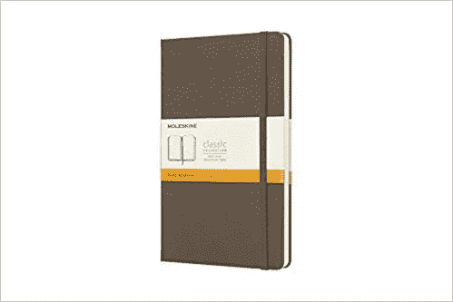
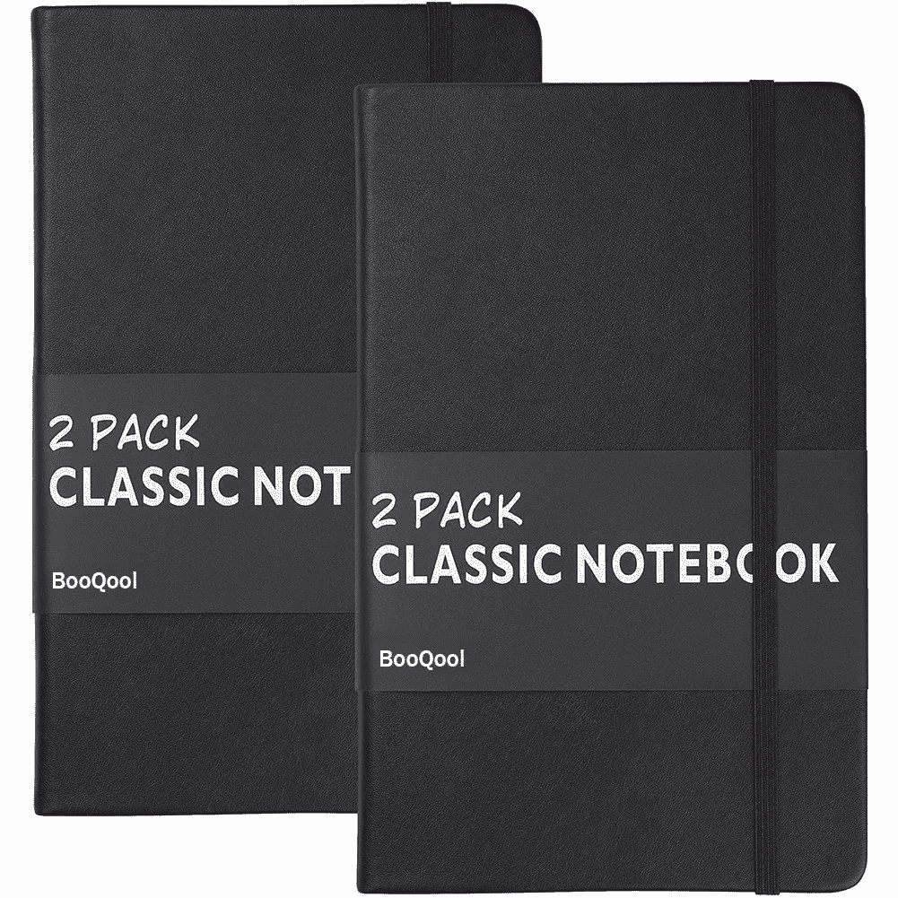
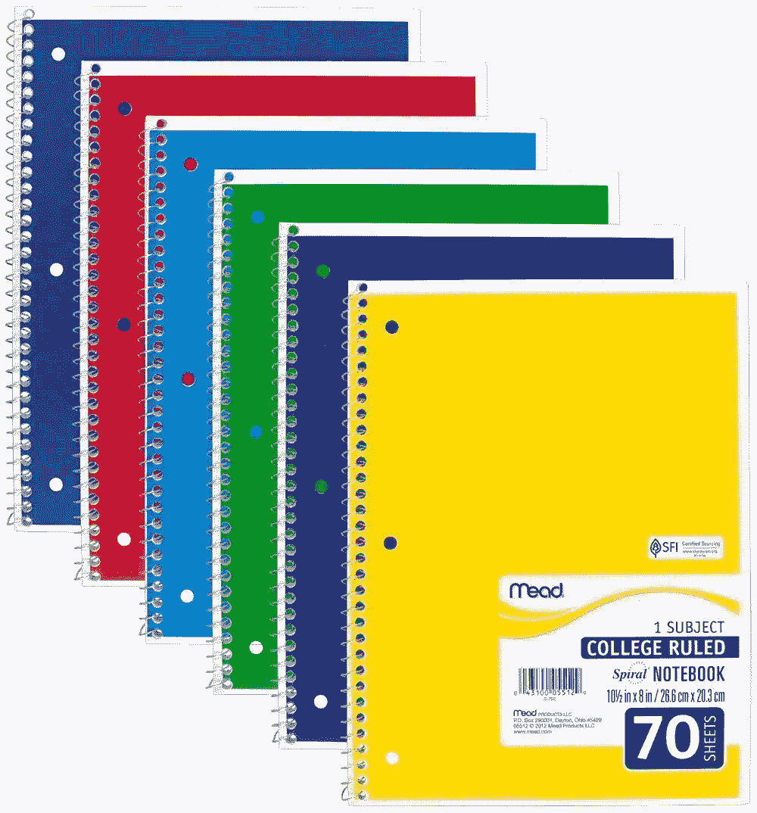

# 记录想法的艺术

> 原文：<https://medium.com/swlh/the-art-of-ideas-4bc1518a6311>

你今天工作很辛苦。你匆忙查看你的电子邮件，睡觉前最后一次。现在是午夜 12 点 45 分。你担心创业会影响你的健康和社交生活，但你离成功已经很近了，不能放弃。

当你慢慢进入梦乡时，你想到了一个好主意。这可能是你整天都在思考的流程优化问题的解决方案。或者是你想了很久的合作协议的决议。你带着微笑入睡，因为你终于找到了解决办法。

**第二天早上，你当然会忘记这件事**。你可能记得你想出了一些东西，或者甚至记得模糊的细节，但是你永远也不会回忆起你到底想了什么。你站起来，重新开始思考解决方案。不幸的是，你已经失去了你的竞争优势，并随之失去了你的时间。

**事情是这样的，好主意多如牛毛；然而，我们的记忆储存这些想法的能力是有限的。**这对新创业者来说尤其如此，因为创业初期的磨砺是一场艰苦的斗争，责任的负担往往会让记忆变得沉重。

研究表明，平均而言，我们的记忆中最多能容纳 7 件物品。因此，假设，如果我们试图记住第八条，我们会很难做到。那么，我们如何克服这个困难呢？

解决办法是养成记录有用信息的习惯。你脑海中闪过的任何重要的事情都可以，从周年纪念日提醒你去给你的 S.O .买份礼物，到加速你业务增长的突破性想法。

既然你已经确信你需要培养记录重要事情的习惯，那么你可以这样做。

拿一本日记本或袖珍笔记本。确保你买的是高质量的，因为它们有耐用的防尘套和更坚韧、抗撕裂的书页。以下是我的一些建议。(声明:我个人不代言任何特定品牌，也没有被指定为这些公司的产品代表。这些只是我推荐的产品):

[http://amzn.to/2p6NNvX](http://amzn.to/2p6NNvX)

[**2 包经典格纹笔记本/日记本**](http://amzn.to/2Fw16gp) (它们有耐用的人造革封面，携带起来非常方便，虽然不如鼹鼠皮系列笔记本时尚，但这些经典日记本仍然是可靠的选择)

[http://amzn.to/2Fw16gp](http://amzn.to/2Fw16gp)

[**Mead 05512 螺旋笔记本**](http://amzn.to/2tyrox7) (这些螺旋笔记本使用方便，外观时尚，每包 6 本 11.90 美元，是迄今为止最经济的选择)

[http://amzn.to/2tyrox7](http://amzn.to/2tyrox7)

**您也可以使用** [**便利贴**](http://amzn.to/2FtPWwY) **记录您的想法，以便快速访问**。当你想在一个特定的地点记录灵感时，便利贴特别方便。另一种便利贴的替代品是 A1 尺寸的打印纸，我发现它通常更有效。我的工作区里贴了四张这样的纸，每当我有了一个想法，在我的工作日程当中，我会迅速地把它写下来，在休息的间隙回顾这些想法。你可以在这里找到一个简单的方法[安装这样的装置，使用一个插接板。](http://amzn.to/2FMkdWS)

最后，你应该学会相信自己记录想法的习惯。最初，你可能感觉不到你的生产力水平有任何显著的提高，但是慢慢地你会注意到这个习惯会变成肌肉记忆。你会花更少的时间去思考，花更多的时间去做和实施决定。

## 这个故事发表在 [The Startup](https://medium.com/swlh) 上，这是 Medium 最大的企业家出版物，拥有 305，184+人。

## 在这里订阅接收[我们的头条新闻](http://growthsupply.com/the-startup-newsletter/)。

