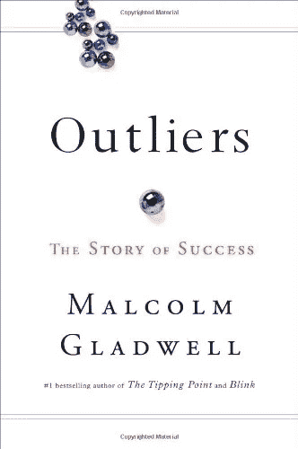
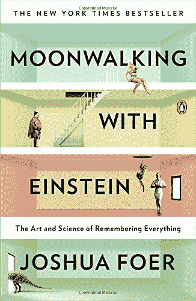

# 掌握的艺术

> 原文：<https://medium.com/swlh/the-art-of-mastery-691e2e0962cf>

你已经开始寻求获得一项新技能。这在你的企业家角色中可能很重要，或者也许你想作为一个独狼式的自由职业者来分散你的技能。

无论你处于哪种情况，掌握某项技能都很重要，而不仅仅是略读基础知识。在马尔科姆·格拉德威尔的畅销书《*》中，他将精通归功于一万小时法则，即精通源于长时间的练习，成功是精通的结果。*

*成为众所周知的“百事通”几乎永远不会成功，因为只有精通才能运用策略。所以，不多说了，这里有一套 5 个小技巧，你可以用来掌握任何技能。*

***有导师**:观摩是最好的学习方式。这尤其适用于社会表现是其不可或缺的一部分的技能。例如，考虑语言技能。假设你已经知道说外语的基本知识。然而，你还远远不能像一个以英语为母语的人那样说这门语言。在这种情况下，你需要一个导师，一个你可以观察和学习该语言各种细微差别的人。可以是任何人，从专门的语言专家(也就是语言教师)到母语是该语言的朋友。*

***熟能生巧**:在看过你的导师完成一项任务后，你应该尽力复制同样的结果。当然，最初的努力可能没有那么有希望，坚持不懈是关键。老实说，我认为一个好学生和一个普通学生之间的区别，一个掌握了知识的学生和一个没有掌握知识的学生之间的区别不是天赋。相反，这是勇气和决心。只有那些奋斗、失败、再奋斗的人才能成功。*

***帮助他人学习**:当你在一门学科中获得一些专业知识后，你应该花些时间去教导或帮助他人。例如，如果你懂编码，你可以在 StackExchange 或 GitHub 论坛上查看别人的代码。或者，如果你是数学系的研究生，你可以帮助大学新生学习积分学。你不仅会让其他人的生活变得更好，还会掌握一些概念，因为这本质上是一种实践，但却是在一个更个人化、更实际的层面上。*

*这里有一些好书，我推荐阅读，以便更好地理解掌握的必要性。*

*[**离群值**](http://amzn.to/2HGVWPs)*

**

*[**与爱因斯坦一起月球漫步:记忆一切的艺术和科学**](http://amzn.to/2pjsVCD)*

****

## *这篇文章发表在《T4》杂志《创业》(The Startup)上，这是 Medium 最大的创业刊物，有 307，792 人关注。*

## *在这里订阅接收[我们的头条新闻](http://growthsupply.com/the-startup-newsletter/)。*

**