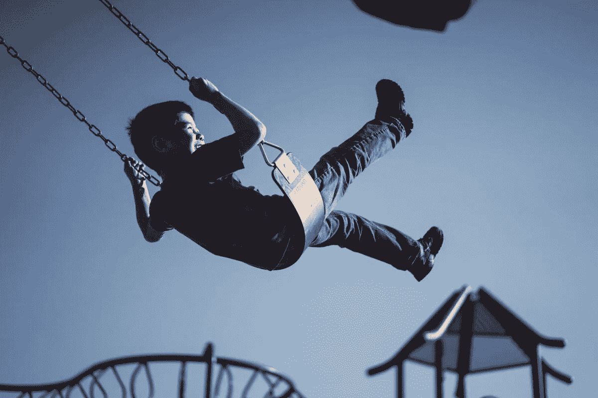

# 不思考的艺术

> 原文：<https://medium.com/swlh/the-art-of-not-thinking-75ae21a3d354>

## 信不信由你，凭直觉行事是最伟大的人和最优秀的人之间的区别。

Stop! In the name of love! (Sorry, couldn’t help myself.)

这六个词概括了我对工作、生活和一切的态度。

> ***“伟人以为。最好是这样。”***

这六个字非常有力量。比你仅仅通过阅读它们所能意识到的要强大得多。

用最基本的术语来说，这些话是在暗示，与其想着去做一件事，不如去做。

但这只是皮毛。

你的直觉应该是你做任何事情的驱动力。你的直觉告诉你什么？

# 我们内心的猴子

任何有生物学基础知识的人都知道我们是从猴子进化而来的。

我们的大脑现在比我们的灵长类祖先复杂得多。我们能够非常详细地思考事物，在时间中向前和向后探索，想象新的世界和创造。

这一切都令人印象深刻。

**但是在内心深处，猴子的大脑还在。有时它会接管。**

你会亲身经历过的。

比如，当你半夜醒来，饥肠辘辘，肚子呻吟着要你吃东西。所以你从卧室溜到厨房，尽情地大嚼。

这是你的猴脑在工作。它告诉你，你饿了，它促使你采取行动，在这种情况下，得到一些食物。

这种简单性令人震惊。

*你有需求。你采取措施来满足它。*

考虑一个还没有接受如厕训练的小孩。他们突然觉得需要排便。令他们父母非常反感的是，他们马上就这么做了。

他们有需求。他们采取措施来满足它。

当然，我并不是建议我们都屈服于这些需求，随时随地去厕所。那太荒谬了。

但是请允许我用这个例子再多讲一会儿，并试着解释为什么一个孩子会弄脏他们的衣服，而一个成年人不会。

当你第一次意识到你有一个紧迫和紧急的需要使用浴室时，你不会脱下你的裤子然后去那里。或者至少我希望你不会。

相反，你会等待一个去厕所的机会来处理你的事情。

你的猴脑会建议你不要傻等。你有需求。你需要满足它。

但是我们压抑自己的猴脑，等待合适的时机。

我们等待合适的时机，因为我们思考。

我们会思考满足这种需求的后果。在这种情况下，后果将是对社会规范和不成文规则的严重破坏。

你可能会被解雇，你可能会没有朋友，你肯定会失去任何自尊。

换句话说，你想想如果你屈服于你的猴脑，决定推迟冲动的行动会发生什么。

然而，一个孩子不会这样做。

# 儿童的天真无邪

当我们年轻的时候，我们没有比更聪明、更年长的自己学得更多。我说的不仅仅是我们在学校学到的东西，还有我们从养育我们的人身上学到的东西。

在成千上万本育儿书籍的帮助下，我们的父母教会我们明辨是非，孰好孰坏。

它们还向我们介绍了管理我们在公共场合行为的社会规范，包括当掏空自己的冲动到来时该怎么做。

本质上，我们被教导的是:

我们应该忽略我们的本能和欲望，相反，我们应该理性地思考我们下一步的行动。

对于生活中的大多数事情来说，这是一件非常明智的事情。

如果每个人都凭冲动行事，那么我们实际上和我们的进化祖先没有什么不同。

但是注意我是怎么说“*最*”的。

**生活中有些事情，我们的本能知道什么是最好的。或者至少，我们可以训练它知道什么是最好的。**

正如我在开始时所说的，这是最棒和最好的区别。

# 当本能最清楚的时候

这是足球比赛的最后一分钟。也不是普通的足球比赛，这是世界杯决赛。你现在正在抽签，比分是 2 比 2。然后你发现自己在对方的禁区里，球在你脚下，只有守门员站在你和制胜球之间。数百万人注视着你，等待你的下一步行动。

或者你是一名设计师，负责为一个价值数百万美元的全球品牌创造下一个主要产品。你的竞争对手正在迅速赶上你，你的客户正在寻找其他地方。如果这个产品失败了，那就全完了。必须是不可思议的。

或者你被困在一艘摇摇欲坠的旧船上。一场风暴在你周围涌起，把你抛来抛去，几乎被抛入水中。你的妻子和宝贝女儿在家等你回来。一个巨浪越来越逼近。

在每一个例子中，都是生死攸关。成功或失败。*想或做*。

球在你脚下。你是做什么的？你会计算角度，四处寻找队友吗？你会试着记住比赛前看过的所有录像，预测门将会做什么吗？你有没有想过如果你失败了会发生什么，对你的粉丝，对你的团队，对你自己？

还是像你职业生涯中多次做的那样，平静地将球穿过守门员，射入网底角？

*你认为，还是你做？*

你坐在办公桌前。你是做什么的？你考虑过你在大学学到的东西吗，关于你以前设计的产品？你研究你的竞争对手，分析市场需要什么吗？你想过如果你失败了会发生什么吗，对你的公司，对你的同事，对你自己？

或者你开始设计一个革命性和原创性的产品，它重新发明了产品类别？

*你认为，还是你做？*

你在船上。你是做什么的？你是否回想起你的航海课，关于如何应对风暴？你是否开始猜测风的方向，海浪的方向？你想过如果你失败了会发生什么吗，对你的家人，对你的朋友，对你自己？

或者你会掌舵，驾船直闯风暴，进入清澈的水域？

你认为，还是你确实认为？

# 什么是本能？

在上面的每个例子中，你的本能会帮助你成功。但是到底是什么呢？

有人称之为直觉。有人说这是天生的，或者说是天生的。

**事实上，你的本能就是你的潜意识。**

它是你大脑的一部分，不断地在后台工作，监控一切，学习一切，并计算出你的下一步。

它与你的意识协同工作。这就是你过去的想法。这是我用来写这篇文章的主要内容，也是你用来阅读这篇文章的主要内容。

在你看来，所有的决定都是由你的意识做出的。你想好要做什么，然后就去做。

但是你多久想一次呼吸呢？

可能很少，对吧？

那是因为你的意识把它留给了无意识。你的无意识在后台做这件事。只有当某样东西吸引你的注意力时，你才会意识到它。就像我刚刚做的一样。

你的本能源于潜意识。你本能地呼吸。

这种无意识的思维非常强大。

蜘蛛恐惧症？你应该感谢的是你的潜意识。当你理性地思考这个问题时，一个不可能对你造成任何伤害的小生物吓到你是没有意义的。

但对某些人来说，他们的本能战胜了任何理性。蜘蛛触发了深藏在表面下的某种东西，无意识开始行动，迫使它们逃离危险。

如果你曾经害怕地跳起来或退缩或跑出房间，那么你已经使用了你的无意识。你无法控制那个动作。

**当你只凭本能行动时，你的潜意识会接管并告诉你下一步该做什么。**

# 相信你的直觉

如果你想更多地利用你的直觉，你需要相信它。你需要放手，接受你正在交出控制权。

当你开始质疑自己是否在做正确的事情时，你的意识占据了上风，你的本能消失了。

生活中总有一些人，我相信你也认识一些，他们似乎比你成就更大。他们逆来顺受，他们“*随波逐流*”，然而他们仍然最终处于领先地位。

我们对这些人的反应是宣称他们是“幸运的”，或者我们为他们的成功找借口，把它归咎于外部因素。

事实是，精英中的精英之所以能够登上顶峰，是因为他们拥抱了自己的本能。他们相信它会带他们去他们想去的地方。

足球运动员相信自己的直觉，帮助自己将球送入网窝，赢得比赛。

设计师相信自己的直觉，创造出令人兴奋的新产品，拯救公司。

水手相信自己的本能，安然渡过风暴，活到明天再出航。

他们不会怀疑自己做的事情是否正确。他们就这么做了。他们不会质疑是否有其他方法。他们就这么做了。

他们不思考。确实如此。

# 当你运用直觉时会发生什么？

很难说当你运用本能时会发生什么，因为关键是你在无意识地行动。你不知道你在做什么。

但是你可以指出暗示你一直在使用直觉的“*症状*”(因为没有更好的词)。

一个常见的标识符是，在做了某事之后，你不能说你是怎么做的。

问艺术家他们的灵感，他们会很难告诉你。问一个网球运动员他们是如何打出那个惊人的发球的，他们不会知道。

**当你本能地工作时，你无法解释你的过程。**

另一个迹象是你已经忘记了时间。你完成了你的任务，检查了一下时钟，你惊奇地发现时间已经过去了。

我写作的时候总是这样。我坐下来写了半个小时，接下来我知道两个小时已经过去了。

当你本能地工作时，时间毫无意义。

你会观察到的最后一件奇怪的事情是，你非常专注。

你开始工作，直到完成任务才停止。永远不会有中途放弃或让外界因素分散你注意力的危险。

当你本能地工作时，所有干扰都会消失。

如果你完成了一项任务，任何一项任务，并且这三件事都适用，那么很可能你是在本能地工作。

# 如何从今天开始运用你的直觉

既然你已经知道它是什么本能，它做什么，当你使用它的时候，是我最后一点的时候了。

当你完成这篇文章的时候，你如何开始运用你的直觉呢？

如果我已经向你推销了本能行动的好处，那么毫无疑问你会问这个问题。

因为你想成为最好的，对吗？

这是我的大揭秘。请击鼓…答案就在这篇文章的标题里:

> “不思考的艺术。”

具体来说就是“*不*”和“*思考*”。

说起来容易做起来难，我明白。

但在我看来，这就像我们在开飞机。有时我们希望飞机自己飞，我们想让它保持自动驾驶。

只需轻轻一按开关。在我们的例子中，使用我们的潜意识是一个有意识的决定。讽刺吧。

这里有一个我有时会用到的有趣的练习，并不是因为我是一个作家。

*我写。*

我打开一张空白页，开始写。我不知道它将走向何方，也不知道这一切意味着什么，但我做了。

我不认为。我知道。

你会开始质疑你在写什么，下一步写什么，但你需要忽略所有这些。那是你的意识拼命想重新获得控制。

给自己设定一个时限，比如说半个小时，然后写。

一旦你完成了，你想做什么就做什么。扔掉它，读一遍，贴在媒体上。这取决于你。没关系。

**这个任务是训练你封闭你的意识，相信你的直觉。**

定期尝试一下，你很快就会开始运用你的直觉做出越来越多的决定。

只是小心不要在需要上厕所的时候用它…

*【推荐阅读:《无情:从优秀到伟大再到不可阻挡》，蒂姆·s·格罗弗著。]*

***你是本能的粉丝吗？你有没有因为信任它而做出过什么伟大的决定？一定要让我知道！别忘了你可以在 Twitter 上关注我—***[***@ thismankeytypes***](https://twitter.com/thismonkeytypes)***。***

## 这个故事发表在 [The Startup](https://medium.com/swlh) 上，这里有 258，400 多人聚集在一起阅读 Medium 关于创业的主要故事。

## 在这里订阅接收[我们的头条新闻](http://growthsupply.com/the-startup-newsletter/)。

