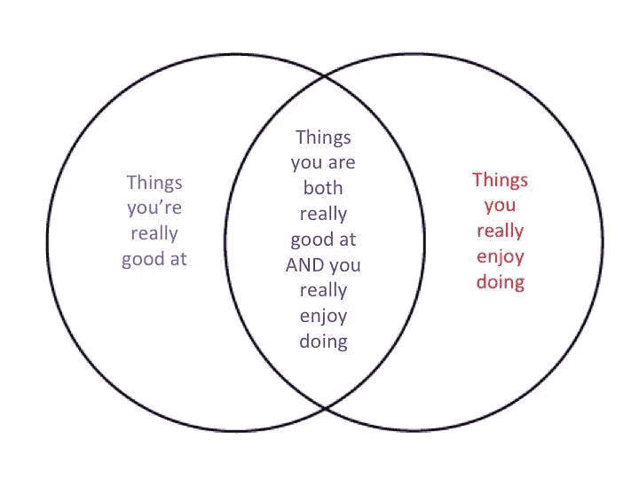
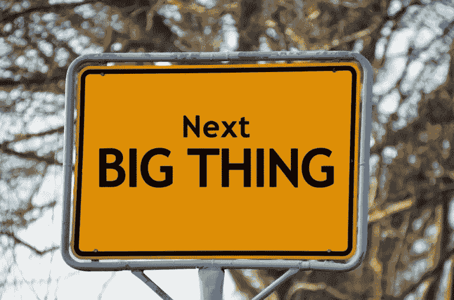

# 自我反省的艺术

> 原文：<https://medium.com/swlh/the-art-of-self-reflection-326aaa570cea>

R **eflection: *名词*T5*。*认真的思考或考虑。 ***同义词:*** 思想、思考、考虑、沉思、研究、商议、深思、冥想、沉思、反刍、深思。**

在当今忙碌的世界中，人们很容易陷入日常生活中的世俗活动——整天都被互联网、电视、广播、无数嗡嗡作响的电子邮件、短信或其他电话提醒等技术分散注意力。

> [奖励:下载一份自我反省的备忘单来帮助你实施这些策略。](https://godirectentertainment.leadpages.co/leadbox/140b3d373f72a2%3A14e3e4942b46dc/5712272949248000)

每个人都想占用你的宝贵时间，而且往往会不假思索地自动给你。想想你一天中所有让你分心的事情；脸书不断的通知，弹出窗口，要求你立即注意，即使 95%是不紧急的。我们受过训练，放下一切，检查任何更新。

> **我们平均每天查看手机 150 次——来源谷歌 2016 年 4 月**

你还记得有意识地同意所有这些耗费你时间和精力的事情吗？或者，我们只是慢慢地适应了我们允许自己消费的数据的增长，而从未有意识地决定选择进入这一级别或信息入侵？你甚至没有意识到，你已经花了一整天的时间从一个任务跳到下一个任务，回应别人对你的时间和精力的要求，从来没有停下来*反思*你那天做了什么，甚至为什么你决定做这些事情。

也被称为自省，自我反省是一项非常重要的技能，因为它使我们能够评估我们日常生活的模式和活动，以了解我们的行为和习惯如何有助于我们的整体福祉、成功和幸福。

> 成功是一种心态。如果你想要成功，开始把自己当成一个成功者。乔茜·布拉勒斯

自我反省意味着审视你是谁，你在哪里，你在做什么——既包括你现在的日常生活，也包括你过去做了什么——然后利用这些信息向你真正想要的地方和 T2 想要的地方靠近。因为如果我们真正坐下来反思我们的行为和习惯，我们会很快发现它们往往与我们真正的生活目标或我们真正想要成为的人不一致。在这个过程中的某个地方，我们已经接受了这个额外的包袱，而我们却常常不记得自己曾经接受过这个包袱。伯顿·波西在[的博客](http://www.burtonposey.com/blog/2015/4/25/todays-habits-and-tomorrows-dreams-do-they-line-up)上提到了习惯和目标的一致性，他在博客上分享了一段关于篮球运动员成功工作习惯的视频——他用一个生动的问题总结了这一点:

> “你今天的习惯和你明天的梦想一样吗？”

这个关于自我反省的谈话可能听起来有点模糊，或者听起来像是一个太大的任务——也许你只是不知道在评估你的日常生活和行为时从哪里开始，也许你不知道如何找出你生活中的真正目标，也许你不知道如何判断这些事情是否相互一致。如果你刚开始考虑这个问题就感到有点不知所措，不要担心——你并不孤单！事实上，大多数人并没有真正的技术或学习习惯来帮助他们停下来反思他们的生活。

当我们的生活自动运行时，我们经常开始失去“生活平衡”的感觉——这是哈里·克雷默在他的博客中谈到的一个话题。

## 这里有一个好消息

自我反省并不是一项很难掌握的技能，就像每天刷牙或整理床铺一样。起初，这可能是你每天都必须有意识地思考的事情，但随着不断的练习，自我反省将成为你毫不费力地从事的习惯。在这篇文章中，我想分解自我反省到底是什么，为什么它如此重要。我想谈谈简单明了的方法来反思你的过去和现在的生活，以便了解你自己和你的优先事项，然后清楚地评估你的日常习惯是否符合你的总体目标和生活梦想。我从我的智囊团中的某个人那里学到了关于自我反省的大部分经验。

> [了解如何在这个平台上加入世界各地的在线策划小组](http://eccountability.io/)

当你开始你的个人旅程时，你可能想看看来自 Larissa Marks 的这篇博客文章,里面有 6 个简单的问题可以问你自己，以便进行自我反省。

# 阳性率

在我们深入研究之前，让我们花点时间来谈谈 Barb Frederickson 博士提出的“阳性率”。基本上，这是一个想法，对于你一天中每一个消极的想法或情绪，你应该用三个积极的想法来平衡它。研究表明，每当人们在日常情绪中能够达到 3:1 的积极比例时，他们的工作状态就处于最佳水平。

爱丽丝·博耶斯博士在她的博客文章[中写了更多关于这个积极比率的内容——甚至有一个自我评估测试的链接，可以帮助你确定自己的积极比率！](http://www.aliceboyes.com/positivity-ratio/)

但问题是:这一切都是为了平衡。你的思想和想法应该是积极的，但同时你需要对自己诚实。什么适合你，什么不适合？你不想陷入消极、自责或自我憎恨的陷阱——消极的自我对话完全适得其反，只会阻碍生活的进步或前进。

> [“审视我们的过去永远不会浪费时间。来自过去的回响为今天的生活提供了学习准则。”―基尔罗伊·j·奥尔德斯特](https://twitter.com/share?text=%E2%80%9CExamination+of+our+past+is+never+time-wasting.%E2%80%9D+%E2%80%95+Kilroy+J.+Oldster&url=http://eccountability.io/the-importance-of-self-reflection/&via=https://twitter.com/Eccountability)

然而，诚实地评估你过去和现在的习惯和行为也很重要。当你在生活中看到失败和坏习惯时，你需要能够识别它们，因为你无法消除消极，除非你能够诚实地识别消极的特质。

Kevin Olusola 是一位受欢迎的、创新的、开创性的大提琴家/beatboxer，他写了一篇简短的博客，讲述了平衡自我反思与建设性批评的重要性，以便向前迈进并改善自己。他认为,“受伤的自我”可能是一件好事，只要它有助于你“增强你处理任何事情的能力”以及“塑造你的性格”,而我们做到这一点的方法是平衡批评。

> 建设性的批评让你通过批评性的反馈来提高自己的技能，而自我反省是一种禅，它让你评估你追求的目标是否适合自己，如果不适合，就改变它们。这样，你收到的建设性批评只会让你朝着正确的方向前进，因为你在追求正确的目标。”

点击阅读他的文章[。](http://kevinolusola.com/blog_index&postid=1567883)

一年中做这件事的最佳时间通常是在年初。我们喜欢用日历年来定义时间，这对我们来说是有逻辑意义的，因此在年初这样做在我们的头脑中更清晰，也更容易跟踪。我们已经回想起我们生命中的重大时刻，并为这一事件添加了年份。[杰西卡·科恩](http://www.eatsleepbe.com/2014/12/29/importance-of-self-reflection/)谈到了年终自我反省的重要性，所以没有固定的时间来做这件事——只要你做就行。

> 额外收获:下载一份自我反省的备忘单来帮助你实施这些策略。

# 每个人都有一些天赋——发掘你的吧

自我反省的最好结果，很简单，就是学会理解你擅长什么，应该做得更多。我们可以通过许多不同的方式来了解自己的“天才”；性格测试是许多人用来了解自己和自己的优缺点的一种常用方法。这些测试可以给你一些线索，它们是一个很好的起点，但是要真正发现你的天赋，你需要更深入地挖掘。

默里·基尔戈有一些很好的建议和一些“发现你的天才”的线索请花 5 分钟时间[在这里观看他的视频](https://www.youtube.com/watch?v=FPx34JQTK1k)。

默里的主要观点是，你可以找到你真正天才的地方位于你的天赋和你的激情的交叉点——你的天赋是“你真正擅长的”，你的激情是“你真正热爱做的”。

在他的视频中，默里建议你应该考虑你的才能和激情，然后你应该开始写日记(写下来)来确定你的生活有多少属于这两个类别。你花了多少时间做你真正擅长的事情，又花了多少时间做你真正喜欢做的事情？

当你找到生活中的甜蜜点，在那里你花大部分时间做你都非常擅长*和*你真正喜欢做的事情，那就是你发现你的天赋的时候。

它应该看起来像这个文氏图

那么，如何着手发掘自己的个人天赋呢？这就是你已经做的沉思真正有帮助的地方。正如[贾里德·拉菲特](http://www.lafittecoaching.com/single-post/2016/10/06/Why-Self-Reflection-Means-Business)在他的博客文章中所讨论的，这不仅仅是关于你的个人生活，而是作为你商业实践的一部分需要发展的相关技能:

安迪·德里什有一个精彩的、经过深思熟虑的视频和附带的工作表，可以帮助你学习如何[“发现你的天才”](https://andydrish.com/free-genius-discovery-kit-2/)这个视频大约有一个小时长，所以需要你留出一些安静的时间来反省，但在我们看来，这个过程绝对是值得的。

# 反思过去:好的…

首先，想想你在生活中已经做了什么，你已经取得的成功。什么对你有效？

**不要跳过这一步！这很重要。** —停下来，花些时间想一想你生活中至少三种不同的情况，你会认为这是三大“胜利”——当你真的、真的想要某样东西，你已经下定决心，努力工作，为了实现你的目标做出牺牲的时候。这应该不会太难——几乎每个人都可以想出他们一生中在真正想要的事情上取得一定程度成功的三个不同时期。这可能很困难，但你能够坚持下去，克服困难，从而赢得这场大胜。

为了说明我所说的，并帮助你思考自己的个人成功，这里有一些常见的例子，说明许多人在生活中的一些大领域取得了成就:

运动 —这可以是组建一个运动队，也可以是更个人化的，比如跑马拉松。你曾经参加过运动队的选拔吗(无论是在小学、高中还是更高的时候)？想想为了加入这个团队，你在训练和完善你的身体技能上花费了多少工作和时间——当你得到它的时候，你可能仍然记得那种在实现你努力奋斗的目标后的兴奋感。或者，如果你曾经跑过马拉松，你会知道为大比赛日进行了多少周(甚至几个月)的体能训练，你会知道在完成你努力完成的任务后，你会有难以置信的成就感。即使是像小时候学骑自行车这样简单的事情，也能提醒你，你曾经不得不为一些起初充满挑战和困难，但最终变成第二天性的事情而努力。

**教育&学习**——例如，获得一个学位或者进入你一直想从事的职业。大学很费时间，很辛苦；当你还是学生的时候，你可能会觉得隧道的尽头没有光，工作和压力会永远持续下去，但你仍然坚持下来，因为你知道这需要你所有的专注和勤奋才能在结束时获得学位。好家伙，当你*终于*毕业时，感觉好吗？

需要大量技术知识的爱好或“激情项目”；想想编织、缝纫、滑雪、绘画或类似的事情。当你第一次开始学习时，它可能是困难的或具有挑战性的，但最终这项技能要么变得容易，要么至少你觉得回报足够大，可以不断激励你在选定的爱好上提高技能。

有偿工作——也许你想在工作中获得晋升，或者你正在做一个大项目，你想从你的老板和同事那里得到积极的反馈。不管具体是什么，想想你在工作中投入大量时间和精力的时候，想想最终得到回报的感觉有多棒。

你个人的成功可能与上面列出的相似，也可能完全不同。你可能在考虑大规模的事情，或者你可能在考虑更小的事情——这没关系。重要的是，你现在脑子里已经有了那三个成功；那些成就和胜利的时刻。

你还记得那种成功的真实感觉吗？你能准确地说出那种感觉吗？—最终的成就感，在整个过程中你有多积极，以及你的头脑如何克服任何和所有的反对或怀疑以完成任务。

那么，为了取得成功，你必须做些什么呢？如果让我猜的话，你可能不得不设定一个非常**明确的**目标，你不得不积极**腾出时间**为那个成功而努力，并且你可能不得不在这个过程中做出一些巨大的牺牲。你确切地知道你想要什么，并且你不怕花费所有的时间和精力去实现那个目标。

**你为什么做这些艰苦的工作？**——简单的回答可能是……因为你想这么做！你的动机是什么？它是内在的(内在驱动的；例如，我喜欢学习新东西，或者这很有趣)还是外在的(外部激励；例如，如果我完成这项培训，我将能够找到一份报酬更高的工作)。

# …还有坏的方面

> 部分原因是因为我们太愿意责备别人的错误，以至于我们太热衷于隐藏自己的错误马修·赛义德

**现在，想想一次“失败”——在你过去的某个特定时间**当你一心想要做一些伟大的事情——一个大项目或者类似于你刚才想到的 3 个例子的事情。但是，你没有以一个伟大的成就结束它，相反，你失败了，感觉被打败了。

你经常想起那次失败吗？俗话说“后知之明 20–20”，有了后知之明，你就能更好地理解可以从过去的错误中吸取什么教训。但是 2014 年哈佛大学的一项研究表明，不仅仅是我们从经历中学到了什么，而是对过去经历的真实反思让我们能够从中吸取教训。当你花时间反思你的错误时，它使你能够将成功转化为失败，这个过程在 Barmetrix 的这篇博客文章[中有所描述。他总结了三个要点:当你反思并从过去的经历中学习时，你能够:1)确认你已经足够努力，2)确认仍需改进的领域，3)与你的团队分享你的学习。](http://www.barmetrix.com/blog/archives/4210/learning-from-your-failures-can-lead-to-future-success/)

> 额外收获:下载一份自我反省的备忘单来帮助你实施这些策略。

所以现在花点时间反思一下你过去的失败。对比你为了成功所做的和以失败告终的:你做了哪些不同的事情？

当你“失败”时，你可能会缺乏动力和激情，因此你不会努力工作，也不会花太多时间去取得成功。

但是失败不一定是坏事。事实上，根据马修·赛义德的说法，“失败是高飞的关键”:

想想世界级花样滑冰运动员在练习中比低水平花样滑冰运动员更容易摔倒的发现。乍一看，这似乎是矛盾的。为什么真正优秀的滑冰运动员摔倒的次数最多？

*原因其实很简单。顶级滑冰运动员在练习中不断挑战自己，尝试挑战极限的跳跃。这就是为什么他们经常摔倒，但也正是为什么他们学得这么快。日本的荒川静香估计，从初学者到奥运冠军，她经历了大约 20，000 次摔倒。*

*低级别的溜冰者有一种完全不同的方法。他们总是尝试他们已经很容易做到的跳跃，保持在他们的舒适区内。这就是他们不会摔倒的原因。从表面上看，他们看起来很成功，因为他们总是站着。然而，事实是，从不失败，他们就永远不会进步。*

滑冰是如此，生活也是如此。

你可以在这里阅读他的文章[的其余部分。这个信息的要点是，只有通过“失败”，通过推动自己尝试新事物和学习新技能，我们才能变得更好，在生活中向前迈进。](http://www.matthewsyed.co.uk/2016/06/19/why-failure-is-the-key-to-flying-high/)

你不应该害怕失败，也不应该把你过去的“失败”视为死胡同。相反，用“向前失败”的心态对待你的失败，正如[埃里克·金(Eric Kim)所描述的那样](http://erickimphotography.com/blog/2016/04/20/fail-forward/)——从你的错误中吸取教训，并把这次经历作为下次做得更好的机会。

> *“失败应该是我们的老师，而不是我们的承担者。失败是拖延，而不是失败。这是暂时的迂回，不是死路一条。失败是我们只有通过什么都不说、什么都不做、什么都不是才能避免的。”—丹尼斯·威特利*

# 你在自动驾驶生活吗？

> 当我回到家的时候，我意识到一整天过去了，我什么也没想。所有的决定都是当场作出的，如果有的话。一整天都处于自动驾驶状态。当然，并不是每天都有这种感觉，但这种情况比我希望的要多。”-来自[加布·约翰逊](http://gabejohansson.com/life-blog-autopilot/)

你上一次花时间停下来，反思和评估你每天/每周/每月所做的事情，甚至是一年，是什么时候？

很有可能，你甚至不知道这个问题的答案…因为如果你和普通人一样，你可能不记得你最后一次真正停下来反思你在生活中做了什么。这意味着你在自动驾驶。

自动驾驶生活是指当你陷入了日常生活中相同的常规和惯例，以至于你不再花时间去思考你每天在做什么，或者你为什么要这样做。

处于自动驾驶模式的糟糕之处在于，很多时候，你甚至不知道自己在做这件事——因为你太专注于所有的分心事物和生活中毫无意义的例行公事，以至于你甚至没有注意到它并没有让你快乐或成功。

因此，走出自动驾驶模式的第一步是首先承认你需要开始做出改变。但是从那里，我们去哪里？这些来自 grad uit prospers 的建议可以帮助你走出自动驾驶模式，进入“过上最好的生活”模式。

再次自我反省有所帮助，因为当你了解自己，知道什么能激励你，让你兴奋，那么你就能以这样一种方式重组你的生活，你就能走出“自动驾驶”模式，进入为成功而积极工作的模式。

“正念”现在是一个流行的词，但是正念是一种真正的技能，可以帮助你最大限度地发挥你最高的生活潜力。在《平衡的生活》中，道恩·奥利瓦雷斯分享了一些关于如何“完全活在当下并有目的地生活”的建议，正如她所说，以避免自动驾驶的生活。她的清单包括像“睡眠”、“分清主次”和“尽量减少分心”这样的项目——这些简单的事情在我们的日常生活中太容易被忘记了。点击这里查看她的其余列表[。](https://thebalancedlifeonline.com/mindfulness-tips-to-avoid-going-through-life-on-autopilot/)

> [奖励:下载一份自我反省的备忘单来帮助你实施这些策略。](https://godirectentertainment.leadpages.co/leadbox/140b3d373f72a2%3A14e3e4942b46dc/5712272949248000)

# **现在花点时间问自己几个问题:**

你的动力是什么？每天早上让你醒来并让你度过一天的动力是什么？是什么推动你开始一个项目，不仅仅是开始，而是看到它成功结束？

**你在哪里寻找和找到自己的个人灵感？谁是你钦佩的真正的思想领袖、作家或普通人？**

**你最大的恐惧是什么？**你为什么害怕那些东西？你现在可以开始采取什么措施来克服这些恐惧呢？

对你来说什么是重要的？是钱吗？创造力？感觉自己在帮助别人？没有正确或错误的答案；每个人都是不同的，在他们自己的生活中会有不同的重要项目。

**你生活中最让你兴奋的是什么？**是你的家人，朋友，建立关系？这是你的工作吗？是旅行吗？不要只说“旅行”、“工作”或“朋友”——T4 让你特别兴奋的是什么，为什么？

什么给了你灵感？

老老实实回答那些问题；对自己完全真实。当你知道这些问题的答案时，就是时候…

> 评估你的生活，看看你每天做的事情是否真的对你重要的事情有所贡献。

弄清楚是什么激励着你，然后确保你做的每件事都会以某种方式帮助你实现目标。[这段精彩的播客来自《成功的科学》——马特·博德纳尔和谢恩·帕里什的讨论——给出了一些很好的例子，告诉你如何让你的生活脱离自动驾驶仪，更深入地理解现实。](http://www.scienceofsuccess.co/show-notes/2016/6/7/how-to-stop-living-your-life-on-autopilot-take-control-and-build-a-toolbox-of-mental-models-to-understand-reality-with-farnam-streets-shane-parrish)

如果你的日常生活对你的整体成功没有帮助，那么问问你自己是什么阻碍了你。你怕什么？生活中这些阻碍你的事情通常被称为“限制信念”，之所以这么叫是因为它们会限制你去做或实现某些事情。限制性信念通常以微小的、看似无关紧要的陈述的形式出现在我们的日常话语中，但随着重复，它们会成为我们为自己创造的身份的一部分，严重阻碍我们实现目标和梦想。

例如，许多人有一种固有的、不断重复的信念，认为他们“不会唱歌”，这可能会阻止他们去上歌唱课，探索他们能够学会唱歌的可能性。“我很懒”、“我不擅长技术”、“我话太多”、“我太害羞”——所有这些都是限制信念的例子。(更多例子，请看这个列表:“ [63 个正在毒害你企业家潜力的有毒信念](http://unsettle.org/limiting-beliefs/)”)不要让自己成为限制性信念的牺牲品，而是要挑战它们，为自己创造新的信念。

关于你自己的恐惧和限制性信念的事情；问问自己这些恐惧是否真的存在。你如何着手克服这些恐惧？日常生活中是什么分散了你的注意力，你如何开始排除这些干扰？

多产生活的创始人兼总裁 Farnoosh Brock 写了一些关于限制信念的文章，并提供了克服这些限制信念的 10 个步骤。

> **“确保你所做的一切都是因为你已经问过并回答过了”**

v·卡帕尔蒂(旧石器时代的女老板)谈了一点关于自动驾驶的生活是什么样子，以及为什么这是一件如此消极的事情。就像你不想乘坐一架自动驾驶的飞机，而更愿意乘坐一艘由深思熟虑、聪明的飞行员驾驶的船一样——你也不想过自动驾驶的生活！

根据 V 的说法，摆脱自动驾驶的方法是停止你一天中的每一个行动，问自己:*为什么*你要这样做，*它应该*改变吗，如果应该*它应该如何*改变？

现在花几分钟时间，看看她对如何成为“你生命的船长”有什么要说的。

如果你想更深入地了解自我反省，IQ Matrix 的 Adam Sicinski 公布了一份每天问自己的问题清单，这份清单将迫使你退后一步，深入思考当天经历的一切:关于你的想法、情绪、与他人的互动、健康、态度等问题。去看看他的问题清单。

> [奖励:下载一份自我反省的备忘单来帮助你实施这些策略。](https://godirectentertainment.leadpages.co/leadbox/140b3d373f72a2%3A14e3e4942b46dc/5712272949248000)

# 现在把所有的都集合起来:过去，现在，未来

在这篇文章中，我们已经谈了很多关于反思你的过去，但是需要澄清的是*反思*过去并不等同于*沉迷于*过去。不要因为自己犯的错误而自责；只有当我们能够从中吸取教训，然后要么继续做好的事情，要么继续前进，克服过去的错误，思考我们的过去对我们才有好处。

反思应该变成一个好习惯，你可以把它融入到你的日常生活中，因为你变得更加有意识，更加注意和意识到你的每一个行为和想法，以及它们将如何影响你未来的成功。

努力在你自我反省的积极和消极想法之间找到平衡。当你反思过去的失败时，不要陷入消极自我对话的窠臼；相反，从失败中吸取教训，把失败变成积极的事情。

不要只是把它藏在心里！把这种积极的情绪带到你周围的世界，努力增加你生活中积极互动的次数(同时减少消极互动的次数)——与你的家人、朋友、同事以及任何你日常接触的人。无论何时，只要你带着有目的和有意图的积极态度去接近他们，你的个人和职业关系就会繁荣。

乔恩·戈登在他的博客中写道:

> “我们需要更多的微笑、友善的话语、鼓励、感激、有意义的谈话、诚实的对话和真诚的积极互动。为了促进这些行动，我们需要创造个人和团队的仪式，帮助我们更积极地互动。如果我们让它们成为我们组织过程和个人习惯的一部分，它们就更有可能发生。”

点击这里，阅读他关于“积极互动的力量”[的其余帖子。](http://www.jongordon.com/blog/the-power-of-positive-interactions-2/)

# 向前迈进:设定明确的目标

当你带着新的个人意识向前迈进，当你调整你的理想和价值观的知识时，下一步是学习如何在日常生活中将自我反省转化为行动(短期和长期)。**在我们的下一篇文章**中，我们将更深入地探讨如何设定清晰、可实现的目标。

与此同时，想想这句流行的名言(通常被认为是圣雄甘地的名言):

> 保持积极的想法，因为你的想法会变成你的语言。保持你的话语积极向上，因为你的话语变成了你的行为。保持积极的行为，因为你的行为会变成你的习惯。保持你的习惯积极向上，因为你的习惯会成为你的价值观。保持积极的价值观，因为你的价值观会决定你的命运。”

*最初发布于*[*ECC count ability . io*](http://eccountability.io/the-importance-of-self-reflection/)