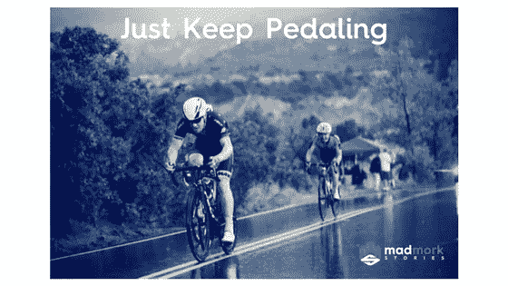
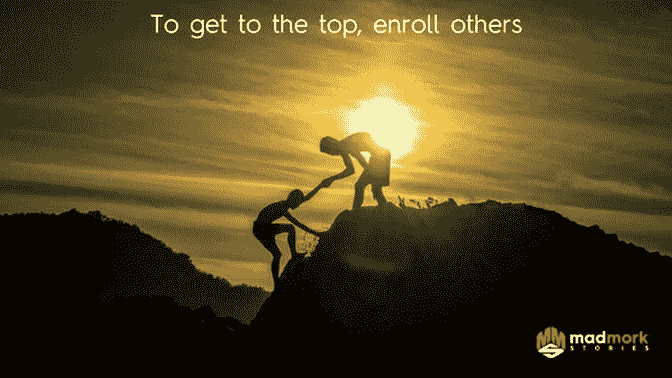
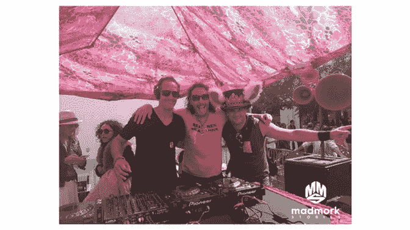

# 创业激励的艺术

> 原文：<https://medium.com/swlh/the-art-of-startup-motivation-f8844c7eb90c>

作为一名企业家，经营自己的企业是你能做的最难的事情之一。它会耗尽你的耐心、你的财务、你的家庭、你的健康甚至你的理智。

**为什么动机很重要**

即使当每个人都告诉你停止或者当人们不再相信的时候，动力和你深入挖掘并继续前进的能力是区分那些成功人士和那些在创业历史上留下痕迹的人的关键因素之一。你日复一日的动力水平会直接影响到以下几个方面:

**完成任务:**作为一名企业家，你保持动力的能力是你完成任务的主要动力。无论是那些额外的几行代码，打 10 个额外的电话，还是做你的第 100 次投资者推介，最终经营一家企业和你的交付能力取决于你完成工作的动力。如果你的动力下滑，事情就开始被拖延，很快就会走下坡路。

**招募他人:**作为教练，我经常谈论这个问题。完成事情的关键之一，尤其是困难的事情，是与他人分享你的目标。当你与他人分享你的目标时，你不仅让他们对你正在做的事情感到好奇和兴奋(因为，如果他们关心你，他们会希望你成功)，而且你也让他们成为你旅程中的乘客。有些人甚至会给你发短信或打电话，告诉你事情进展如何，你取得了多少进展。你越有动力，就越容易让人们对你的旅程感到兴奋，如果你幸运的话，让他们真正加入或者以某种方式帮助你。当你身边有一个团队的时候，这就更重要了。当人们看到创始人有着难以置信的动力，并感受到那种能量时，他们就更容易获得动力，并在困难时期向前推进。

**获得动力:**你有没有感觉到，当你相对快速地连续做一系列事情时，它们会相互促进？动力，以及在你需要的时候能够深入挖掘，是创造动力的关键因素。你和你周围的人越快看到事情发生，当事情开始变得困难时，就越容易继续前进。当你建立了动力，看到了进步，你就进入了一种状态，事情就这样开始发生了。当你雇佣/引进新人到你的公司时尤其如此。让他们参与进来似乎要花很长时间，而且是一件真正的苦差事，但是一旦他们参与进来并开始做一些事情，你会注意到一些你甚至没有意识到的事情开始发生了。

**打造更好的产品:**当你的动力水平很高时，你会更专注于花额外的时间来做好你的产品。你会更加努力地改正缺陷、错误或质量问题，这些可能是好产品和伟大产品的区别。你还会激励其他人付出额外的努力，想出创新的方法，让你的产品做你意想不到的事情，并超越客户的期望。

**销售更多东西:**你兴奋、精力充沛、热情和积极的能力将直接影响你的客户的购买意愿。当你完成额外的销售并获得新客户时，这也有助于建立势头，并能引导你找到下一个客户。就在上周，我连续向客户推销了 3 份提案。这种能量是有感染力的，每一次销售都变得越来越容易。客户实际上能感觉到我的能量和动力，这让他们更愿意和我一起工作。动机导致成功，随着你信心的增长，它会带来更多的成功。

**保持好奇心:**我经常发现那些高度积极的人通常也非常好奇。他们总是在寻找打破常规、改写游戏规则的方法。好奇心是任何成功企业的生命线。它帮助我们制造更好的产品，缩短上市时间，更快地解决客户问题，尝试新事物，并不断磨练我们如何发展我们的业务。当你动力十足时，你更有可能挑战自己和他人，打破常规去解决复杂的问题。

**保持动力的有效方法**

**找到你的目的:**除非你知道目的地是什么，否则你怎么能到达目的地？你会发现，无论是创始人、运动员还是名人，获得巨大成功的人都有一个非常明确的目标感。对一些人来说，这是一个单一的大目标，如治愈癌症或赢得冠军，而对其他人来说，他们的目的可能是向自己和周围的人证明，他们可以实现一些史诗。作为一名营销教练，营销主管找我的主要原因之一是因为他们对生活不满意或感到沮丧。他们在生活的跑步机上漫无目的地跑着，一天一天地做着运动，没有任何明确的目标。一旦你发现你的目标是什么，并与世界广泛分享，宇宙似乎就进入了状态，决定你会做什么和不会做什么就变得容易多了。

制定明智的目标:为了实现你的目标，你需要目标。当你开始考虑你的最终目标时，当你看到自己在进步时，就更容易保持动力。为自己建立年度、季度、月度和周目标可能看起来令人生畏，你可能并不总能实现它们，但它有助于你变得自律和专注。 [Smart](https://www.mindtools.com/pages/article/smart-goals.htm) 目标具体、可衡量、可问责、相关且有时限。将这些目标分解成易于理解的小块，这样你就可以每天为之努力。你越是看到自己达到这些目标，事情就变得越容易。例如，我的年度骑行目标是 2500 英里，所以我知道我需要每月骑行 208 英里或者每周骑行 50 英里多一点。更重要的是，我每周在 Strava 上与我所有的追随者分享我的骑行，这让我保持诚实和动力。

被许多人认为是世界上最好的励志演说家之一的莱斯·布朗说得好:只和优秀的人在一起。你周围的人素质越高，你就越有动力去超越自己的极限，他们的成功、动力和激情也会激励你。你甚至可以学到一两个关于他们如何保持积极性的技巧。

分享你的目标:如果你是唯一一个负责任的人，那么作弊就更容易了。如果有人和你一起工作，特别是 OQP，你可以使用像体式这样的工具来创建你的目标，分解它们，当你完成目标时(或者不完成)，让别人“跟随”你。与他人分享你的目标不仅能让他们帮你实现目标，还能让你承担起采取行动的责任，这样当你没有实现自己设定的目标时，你会真正地质疑自己。

**养成“杀手锏”套路并坚持:**套路是关键。我怎么强调都不为过。平均来说，养成一个新习惯需要大约 14 天的时间，但是一旦你养成了一个新习惯，就会有很大的不同。对我来说，杀人程序在我的日程表上。例如，我称星期二为打字星期二，因为每个星期二我都在创造伟大的内容。

以下是我周二的日常安排:

-早上 6 点起床！

-早上 6:15 骑 10 英里/ 38 分钟自行车

-上午 7:15 冰冷水淋浴(好处[太棒了！)，礼服，早餐](https://www.medicaldaily.com/benefits-cold-showers-7-reasons-why-taking-cool-showers-good-your-health-289524)

-上午 8:30-上午 9:00 感恩日记/电子邮件

-上午 9 点-上午 10 点 30 分播客制作

-上午 10:45-下午 12:15 博客文章创建

-中午 12:30-下午 1:30 与客户、联系人或朋友共进午餐

-下午 1:30-下午 2:30 内容联合和搜索引擎优化

-下午 2 时 45 分至 3 时 30 分会议

-下午 3:30-4:15 去学校接孩子

-下午 4:15-5:30 电话/会议

-下午 5:30-7:00 电子邮件/第二天准备/费用

-晚上 7:00-晚上 9:00 晚餐/儿童时间

-晚上 9 点-晚上 10 点电子邮件/会议日程

-晚上 10:00-晚上 11:00 阅读/冥想

- 11 点睡觉

你可能会注意到，我试着每隔 90 分钟左右休息一下。至少，我会试着去散散步，呼吸点空气，伸伸懒腰，喝点水。为什么？根据《快速公司》的这篇文章:“在需要休息之前，你的大脑只能集中注意力 90 到 120 分钟。为什么？这是一种超节奏，一种存在于我们睡眠和清醒生活中的循环。”

**睡眠:**在硅谷，许多人，尤其是年轻的企业家，似乎认为这是一种荣誉，或者认为永远处于睡眠不足的状态很酷。你猜怎么着？不是的。它会让你变得更笨。在商业内幕的这篇[文章中，伯克利大学睡眠专家马修·沃克，神经科学教授和《我们为什么睡觉》的作者，将睡眠不足归因于血压升高、患癌症的几率增加、轻度健忘症(由于我们无法有效地创造新的记忆)和患老年痴呆症的风险增加(由于大脑中某些蛋白质的积累)。极度清醒(即根据沃克的说法，在应该睡觉的时候醒了 16 个小时以上，基本上是“轻度脑损伤”。所以，帮你自己一个忙:别再装酷了，好好睡上 6-7 个小时。我每晚睡 7 个小时，如果不睡觉，我就不能正常工作。我喜怒无常；缺乏活力；没有完成足够的工作，然后变得更加情绪化，因为我没有完成我需要完成的工作。结果是:我的动力水平直线下降。](http://www.businessinsider.com/what-happens-when-you-dont-get-enough-sleep-2017-12)

音乐:众所周知，在我们最需要的时候，合适的音乐确实能给我们带来动力和能量。我的情况是电子舞曲(EDM)。当我写作的时候，音乐帮助我进入一种状态，非常有动力。关键是要明白什么样的音乐能激励你，什么时候是使用它的合适时机。例如，当我在做战略工作或处理数字时，我不能使用音乐，因为它太分散我的注意力了。但是当我在做更有创造性的工作时，比如写帖子、制作图形或写演讲稿，合适的音乐不仅能激励我，还能提高我的工作质量。

**励志视频:**我承认这个对我来说有点新，但我最近开始每周在 YouTube 上听几次励志视频。这些视频中的一些，像那些来自[的《疯狂动机》和](https://www.youtube.com/user/viralrescue)，当然可以在需要的时候提供帮助和灵感。重要的是始终将这一点与你的 SMART 目标联系起来，并让球继续前进。没有什么比真正努力工作、看到工作成果或得到同事、朋友和客户的赞扬更能激励你了。激励视频可以在每天早上提供额外的激励，可以成为你日常生活的一部分，但是不要错误地认为仅仅看这个视频就可以帮助你达到目标。

所以这就是我的乡亲。希望这篇帖子有用。如果有帮助，请在下面点赞、分享和评论。还记得 mad mork stories 现在有音频，所以请查看我在 [**Anchor.fm.**](https://anchor.fm/madmork-stories) 上的播客。如果你觉得你可能会从一些辅导中受益，请确保在我的[主页](https://www.madmork.com/)上预定一次会议，或者访问我的[脸书](http://www.facebook.com/madmorkstories)页面以了解更多信息和优惠。

保持动力！

疯狂默克

## 这个故事发表在 [The Startup](https://medium.com/swlh) 上，这是 Medium 最大的企业家出版物，拥有 320，924+人。

## 在此订阅接收[我们的头条新闻](http://growthsupply.com/the-startup-newsletter/)。

